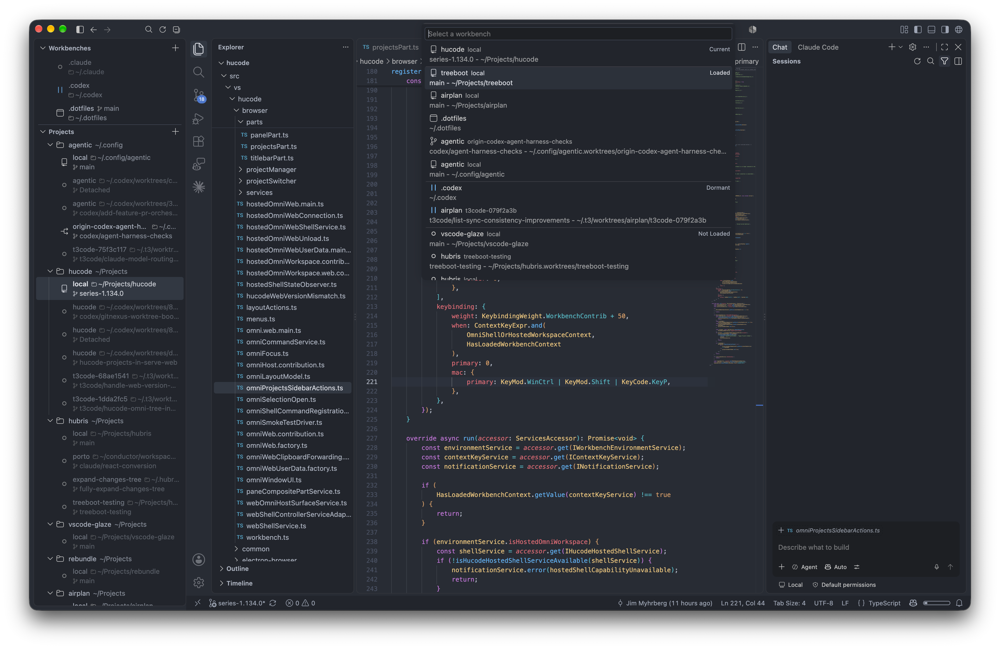

<div align="center">


# Hucode

**A VS Code fork built around projects, worktrees, and persistent workspaces.**

[](https://github.com/jimeh/hucode/releases/latest)
[](https://github.com/jimeh/hucode/actions/workflows/hucode-ci.yml)
[](https://github.com/jimeh/hucode/issues)
[](https://github.com/jimeh/hucode/pulls)
[](https://github.com/jimeh/hucode/blob/HEAD/LICENSE.txt)

</div>

Hucode wraps the familiar Code OSS workbench in Omni, a persistent project
manager for repositories and Git worktrees. Add projects once, navigate their
worktrees from a shared sidebar, and switch between resident workspaces without
managing a separate editor window for each one.

Individual workspaces remain normal VS Code workbenches, preserving the
editing, debugging, terminal, and extension experience underneath Hucode's
project-oriented shell.

<p align="center">
  
</p>

## What Hucode Adds

- **One place for projects and worktrees.** Save repositories as projects and
  browse their Git worktrees from the Omni sidebar.
- **Resident workspaces.** Keep multiple workbenches loaded and switch between
  them without reopening windows or rebuilding editor state.
- **Explicit workspace lifecycle.** See which workspaces are active, loaded,
  dormant, loading, or crashed, and suspend workbenches you no longer need in
  memory.
- **Worktree operations in the editor.** Create, rename, and remove worktrees
  from the Projects surface while keeping destructive Git operations explicit.
- **Desktop and web shells.** Use Omni in the native desktop app or self-host it
  in a browser with `hucode serve-web`.
- **OpenVSX extensions.** Hucode uses [OpenVSX](https://open-vsx.org/) for
  extension discovery and installation.

## Getting Around

Hucode provides these default workbench shortcuts on macOS:

| Command | macOS |
| --- | --- |
| Quick Switch Loaded Workbench | `Cmd+Ctrl+Tab` |
| Switch Workbench... | `Cmd+Ctrl+P` |
| Switch to Previous Loaded Workbench | `Cmd+Ctrl+[` |
| Switch to Next Loaded Workbench | `Cmd+Ctrl+]` |

Quick Switch works like the macOS app switcher: hold `Cmd+Ctrl`, press `Tab` to
cycle through loaded workbenches, use `Shift+Tab` to move backward, then release
the modifiers to activate the selected workbench. `Cmd+Ctrl+P` opens the full
switcher, including dormant and unloaded workbenches.

All four commands are also available from the Command Palette and can be
changed in Keyboard Shortcuts. Windows and Linux defaults are being tracked in
[issue #100](https://github.com/jimeh/hucode/issues/100).

## Download Hucode

Prebuilt desktop releases are currently available for macOS and Linux from the
[latest GitHub Release](https://github.com/jimeh/hucode/releases/latest).

### macOS

Download the DMG matching your Mac:

- `hucode-darwin-arm64.dmg` for Apple silicon
- `hucode-darwin-x64.dmg` for Intel

Hucode also publishes ZIP archives used by the built-in macOS updater.

### Linux

Linux releases are available for x64 and arm64 as:

- DEB packages for Debian, Ubuntu, and derivatives
- RPM packages for Fedora, RHEL, and derivatives
- ZIP archives for package-manager-independent installations

See [Linux Installation and Updates](docs/hucode/linux-installation.md) for
package selection, checksum verification, installation, and upgrade
instructions.

Every release includes `SHA256SUMS`. Verify a downloaded asset with:

```sh
sha256sum --check --ignore-missing SHA256SUMS
```

On macOS, use `shasum -a 256 <downloaded-asset>` and compare the result with
the matching entry in `SHA256SUMS`.

## Self-Host Hucode

Hucode publishes standalone CLI and server-web archives for macOS, Linux, and
Windows. Download the `hucode-cli-<platform>-<arch>` archive for your system
from the [latest GitHub Release](https://github.com/jimeh/hucode/releases/latest),
extract it, and place `hucode` (`hucode.exe` on Windows) on your `PATH`. Then
start the Omni web shell with:

```sh
hucode serve-web
```

The Omni shell is available at the root URL by default. Pass `--no-omni` to
serve a regular standalone workbench at the root instead. By default, the
server listens on localhost and protects access with a connection token. Run
`hucode serve-web --help` for bind, port, authentication, and browser-launch
options.

Settings, keybindings, profiles, and UI/extension state remain browser-local by
default. To share them between browsers and devices that use the same server,
start serve-web with `--user-data-storage=server`. On first use, Hucode offers
to migrate supported data from the current browser or start with an empty
server profile. Secrets, sign-ins, cookies, and connection credentials always
remain in each browser. Server mode stores non-secret user data below the
server data directory, so back up that directory with the rest of the server.

## Build From Source

Hucode is maintained as a fork of the full VS Code source tree. Install the
upstream prerequisites for your platform, then install dependencies and compile
Hucode:

```sh
npm install
npm run hucode:compile
```

Launch the desktop app from the compiled output:

```sh
npm run hucode:run
```

For incremental development, run the watcher in one terminal and launch Hucode
from another:

```sh
npm run hucode:watch
npm run hucode:run
```

To launch the local serve-web development server instead:

```sh
npm run hucode:web
```

See the [Hucode documentation](docs/hucode/README.md) for architecture, fork
strategy, release workflow, and Hucode-specific development guidance. The
upstream [contribution guide](CONTRIBUTING.md) covers the underlying VS Code
toolchain and development workflow.

## Documentation

- [Hucode Documentation](docs/hucode/README.md) is the map for user,
  architecture, development, release, and agent guidance.
- [Hucode Omni](docs/hucode/omni.md) explains projects, workbenches, lifecycle
  actions, settings, and serve-web behavior.
- [Hucode Architecture](docs/hucode/architecture.md) describes Omni, hosted
  workspaces, project management, and the boundaries around upstream code.
- [Development Guide](docs/hucode/development.md) covers the overlay, local
  commands, and validation.
- [Release Guide](docs/hucode/release.md) covers versions, CI artifacts,
  signing, publication, and updates.
- [Linux Installation and Updates](docs/hucode/linux-installation.md) covers
  Linux packages and manual upgrades.
- [Roadmap](docs/hucode/roadmap.md) tracks completed, active, and planned work.
- [Repository Strategy](docs/hucode/repo-strategy.md) explains how Hucode
  follows selected VS Code releases while maintaining a reviewable patch
  series.
- [Changelog](CHANGELOG.md) lists user-visible changes in each Hucode release.

## Contributing and Feedback

- [Report a bug or request a feature](https://github.com/jimeh/hucode/issues)
- [Review open pull requests](https://github.com/jimeh/hucode/pulls)
- Read the [Hucode agent instructions](docs/hucode/agent-instructions.md) before
  making Hucode-specific code or documentation changes

Hucode pull requests use Conventional Commit titles. Feature and fix pull
requests also require a matching `.changes/*.md` fragment; the agent
instructions describe the exact format and validation workflow.

## Code OSS and License

Hucode is a fork of [Code - OSS](https://github.com/microsoft/vscode), the open
source codebase underlying Visual Studio Code. Hucode keeps the standard
workbench experience while adding its own product identity, Omni shell, project
manager, worktree workflows, release infrastructure, and OpenVSX integration.

The inherited Code OSS sources remain copyright Microsoft Corporation.
Original Hucode additions are copyright Hucode contributors. Files materially
derived from Code OSS retain Microsoft's notice alongside Hucode's. See the
[copyright policy](docs/hucode/copyright.md) for the repository's attribution
rules.

All Code OSS and Hucode code is licensed under the
[MIT License](LICENSE.txt). See [ThirdPartyNotices.txt](ThirdPartyNotices.txt)
for third-party notices.
