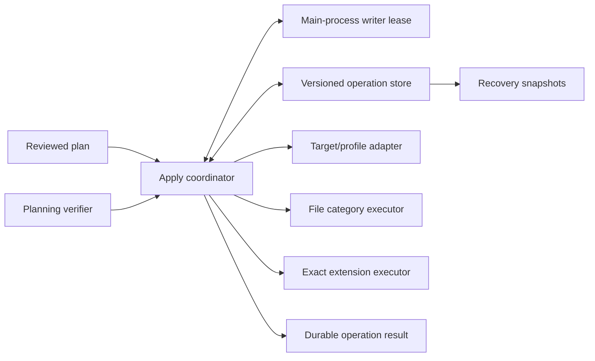

# Hucode editor migration Apply and recovery plan

Status: implemented

Tracks: [#202](https://github.com/jimeh/hucode/issues/202), under the
[settings import and onboarding epic](https://github.com/jimeh/hucode/issues/192)

This document is the implementation plan for the first mutating slice of
Hucode's editor migration flow. It refines the broader
[editor migration architecture plan](editor-migration-architecture-plan.md)
and begins at the immutable reviewed-plan boundary delivered by
[issue #201](editor-migration-planning-plan.md).

## Outcome

Implement a desktop Apply service that executes only an accepted reviewed plan
against its explicit existing or proposed target. It durably records progress,
preserves recoverable pre-operation file state, materializes inherited file
categories without writing through to Default, installs exact reviewed
extensions additively with explicit application-scope handling, and reports
every category and extension outcome.

The implementation is ready when a future shared migration flow can:

1. admit one valid reviewed plan under an installation-wide writer lease;
2. create or re-resolve the explicit target without switching profiles;
3. resume or retry safely after cancellation, failure, renderer loss, or app
   restart;
4. roll eligible file categories back without overwriting later edits;
5. acknowledge a final result and remove its sensitive recovery data; and
6. show accurate partial-success results without rereading the source or
   silently replanning.

## Grounded seams

The current tree already provides the necessary narrow boundaries:

- `IEditorMigrationPlanningService.verifyPlan()` rereads and fingerprints the
  source, explicit target, policy, choices, environment, and exact gallery
  selections without mutation.
- `EditorMigrationReviewedPlan` contains accepted category operations,
  materialization prerequisites, exclusions, and all fingerprints needed at
  admission.
- `IUserDataProfilesService.createProfile()` accepts an explicit profile ID;
  `updateProfile()` can change `useDefaultFlags` without switching the current
  profile or associating a workspace. Both methods update the main-process
  profile catalog through a delayed `StateService` write, so their resolved
  promises do not prove that a crash can no longer revert the catalog.
- An inherited `IUserDataProfile` aliases its resource URI to Default. The
  owned settings, keybindings, snippets, and extensions locations must therefore
  be derived from `profile.location` until the relevant inheritance flag is
  cleared.
- `IFileService.writeFile()` supports etag and mtime dirty-write guards plus
  temporary-sibling atomic replacement on capable providers.
- `IExtensionManagementService.copyExtensions()` copies only
  non-application-scoped extensions between profile manifests, but its scanner
  may perform a semantic-neutral Default-manifest maintenance rewrite and omits
  entries whose extension folder is missing.
- The workbench `installFromGallery()` wrapper can show publisher-trust,
  workspace-trust, and Settings Sync dialogs. The local extension-management
  server performs the underlying install without those workbench prompts.
- Exact reviewed gallery releases can be installed with `profileLocation`,
  `installGivenVersion`, and dependency-pack expansion disabled.
  `installGivenVersion` also pins the installed extension, and
  application-scoped extensions override `profileLocation` and write their
  membership to Default.
- Upstream `ExtensionsResource.apply()` is unsuitable: it changes enablement,
  resolves gallery state again, and uninstalls target extensions absent from
  the imported profile.
- Existing Hucode MessagePort acceptors provide the trusted renderer-to-main
  pattern required for a lease bound to one Omni window and one port
  generation.

## Settled constraints

- Apply accepts only a valid `EditorMigrationReviewedPlan`. It never accepts a
  mutable draft or independent target argument and never infers a target from
  the Omni window, current workspace, or current profile.
- The Omni shell remains on the application Default profile. Applying to a
  named profile does not change the shell profile; applying explicitly to
  Default changes the shell's backing user data as already disclosed in Review.
- The first release admits one mutating migration operation per Hucode
  user-data installation. Read-only discovery and planning remain concurrent.
- A proposed target is created only after admission. It is an ordinary,
  non-transient, unassociated profile and remains attached to the operation
  after cancellation or rollback.
- Apply executes the reviewed operations. It does not make new conflict
  choices, import excluded state, substitute extension releases, or broaden
  selected categories.
- Settings, keybindings, and snippets are merge categories with recoverable
  file mutations. Extension installation and extension ownership
  materialization are additive and forward-only. Rollback never uninstalls a
  successfully installed extension or re-enables extension inheritance after
  Apply made the category profile-owned.
- An accepted reviewed plan fixes the exact extension operations, but does not
  by itself prove that the user confirmed their third-party publishers. Apply
  also requires a migration-scoped authorization bound to the plan fingerprint
  and exact normalized publisher set. It does not mutate the workbench's global
  trusted-publisher store or open trust or sync dialogs midway through a
  journaled operation. Issue #203 owns collecting that confirmation in Review.
- Local operation records may contain the reviewed settings, keybindings,
  snippet contents, extension IDs, profile names, and recovery paths needed to
  resume. Telemetry receives only schema versions, phase and outcome codes,
  category counts, duration buckets, and stable diagnostic reason codes.
- Tasks, accounts, authentication state, source-editor global state, opaque
  databases, onboarding UI, the standalone command, serve-web migration, and
  automatic first-launch activation remain outside issue #202.

## Recommended architecture

Keep mutation ordering in one coordinator, with pure state transitions and
narrow infrastructure collaborators:



The browser-layer coordinator is the sole migration writer. It owns admission,
safe-boundary cancellation, target resolution, category ordering, extension
ordering, recovery, and result publication. It does not hide these transitions
inside upstream profile import/export resources.

Electron main owns only the installation-wide lease. The lease acceptor uses a
dedicated least-authority MessagePort, validates the trusted Omni shell window,
binds ownership to `webContents.id` and the port generation, and releases the
lease when the port or window closes or crashes. The lease is deliberately not
durable: a resumed operation must acquire a fresh lease before mutation.

The operation store owns a versioned installation-scoped directory tree under
the Default `User` root, but outside named, transient, and internal profile
directories. It is not a Default profile resource:

```text
<user-data-dir>/User/hucode/migration/operations/<operation-id>/
  operation.json
  snapshots/
    <category>.before
    <category>.hidden-owned
    snippets/<encoded-relative-name>
    hidden-snippets/<encoded-relative-name>
    drift/<category>-<revision>-<encoded-item>
```

`operation.json` contains the full reviewed plan, target attachment, state
machine, snapshot manifest and hashes, category and extension outcomes, and
acknowledgement state. Snapshot payloads are separate so one record rewrite
does not repeatedly copy large private values.

### Structural alternatives

| Shape | Assessment |
| --- | --- |
| One Apply coordinator with explicit category executors and a versioned journal | Recommended. It keeps ordering and recovery visible while allowing pure reducers and fault-injected collaborators in tests. |
| Reuse `IUserDataProfileImportExportService` and its resource `apply()` methods | Rejected. Whole-category replacement and extension removal contradict the reviewed additive plan and obscure recovery boundaries. |
| Introduce a generic transaction or workflow engine first | Rejected. The categories have different rollback and idempotence rules; a general engine adds schema and abstraction cost before a second use exists. |
| Move all Apply work into Electron main | Rejected. It would duplicate or bridge workbench profile, gallery, and extension-management services. Main needs authority over the single-writer lease, not ownership of every mutation. |

## Public Apply contract

Add a versioned Hucode-owned service contract under
`src/vs/hucode/common/migration/`. The final names should follow nearby service
conventions, but the service should provide the equivalent of:

```ts
createApplyAuthorization(
  plan: EditorMigrationReviewedPlan,
  confirmedPublishers: readonly string[]
): Promise<EditorMigrationApplyAuthorization>;

apply(
  plan: EditorMigrationReviewedPlan,
  authorization: EditorMigrationApplyAuthorization,
  token: CancellationToken
): Promise<EditorMigrationOperationResult>;

getOperation(operationId: string): Promise<EditorMigrationOperation>;
listRecoverableOperations(): Promise<readonly EditorMigrationOperationSummary[]>;
resume(operationId: string, token: CancellationToken): Promise<EditorMigrationOperationResult>;
retry(operationId: string, token: CancellationToken): Promise<EditorMigrationOperationResult>;
rollback(
  operationId: string,
  options: EditorMigrationRollbackOptions,
  token: CancellationToken
): Promise<EditorMigrationOperationResult>;
acknowledge(operationId: string): Promise<void>;
```

`apply()` is the only admission method. Before the first durable operation
record, cancellation rejects without creating a profile or changing the
target. After admission, cancellation is converted into a durable cancellation
request and the promise settles only after the current safe boundary is
recorded.

After Review confirms the displayed publishers, it calls
`createApplyAuthorization()`. The service recomputes the canonical normalized
publisher set from the plan, rejects a caller-supplied set that differs, and
returns an opaque, single-use authorization with a random nonce and a ten-minute
expiry. The service keeps the pending nonce only in memory, bound to the
planning schema version, reviewed plan fingerprint, canonical publisher list,
and publisher-set fingerprint. Apply consumes the nonce before acquiring the
writer lease and rejects a missing, reused, expired, malformed, or mismatched
authorization before it writes a journal. A service restart before admission
therefore requires Review to confirm again. An empty publisher set still
requires a service-issued authorization so callers cannot silently bypass the
contract.

Persist the consumed authorization facts with the admitted operation for
recovery and audit, but never persist the reusable nonce or add its publishers
to the workbench's global trusted-publisher store. `resume()` and `retry()` use
the admitted facts and cannot broaden the plan or publisher set.

`resume()` continues an interrupted operation from its next durable step.
`retry()` resets only failed, unavailable, or canceled item attempts that are
eligible to run again; it does not discard completed evidence. Neither method
rereads the source or creates a new plan.

`rollback()` operates only on the admitted operation's retained snapshots.
Normal rollback refuses drifted categories. A force option must name the exact
categories confirmed by the caller and takes another snapshot before restoring
their pre-operation state.

`acknowledge()` first persists acknowledgement and then removes the operation
directory. Startup cleanup completes deletion if a crash occurs between those
steps. Unknown newer schema versions are listed as unsupported recovery records
and are never rewritten or deleted.

## Durable operation model

Version the operation record independently from the source and planning
schemas. Refine `EditorMigrationPlanOperation` into a discriminated union with
kind-specific payloads before embedding it in the first durable record. This
changes a fingerprinted #201 value, so bump the planning schema version and its
canonical test vectors in the same step. Apply must not decode settings,
keybindings, snippets, and gallery coordinates from one unvalidated
`EditorMigrationJsonValue` field.

The operation record should contain:

- operation schema version, stable operation ID, record revision, and reviewed
  plan schema version;
- the complete immutable plan and its aggregate fingerprint;
- the admitted Apply authorization, including its exact canonical publisher
  set and publisher-set fingerprint;
- lease-neutral operation state and durable cancellation request;
- explicit target selection plus reserved, created, and confirmed profile
  identity states;
- one snapshot manifest entry per selected recoverable resource, including
  absent/present state, ownership, byte hash, semantic hash where applicable,
  and operation-relative snapshot location;
- category stage, checkpoint, result, local diagnostic, pre-apply hash, and
  post-apply hash;
- one entry per reviewed extension coordinate with attempt count and outcome;
- aggregate final result and acknowledgement or rollback state.

Separate progress from outcome. A category has a stage such as `pending`,
`preparing`, `mutating`, `settled`, `rollbackPending`, or `rolledBack`; its
reported outcome is one of `completed`, `alreadyPresent`, `skipped`,
`unavailable`, `incompatible`, `canceled`, or `failed`. Drift is a local reason
for `failed` or rollback refusal, not an unreviewed eighth user outcome.

The aggregate result is:

- `completed` when every selected item completed or was already present;
- `completedWithIssues` when all work settled but any item was skipped,
  unavailable, incompatible, canceled, or failed;
- `recoverable` when an interrupted or failed operation still has resumable or
  rollback-eligible work; or
- `rolledBack` after all requested eligible categories settle.

Never report aggregate completion until its record is atomically persisted.

### Persistence rules

Use a monotonically increasing record revision and atomic temporary-sibling
replacement for every `operation.json` update. Admission fails before mutation
if the operation root cannot provide the durability needed for atomic journal
replacement.

For every external mutation:

1. write and hash any new snapshot payload;
2. atomically persist a record that references the payload and declares the
   intended next mutation;
3. perform exactly one idempotent external mutation;
4. reread or otherwise prove the observed postcondition; and
5. atomically persist the completed checkpoint and outcome.

The record never references an unwritten snapshot. A crash between steps 2 and
5 leaves enough intent and hashes for recovery to determine whether the
postcondition already holds. The coordinator must not infer a completed step
from a later category or from an aggregate profile fingerprint.

On startup or first service use, scan operation directories without mutating
them. An operation left in a transient stage is exposed as recoverable. Resume,
retry, rollback, and cleanup all require a newly acquired writer lease.

## Admission and target attachment

Admission uses this exact order:

1. reject a malformed, non-canonical, or unsupported reviewed plan;
2. recompute the exact canonical publisher set from the reviewed extension
   evidence and reject a missing, malformed, stale, or mismatched Apply
   authorization;
3. acquire the installation-wide writer lease;
4. call `verifyPlan()` while holding the lease;
5. stop with no journal if verification is not `unchanged` or cancellation was
   requested;
6. allocate an operation ID and atomically persist the admitted operation and
   authorization proof;
7. resolve an existing target, or attach a proposed target as described below;
8. snapshot every selected category before its first mutation;
9. prove each snapshot still equals the exact reviewed category hash, using the
   semantic hash for extensions; and
10. begin category work only after the target attachment and matching required
   snapshots are durable.

Holding the migration lease closes the race with another Hucode migration, but
it cannot prevent ordinary settings edits from another window or process.
The post-verification snapshot gate catches a change before Apply's baseline is
admitted. Every later file write compares against that admitted reviewed
baseline, performs a fresh read, and uses etag/mtime dirty-write guards. A
snapshot that already differs from Review settles the affected category as
`failed` with target-drift diagnostics and causes no category mutation.

### Existing target

Resolve the reviewed profile ID against the complete catalog again. Reject a
missing, internal, transient, renamed, or ownership-drifted target. Persist the
resolved ID and current owned resource locations; never switch the current
profile or change workspace associations.

### Proposed target

Do not use `createNamedProfile()`: it allocates its ID internally and leaves a
crash window between profile creation and recording the returned identity.
Instead:

1. revalidate the reviewed trimmed name and options;
2. generate a collision-resistant ordinary profile ID;
3. persist that reserved ID and `creating` intent in the admitted operation;
4. call `IUserDataProfilesService.createProfile()` with the reserved ID,
   reviewed name, and reviewed `icon` and `useDefaultFlags` only;
5. confirm that the catalog entry exactly matches the reservation; and
6. persist the attached profile identity before any category write.

After a crash, recovery can distinguish an uncreated reservation from the one
profile created with that ID. If the ID exists with different attributes, or
the name is now owned by another ID, stop with a recoverable diagnostic rather
than attaching an unrelated profile. Because profile-catalog writes are
delayed, every resume, retry, rollback, and pre-category boundary re-proves the
reserved ID, reviewed attributes, and current selected-category ownership. If a
crash lost the catalog entry, recovery recreates the same reserved profile only
when both the ID and name remain available.

## Category preparation and materialization

Snapshot raw current bytes, absence, stat/etag evidence, and ownership before
changing a selected category. The reviewed normalized value proves semantic
intent; the raw snapshot provides exact recovery and materialization input.

For every inherited selected category, derive its owned location from
`profile.location` rather than the effective aliased URI. Seed all inherited
categories before changing profile ownership, then clear the successfully
prepared categories' flags in one catalog update:

1. prove every effective Default resource still matches its reviewed baseline;
2. snapshot each effective resource and the target's complete
   `useDefaultFlags` value;
3. seed each owned resource from its snapshot while all remain hidden behind
   inheritance, persisting and proving each seed independently;
4. persist one ownership-change intent naming the complete expected flag set;
5. call `updateProfile()` once to clear all successfully prepared selected
   inherited-category flags while leaving failed categories inherited;
6. re-resolve the profile and prove every changed owned URI is active; and
7. persist the batched ownership checkpoint plus each affected category's
   completed materialization checkpoint.

Settings and keybindings seed one raw file. Snippets seed the reviewed
`.json` and `.code-snippets` files into the owned snippets directory using
validated normalized relative names. Extensions use
`IExtensionManagementService.copyExtensions()` from the reviewed effective
manifest to the owned manifest, which excludes application-scoped entries;
application-scoped extensions remain effective from Default. Snapshot Default
before that call and allow only a semantic-neutral scanner maintenance rewrite.
Prove that the copied non-application-scoped semantic set exactly matches the
reviewed set. If the scanner omits a missing-on-disk entry or otherwise produces
a different set, settle extension materialization as `failed`, leave extension
inheritance enabled, and allow successfully prepared file categories to use the
same single ownership update.

A crash before the flag change leaves hidden owned data and is safe to resume.
On every recovery entry point, re-prove all selected ownership flags even when
the journal says the batch settled. If delayed profile-catalog persistence lost
the flag update, re-run the one batched `updateProfile()` only when every owned
baseline or post-apply hash still matches. Otherwise stop with a recoverable
diagnostic. One batch limits live workbenches using the target to one
extension-host restart or reload; issue #203 must disclose that side effect.
Apply never writes an inherited effective file URI directly.

## File category execution

Build each expected post-apply value with a pure reducer over the persisted
pre-operation snapshot and the reviewed typed operations. This reducer is the
single source of truth for both execution and idempotence tests.

Immediately before a write:

- if the current semantic and byte evidence matches the expected post-apply
  state, record `alreadyPresent` or the recovered `completed` checkpoint;
- if it matches the admitted pre-apply state that already passed the reviewed
  snapshot gate, perform the write;
- otherwise stop that category as `failed` with target-drift diagnostics and
  do not overwrite it.

Request atomic replacement only when the provider advertises support, always
pass the last observed etag and mtime, and verify the post-write bytes. The
operation record notes whether atomic replacement was available for local
diagnostics, but telemetry reports only an aggregate capability count.

### Settings

Apply only reviewed `setSetting` operations. Preserve unrelated target keys.
Build edits against the snapshotted JSONC with the existing JSON editing
helpers so comments and formatting outside changed properties survive.
Serialize a clean object only when the resource was absent. If the helper
cannot represent an accepted edit without replacing unrelated text, fail the
category instead of silently normalizing the file. One final atomically
replaced file contains the full accepted category result.

### Keybindings

Apply reviewed additions and replacements by their stable normalized identity
and `relatedTargetIds`. Preserve unrelated entry order. Additions are inserted
in reviewed source order; replacements occupy the first reviewed conflicting
target position and remove only the exact reviewed conflicts. Extract the
planner's keybinding row-ID function into a shared pure helper and recompute IDs
over the original pre-operation array, including its reviewed indexes. Do not
match `relatedTargetIds` by normalized identity alone.

Apply the resulting array edits to the snapshotted JSONC in memory with the
same JSON editing machinery used by keybinding editing, preserving unrelated
comments and formatting. Write the fully edited text once so a crash cannot
expose half of a replacement. If a safe edit cannot be produced, fail the
category rather than serializing away comments.

### Snippets

Treat each reviewed filename as an independent item inside one category
checkpoint. Validate containment before every path construction. An addition
requires the target file to remain absent; a replacement requires its current
hash to match the reviewed collision. Write each file atomically where
supported, persist its outcome before the next file, and preserve all unrelated
files.

The category's post-apply manifest records the expected hash for every file it
created or replaced. This lets retry skip completed files and lets rollback
remove a newly added file only when it still has the Apply-produced hash.

## Exact additive extension execution

Never call `ExtensionsResource.apply()`, uninstall, change enablement, or copy
an entire source profile during normal extension Apply.

Use the desktop local extension-management server's platform service directly,
not the workbench `installFromGallery()` wrapper. The admitted migration-scoped
authorization proves that Review confirmed the plan's exact publisher set, so
Apply must not open publisher-trust, workspace-trust, or Settings Sync dialogs
between durable checkpoints. This proof authorizes only this migration and does
not globally trust a publisher for later installs. If the local server is
unavailable, settle the extension category as `unavailable`. Issue #203 owns
the pre-admission publisher-trust explanation and confirmation.

For each reviewed `installExtension` operation in stable order:

1. inspect the effective target as the union of the owned profile and
   application-scoped Default extensions;
2. report `alreadyPresent` if the normalized ID is already effective, without
   changing its version, scope, or pinned state;
3. resolve the persisted gallery ID, UUID, version, target platform, channel,
   engine evidence, and gallery identity through a narrow exact-coordinate
   resolver shared with planning verification;
4. report `unavailable` or `incompatible` if that exact coordinate can no
   longer be used after admission; never select a replacement release;
5. inspect the exact manifest and determine whether the platform service will
   use the target's owned manifest or Default for an application-scoped
   extension;
6. persist the install intent and expected actual profile location;
7. call the local server's `installFromGallery()` with the target-owned
   `profileLocation`, `isMachineScoped: false`,
   `donotIncludePackAndDependencies: true`, `installGivenVersion: true`, and
   `installPreReleaseVersion` derived from the reviewed `selectedChannel`, not
   the requested channel;
8. inspect the effective target again and prove the exact extension is present;
9. for an extension newly installed by this operation, clear the pin created by
   `installGivenVersion` through `updateMetadata(..., { pinned: false },
   actualProfileLocation)` and prove the unpinned state; and
10. persist `completed` or `failed` before moving to the next extension.

Application-scoped releases, including language packs, legitimately record
their membership in Default even when Apply supplied the named target's owned
manifest. Treat that as an extension-manager write, inspect the named target's
effective set for the postcondition, and record the actual scope locally. The
ban on Default writes applies to migration file categories and inherited
aliases, not this upstream application-scope rule.

Run extension installs sequentially for deterministic checkpoints and simple
safe-boundary cancellation. A failure does not roll back or block unrelated
remaining items unless the failure makes the extension service itself
unavailable. Retry checks installed state first and never repeats a successful
install unnecessarily. A renderer or lease can disappear while the utility
process continues an install. Recovery first reconciles the effective installed
and pinned state. If the exact install is still in flight, repeating the same
coordinate and actual profile location joins the extension service's existing
task rather than starting a second install.

Once Apply clears extension inheritance, the category stays profile-owned even
if every later install is unavailable or fails. Extension rollback never
uninstalls an imported extension or re-enables inheritance. The pre-operation
extension snapshot remains diagnostic and recovery evidence; rollback
eligibility applies only to settings, keybindings, and snippets.

## Cancellation, restart, retry, and rollback

Document these safe boundaries:

- after admission and target attachment;
- after each snapshot or materialization checkpoint;
- after each settings or keybindings category;
- after each snippet file; and
- after each extension outcome.

Cancellation is observed before beginning the next boundary. It is not passed
into an external mutation after its durable intent has been recorded; an
ambiguous in-flight result must finish or be reconciled by postcondition on
recovery. The resulting pending items become `canceled`, while completed items
retain their outcomes.

Resume continues pending work after reconciling every `mutating` checkpoint.
Retry reopens only failed, unavailable, or canceled items requested by the
caller. Resume, retry, and rollback re-prove target identity and every expected
selected-category inheritance flag even for checkpoints recorded as settled.
If delayed catalog persistence lost a proposed profile or batched flag update,
the coordinator replays that catalog mutation only after the reserved identity
and owned hashes prove it is safe. All paths refuse file drift. Gallery
availability may recover, but only the persisted exact coordinate is eligible.

Normal rollback for settings, keybindings, and snippets:

1. compare current content with the recorded post-apply hash;
2. refuse the category if it drifted after Apply;
3. record rollback intent;
4. atomically restore original bytes, restore absence, or remove an Apply-added
   snippet as described by the snapshot;
5. verify the restored state; and
6. persist the rolled-back checkpoint.

For settings, keybindings, or snippets that were inherited before Apply, first
restore effective behavior by re-enabling the requested categories together in
one `updateProfile()` call. Then remove each now-hidden owned materialization
when its hash still matches the operation record. This ordering avoids exposing
an empty owned category and limits live-target extension-host restarts to one
per rollback batch. Extension inheritance is never re-enabled after
materialization, regardless of how many installs succeeded.

Force rollback is a separate explicit path. It snapshots the drifted current
value under `snapshots/drift/`, persists that recovery point, and only then
restores the original snapshot. It never broadens to categories the caller did
not confirm.

## Results, retention, and telemetry

Persist one outcome for every selected category and reviewed extension,
including exclusions already classified by Review when the Results UI
needs to explain them. Preserve local error messages and stable reason codes,
but do not make the aggregate state depend on localized text.

Retain the full operation directory while the result is unacknowledged or any
eligible file category remains recoverable. Acknowledgement removes the
reviewed plan, snapshots, paths, and extension IDs by deleting the operation
directory after the durable acknowledgement marker. A completed rollback may
use the same cleanup sequence once no recovery point remains.

Telemetry must exclude:

- source and target paths or profile names;
- setting keys or values;
- keybindings or command IDs;
- snippet filenames or contents;
- extension IDs, UUIDs, versions, or gallery query details; and
- operation IDs or fingerprints that could become stable correlators.

## Issue acceptance traceability

| Issue #202 requirement | Planned evidence |
| --- | --- |
| Accept only a valid reviewed plan and explicit target | Lease-held verification and target attachment in [Admission and target attachment](#admission-and-target-attachment) |
| Create a proposed profile only after admission and persist its identity before writes | Durable explicit-ID reservation and confirmed attachment in [Proposed target](#proposed-target) |
| Materialize inherited selected resources without writing file categories through Default | Hidden owned-resource seeding, one batched ownership transition, and explicit application-scoped extension handling in [Category preparation and materialization](#category-preparation-and-materialization) |
| Snapshot file resources and write atomically where supported | Raw snapshot manifests, intent checkpoints, etag/mtime guards, and provider-aware atomic replacement in [Persistence rules](#persistence-rules) and [File category execution](#file-category-execution) |
| Never remove unrelated extensions | Closed additive executor that never calls uninstall in [Exact additive extension execution](#exact-additive-extension-execution) |
| Preserve successful installs through partial failure | Per-extension durable outcomes, sequential safe boundaries, and forward-only extension recovery |
| Remain idempotent across rerun, retry, and restart | Pure expected-state reducers, pre/post hashes, installed-state checks, and checkpoint reconciliation |
| Cover cancellation, crash recovery, retry, and rollback | Fault injection and the behavioral matrix in [Verification strategy](#verification-strategy) |
| Report every category and extension without masking partial success | Allowed item outcomes and aggregate `completedWithIssues` in [Durable operation model](#durable-operation-model) |
| Produce test-first regression evidence | Required intended-assertion failures and runner pickup evidence in [Verification strategy](#verification-strategy) |

## Expected code ownership

Keep new policy and state under `src/vs/hucode/`; use upstream files only for
thin registration when a Hucode entrypoint cannot own it.

| Concern | Intended location |
| --- | --- |
| Operation, result, rollback, and Apply service contracts | `src/vs/hucode/common/migration/editorMigrationApply.ts` |
| Pure operation validation, reducers, and state transitions | `src/vs/hucode/common/migration/` |
| Operation store, snapshots, target adapter, category executors, coordinator | `src/vs/hucode/browser/migration/` |
| Installation-wide lease authority and trusted port acceptor | `src/vs/hucode/electron-main/migration/` |
| Lease MessagePort client and generation handling | `src/vs/hucode/electron-browser/migration/` |
| Pure transition and reducer tests | `src/vs/hucode/test/common/` |
| Store, target, file, extension, resume, and rollback tests | `src/vs/hucode/test/browser/` or `src/vs/hucode/test/electron-browser/` |
| Lease ownership and disconnect tests | `src/vs/hucode/test/electron-main/` |

Import the Apply registration alongside planning from the Omni desktop
entrypoint. Do not relax the scoped read-only discovery filesystem rules;
Apply gets separate explicit write collaborators.

## Implementation sequence

1. **Land typed durable contracts and pure transitions.** Refine reviewed
   operations into a discriminated union, bump the planning schema and canonical
   vectors, add operation and result schemas, extract shared keybinding row IDs,
   validate all persisted input, define aggregate result derivation, and test
   every legal and illegal transition before adding I/O.

2. **Build the operation store and fault-injection harness.** Resolve the
   installation-scoped root, atomically persist revisioned records, write and
   validate snapshot manifests, preserve unknown versions, implement scan and
   acknowledgement cleanup, and inject failures before and after every durable
   boundary.

3. **Add the installation-wide writer lease.** Implement the trusted
   main-process MessagePort acceptor and renderer adapter, bind leases to window
   and connection generations, reject concurrent holders, and prove release on
   explicit completion, port close, renderer crash, and window destruction.

4. **Implement admission and target attachment.** Verify while leased, persist
   before mutation, validate the migration-scoped publisher authorization
   before acquiring mutation authority, require snapshots to match the reviewed
   hashes, re-resolve existing targets, reserve explicit proposed IDs, re-prove
   delayed catalog state at every recovery entry point, recover every
   profile-creation crash point, and prove that cancellation before admission
   creates neither journal nor profile.

5. **Implement snapshots and inherited materialization.** Add raw resource and
   ownership snapshots, owned-location derivation, checked extension-profile
   copying, one batched inheritance update, catalog postcondition checks, and
   fault injection around each write and ownership transition.

6. **Implement file reducers, writes, and rollback.** Add comment-preserving
   settings and keybindings edits, snippets execution, pre-write drift checks,
   atomic replacement, per-item snippet checkpoints, idempotent recovery,
   normal rollback refusal on drift, and force-rollback snapshots.

7. **Implement exact additive extensions.** Share exact-coordinate resolution
   with verification, use the no-dialog local server path, handle
   application-scoped Default membership, clear operation-created pins, install
   one reviewed extension at a time, preserve partial success, avoid every
   uninstall path, and prove retry and restart behavior.

8. **Assemble results, recovery queries, and retention.** Derive aggregate
   outcomes, expose resumable operations, persist final results before return,
   implement acknowledgement cleanup, and add telemetry-safe event payloads.

9. **Register the internal service and update evidence.** Wire desktop Omni
   only, regenerate the Hucode suite snapshot, update broader docs only where
   implementation evidence changed a seam, and leave commands and onboarding
   UI to issues #203 through #205.

## Verification strategy

New behavioral tests must fail at their intended assertion before the corrected
implementation passes. Confirm from runner output that each new suite and named
case ran. Use deterministic gallery, profile, file, lease, and extension fakes;
automated tests must not install a real extension or query the live gallery.

The minimum automated matrix is:

- admission rejection for every plan drift class, malformed or unsupported
  schemas, missing, malformed, stale, or publisher-mismatched authorization, a
  target change between verification and snapshot, cancellation before
  persistence, and competing writer leases;
- existing Default and named targets, ineligible targets, proposed-name races,
  explicit-ID reservation, and crashes before and after profile creation and
  attachment persistence, including a catalog entry lost after a settled
  checkpoint;
- present, absent, inherited, malformed, changed, and non-atomic file-provider
  resources for each selected category;
- settings additions and replacements, keybinding additions and replacements,
  exact indexed `relatedTargetIds`, JSONC comment preservation, snippet
  additions and collisions, unrelated-data preservation, and exact idempotent
  reruns;
- snapshot-write, journal-write, materialization-write, ownership-update,
  delayed-catalog-revert, category-write, item-result, and final-result fault
  injection, with exactly one forward `updateProfile()` call when one or more
  inherited categories are prepared and exactly one per requested rollback
  batch;
- cancellation at every documented safe boundary and restart reconciliation
  of every `mutating` checkpoint;
- exact installed, newly installed, unavailable, incompatible, canceled, and
  failed extension outcomes; stable fallback through `selectedChannel`;
  application-scoped Default membership; operation-created pin removal; no
  dialogs or uninstall calls; partial success; and retry that skips prior
  success;
- inherited extension materialization with application-scoped filtering,
  semantic-neutral Default scanner maintenance, a missing-on-disk manifest
  entry that fails before the ownership change, and an in-flight install joined
  after renderer loss;
- normal rollback, post-apply drift refusal, force-rollback secondary
  snapshots, inherited ownership restoration, Apply-added snippet removal, and
  extension preservation;
- operation enumeration, unsupported newer records, corrupt snapshot hashes,
  acknowledgement crashes, eventual cleanup, and telemetry payload redaction;
- mutation spies proving no profile switch, workspace association, unselected
  category write, file-category write through Default inheritance, extension
  dialog, global trusted-publisher mutation, uninstall, unexpected
  application-scoped write, or source reread after admission.

During implementation, run the narrow Node/browser/Electron suites after each
source compile. Before delivery, run:

```sh
npm run hucode:test-suites -- --write-snapshot
npm run hucode:check-test-suites
npm run hucode:compile
npm run -s precommit -- <changed-paths>
```

Run the relevant Electron-main lease suite and desktop service smoke with an
isolated user-data directory. A runtime smoke should exercise a proposed
profile, one inherited category, one file merge, one exact extension stub or
controlled fixture, restart discovery, and acknowledgement cleanup. Add a
targeted platform integration or runtime case for renderer loss during an
in-flight utility-process install; a pure fake cannot prove the platform
service's task joining. The full interactive migration flow and real
mixed-source evidence belong to issue #203.

For this Markdown-only plan, validate links and fences, run `git diff --check`,
and run the repository precommit path for the changed docs. No product tests are
needed because this change does not alter runtime behavior.

## Risks and controls

| Risk | Control |
| --- | --- |
| Crash leaves a proposed profile with no durable identity | Persist an explicit reserved ID before `createProfile()` and reconcile that exact ID on recovery |
| Delayed state persistence loses a profile or ownership update after its promise resolves | Re-prove catalog postconditions at every recovery and pre-category boundary, then replay only against matching reserved identities and owned hashes |
| Another window edits a category after admission | Revalidate per category, pass etag/mtime guards, and refuse drift instead of overwriting |
| Target changes between plan verification and Apply's snapshot | Require every admitted snapshot to match the reviewed byte or semantic hash before mutation |
| Journal says a mutation completed when it did not | Persist intent before mutation, verify postcondition, then persist completion |
| Journal references missing recovery data | Write and hash snapshot payloads before the record may reference them |
| Apply writes file categories through inherited Default aliases | Derive owned locations, seed them while hidden, then clear prepared flags in one catalog update |
| Extension materialization loses or changes reviewed membership | Compare the copied semantic set exactly, permit only semantic-neutral scanner maintenance, and keep inheritance on failure |
| Extension Apply blocks on a dialog | Use the local server platform service and assert that Apply never calls the dialog service |
| Exact-version installation leaves migrated extensions pinned | Clear and verify the pin before recording a new install as completed |
| Application-scoped installation appears absent from a named profile | Inspect the effective target set and record Default as the actual membership location |
| Retry duplicates or upgrades an extension | Check effective installed state first and resolve only the persisted exact coordinate |
| Rollback removes or hides an extension | Keep extension installs and extension ownership forward-only after materialization |
| Recovery overwrites later user edits | Compare post-apply hashes; require separately snapshotted explicit force rollback after drift |
| A renderer crash strands the global lock | Bind the lease to a trusted MessagePort generation and release it on port/window loss |
| Private migration data reaches telemetry | Keep local diagnostics and telemetry DTOs separate, with redaction tests |

## Unresolved questions

No product decision blocks implementation. One code-placement detail remains:

- whether the exact-gallery resolver can be extracted from the current
  planning coordinator without widening its public service.

Resolve that through compile-time dependency evidence. It does not change
admission, recovery, target ownership, additive extension, or result semantics.
