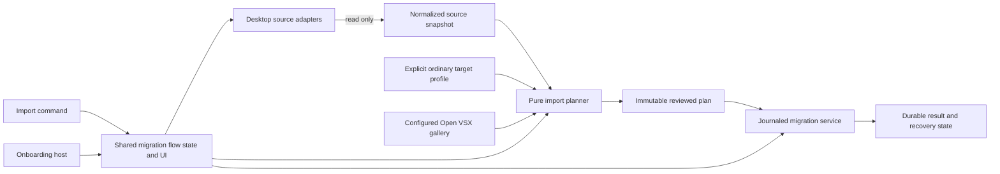

# Hucode editor migration architecture and implementation plan

Status: proposed

Tracks: [#200](https://github.com/jimeh/hucode/issues/200),
[#201](https://github.com/jimeh/hucode/issues/201),
[#202](https://github.com/jimeh/hucode/issues/202), and
[#203](https://github.com/jimeh/hucode/issues/203)

This plan turns the migration portion of the
[first-launch onboarding plan](onboarding-plan.md) into an implementation-ready
architecture. It covers the reusable migration system first. The full-window
onboarding host and first-launch routing remain in issues
[#204](https://github.com/jimeh/hucode/issues/204) and
[#205](https://github.com/jimeh/hucode/issues/205).

## Decision

Build migration as four Hucode-owned layers:

1. Desktop source adapters discover and read supported editors without writing
   to them.
2. Common contracts normalize source data so later layers do not know editor
   paths or storage formats.
3. A pure planner combines one source snapshot, one explicit ordinary target
   profile, user choices, product configuration, and gallery results into an
   immutable reviewed plan.
4. A journaled migration service applies only that accepted plan, records
   progress before moving between safe boundaries, and produces a durable
   result.

The standalone import command and full-window onboarding use the same migration
flow state and UI components. Neither host owns migration policy.



This shape keeps the filesystem and editor-specific formats at the desktop
boundary. It also keeps planning deterministic and makes Apply the only layer
allowed to change Hucode profile data.

## Scope

The first desktop release supports these automatic source adapters:

- Visual Studio Code stable;
- Visual Studio Code Insiders;
- Cursor stable.

It imports these categories:

- settings, including appearance settings;
- keybindings;
- extensions;
- snippets.

It can target Default, an existing named ordinary profile, or one newly created
ordinary profile. It never targets the Omni shell's internal profile.

The following work remains outside this plan:

- serve-web source and target contracts;
- custom or portable user-data directory discovery, including source-editor
  `--user-data-dir`, `--extensions-dir`, `VSCODE_APPDATA`,
  `VSCODE_EXTENSIONS`, and `VSCODE_PORTABLE` overrides;
- editors other than the initial three;
- tasks, recent workspaces, workspace history, MCP configuration, accounts,
  authentication state, telemetry identity, extension global state, and opaque
  databases;
- importing several target profiles in one operation;
- Settings Sync orchestration.

Explicit `.code-profile` selection remains a separate source adapter used by
the shared flow. It does not weaken the automatic desktop discovery contract.

## Current constraints

### Profile ownership

The Omni shell runs with a stable internal profile. Hosted workbenches use
ordinary workspace-profile associations and can switch independently. Every
migration must therefore name its target profile. No service may infer the
target from the current window or active shell profile.

Onboarding state and migration state also have different owners:

- onboarding navigation and completion belong to the Hucode user-data
  installation;
- reviewed plans, snapshots, progress, and results belong to a migration
  operation and its explicit target profile.

### Upstream profile code

The upstream profile services contain useful parsers, serializers, profile
resource resolution, and gallery integration. They are not a safe migration
engine as a whole.

In particular:

- `IExtensionsProfileScannerService` can rewrite a legacy extension manifest
  while scanning it;
- `ExtensionsResource.apply` calculates extensions to uninstall when they are
  absent from the incoming profile;
- settings and keybindings import paths use replacement-oriented category
  semantics rather than Hucode's preserve-by-default merge contract.

Hucode may extract or call functions that are demonstrably pure. Discovery must
not call a scanner that can write, and Apply must not call replacement behavior.

### Process boundary and cancellation

Local source discovery belongs in desktop Node code behind an Electron-main
channel. The renderer should not receive a general local filesystem service.
`ProxyChannel` cannot transport a `CancellationToken`, but the lower-level
`IChannel.call` and `IServerChannel.call` protocol already forwards a
per-request token and sends cancellation when the caller's token fires.

The source client and server must therefore use a small hand-written channel
instead of `ProxyChannel`. Cancellation must settle both active and queued
requests. Do not use the shared `Limiter` or `Queue` implementations for work
whose returned promises must settle when canceled or disposed.

## Domain model

The common layer owns the following terms.

### Source adapter

A source adapter identifies one product and channel. It owns candidate roots,
catalog parsing, resource resolution, normalization rules, and diagnostics for
that source format.

An adapter is not a general plugin system. The initial adapters are registered
in code. Later editor or serve-web sources can implement the same common
contract without making adapter loading dynamic.

### Source profile reference

A source profile reference is an opaque, local identifier returned by
discovery. It identifies an adapter, canonical source installation, and profile.
Callers may compare and retain it during one flow, but they cannot derive file
locations from it.

The service may reject a stale reference after Refresh or restart. Durable
migration state stores a non-sensitive source fingerprint, not a promise that a
filesystem path will remain available forever.

### Source descriptor

A source descriptor contains only the information needed to select a source:

- product and channel identity;
- Default or named-profile identity and display name;
- available categories and summary counts;
- local path details for the selection UI;
- structured diagnostics;
- ranking evidence and final deterministic order;
- the opaque source profile reference.

It does not contain complete settings, keybindings, snippet contents, or raw
extension manifests.

### Source snapshot

A source snapshot contains the normalized contents read for selected categories
and a versioned fingerprint of the exact inputs. The reader computes each hash
from the same bytes it parses. It does not hash one read and parse another.

The aggregate fingerprint includes:

- adapter and schema version;
- a digest of each canonical logical resource identity, never the raw path;
- a present, absent, or unreadable state for each requested resource;
- content hashes for readable files;
- sorted relative names and content hashes for accepted snippet files.

Modification times may support ranking, but they are not sufficient for plan
validity.

### Reviewed plan

A reviewed plan is an immutable, versioned, serializable value owned by the
planner. It contains the source, target, user-choice, policy, and reviewed
gallery-selection fingerprints needed to prove that Apply is executing what the
user accepted.

It also contains the chosen operation for each setting, keybinding, snippet,
and extension. Apply does not make a new conflict choice or choose a different
extension release.

### Migration operation

A migration operation is the durable execution record for one accepted plan.
It persists the full reviewed plan, its fingerprint, category boundaries,
snapshots, item results, cancellation, recovery, and final acknowledgement. The
plan contents remain local user data and never enter telemetry. The operation
can Resume after a restart without rereading the source or re-planning.

The first release admits only one mutating migration operation per Hucode
user-data installation at a time. Discovery and planning remain concurrent and
read-only.

This single-writer rule prevents two windows from interleaving profile files,
extension installs, or recovery records. A later release can relax it only
after proving that every shared target and extension-management dependency can
be isolated safely.

## Component ownership

Use Hucode-owned modules and keep upstream integration points thin. The paths
below define ownership roots, not a requirement to create every file in the
first change.

| Owner | Proposed root | Responsibility |
| --- | --- | --- |
| Common migration contracts | `src/vs/hucode/common/migration/` | Source, plan, operation, result, diagnostic, and fingerprint types |
| Pure migration logic | `src/vs/hucode/common/migration/` | Ranking, normalization helpers, filtering, conflict planning, fingerprints, and state transitions |
| Desktop discovery | `src/vs/hucode/node/migration/` | Read-only filesystem boundary, adapter registry, source discovery, source snapshots, and source verification |
| Desktop authority | `src/vs/hucode/electron-main/migration/` | Cancellation-aware source channel, service registration, and installation-wide writer lease |
| Desktop source client | `src/vs/hucode/electron-browser/migration/` | Hand-written IPC client, protocol cancellation, generation checks, and URI revival |
| Migration application | `src/vs/hucode/browser/migration/` plus narrow platform integrations | Explicit-target Apply, snapshots, extension installation, operation persistence, recovery, and results |
| Shared flow | `src/vs/hucode/browser/migration/` | Discover, Review, Apply, Results state and reusable UI components |
| Hosts | command and onboarding contributions | Invocation framing, navigation entry and exit, and Omni handoff only |

If VS Code layer rules reject a dependency from `src/vs/hucode/`, add a clearly
named `hucode*` companion beside the upstream integration point. Keep policy and
state transitions in Hucode-owned modules.

## Source service contract

The common caller-facing contract should stay small:

```ts
interface IEditorMigrationSourceService {
	discoverSources(
		options: EditorMigrationDiscoveryOptions,
		token: CancellationToken,
	): Promise<EditorMigrationDiscoveryResult>;

	readSourceProfile(
		ref: EditorMigrationSourceProfileRef,
		categories: readonly EditorMigrationCategory[],
		token: CancellationToken,
	): Promise<EditorMigrationSourceSnapshot>;

	verifySourceSnapshot(
		ref: EditorMigrationSourceProfileRef,
		fingerprint: EditorMigrationSourceFingerprint,
		token: CancellationToken,
	): Promise<EditorMigrationSourceVerification>;
}
```

The Electron client passes its token to `IChannel.call`; the hand-written server
uses the token supplied to `IServerChannel.call`. IPC's internal request ID and
cancel message remain transport details and do not leak into common domain
types.

Every method returns structured diagnostics for expected source failures.
Programmer errors and an unavailable discovery service may reject the call.
One unreadable candidate must not reject discovery for other candidates.

## Issue #200: read-only source discovery

Issue #200 establishes the first architecture boundary. It must land without a
target-profile dependency, gallery lookup, migration operation store, or UI
policy.

### Narrow filesystem capability

Adapters receive a read-only capability with only the operations they need:

```ts
interface IEditorMigrationSourceFileSystem {
	realpath(resource: URI, token: CancellationToken): Promise<URI>;
	stat(resource: URI, token: CancellationToken): Promise<SourceFileStat>;
	readDirectory(resource: URI, token: CancellationToken): Promise<readonly SourceDirectoryEntry[]>;
	readFile(resource: URI, limits: SourceReadLimits, token: CancellationToken): Promise<VSBuffer>;
}
```

The production implementation wraps the local file provider. It collects a
bounded `readFileStream` so cancellation reaches active disk reads; the
provider's ordinary `readFile` method has no cancellation token. Tests use a
fake that can model missing files, permission errors, partial reads, cancellation,
symlinks, case differences, and files changing during discovery. The interface
has no write, create, copy, rename, or delete operation.

Readers must bound individual file reads and directory entry counts. Oversized
or unstable resources become diagnostics rather than unbounded memory or work.
Choose the concrete limits from current real fixtures and record them beside the
reader constants.

### Candidate roots

The initial automatic candidates use the conventional product directories
below. Each adapter expands them through platform-specific home, application
data, and XDG services rather than concatenating environment variables in UI
code.

| Adapter | Channel | User-data product directory | Extension root |
| --- | --- | --- | --- |
| `vscode` | stable | `Code` | `.vscode/extensions` |
| `vscode-insiders` | insiders | `Code - Insiders` | `.vscode-insiders/extensions` |
| `cursor` | stable | `Cursor` | `.cursor/extensions` |

For the default desktop layouts, the product directory expands under:

- macOS: `~/Library/Application Support/<product>/User`;
- Linux: `${XDG_CONFIG_HOME:-~/.config}/<product>/User`;
- Windows: `%APPDATA%\<product>\User`.

The extension roots expand from the user's home directory. These are candidate
locations, not proof of a usable source. A readable known resource is the
primary signal. An application binary may confirm product identity but cannot
make an otherwise empty source usable.

Custom and portable roots, environment or CLI extension-root overrides, Snap,
and Flatpak locations need concrete fixtures and separate product decisions.
They are not silently guessed in the first adapter set.

### Profile catalog and resources

Default does not depend on the named-profile catalog. An adapter evaluates its
known Default resources even when application state is absent or malformed.

Named profiles require a strict reader for the known `userDataProfiles` entry
in `User/globalStorage/storage.json`. It does not inspect other state keys.

For each entry, the reader requires a non-empty string `name` and one of these
known location forms:

- a single relative path segment, with that segment becoming the profile ID;
- a legacy file `UriDto` that resolves to a direct child of `User/profiles/`,
  with the final path segment becoming the profile ID.

Skip `builtin` and anything below it. Those entries are editor-owned system
profiles, not user migration sources. Accept an optional string `icon` and an
optional `useDefaultFlags` object containing booleans for the known
`ProfileResourceType` keys. Ignore unknown top-level metadata after the required
fields validate, but reject an entry with an unknown inheritance flag because
that flag could change resource ownership.

An invalid entry produces a diagnostic and does not hide other valid named
profiles. An unfamiliar catalog container hides all named profiles and produces
a catalog diagnostic. Default remains independently available in both cases.
The reader honors `useDefaultFlags` by pointing inherited categories back to
Default.

The first readers inspect only these logical resources:

| Category | Default | Named profile |
| --- | --- | --- |
| Settings | `User/settings.json` | `User/profiles/<id>/settings.json`, unless inherited |
| Keybindings | `User/keybindings.json` | `User/profiles/<id>/keybindings.json`, unless inherited |
| Snippets | `User/snippets/` | `User/profiles/<id>/snippets/`, unless inherited |
| Extensions | `<extension-root>/extensions.json`, with read-only fallback to legacy `User/extensions.json` only when the primary is absent | `User/profiles/<id>/extensions.json`, unless inherited |

Settings and keybindings use JSON with comments parsing. Snippet discovery reads
only direct `*.json` language snippets and `*.code-snippets` global snippets. It
never descends through arbitrary directories. Extension discovery accepts the
required string fields `identifier.id` and `version`, plus optional
`identifier.uuid`, `metadata.preRelease`, and `metadata.hasPreReleaseVersion`.
It ignores `location` and `relativeLocation` because migration never reads the
installed extension directory. An unreadable or malformed primary manifest is a
diagnostic, not a reason to consult the legacy file. If both files exist, the
primary wins and their contents are never merged. Discovery never migrates or
deletes the legacy manifest.

Cursor keeps a separate adapter and fixtures even where its current layout
matches VS Code. Shared Code-family helpers may remove mechanical duplication,
but a schema or filter change in Cursor must not silently change the VS Code
adapter.

### Symlinks, aliases, and identity

Resolve candidate roots and logical resources to canonical identities for
deduplication. Preserve the logical path for user-facing source details. Compare
paths with the current platform's case semantics and emit one descriptor when
several candidates reach the same installation or profile.

Do not use symlink traversal to discover additional files. A symlink encountered
at a known logical resource may be read as that resource, but it must not cause
directory traversal outside the resource shape. Record a digest of the canonical
identity in the source fingerprint so an alias change invalidates Review without
persisting the source path.

### Diagnostics

Diagnostics are values, not prose assembled by adapters. Each diagnostic has a
stable code, severity, source scope, optional category, and local display
details. Initial codes must distinguish at least:

- candidate absent;
- permission denied or locked;
- malformed known resource;
- unsupported named-profile catalog schema;
- source changed during read;
- oversized resource;
- duplicate alias;
- canceled operation.

The UI may show local paths needed to explain or recover a source. Telemetry
must not contain paths, usernames, settings, keybindings, extension IDs, snippet
contents, or raw operating-system error strings.

### Ranking

Rank usable descriptors with an explicit lexicographic tuple:

1. resource completeness for the supported categories;
2. the newest trustworthy modification evidence from successfully read
   user-owned resources;
3. stable-channel preference;
4. registered adapter order, normalized profile name, and canonical reference
   as deterministic tie-breakers.

Return the tuple and evidence with the descriptor. UI copy may say "modified"
and name the evidence. It must not turn a file modification time into "last
used" or "recently opened".

Discovery output order must not depend on filesystem enumeration or asynchronous
completion order.

### Cancellation and lifecycle

The renderer passes its token to the hand-written channel call. IPC sends its
built-in promise-cancel message when that token fires, and the server receives
the corresponding protocol-owned token.

Adapters check cancellation before starting each read, after filesystem calls,
and inside bounded directory processing. Queued work must reject with a
consistent cancellation result. Service disposal rejects pending work and
waits only for already admitted reads that the underlying provider cannot abort.

Back navigation retains the last completed discovery result. Refresh cancels
the current run, starts a new generation, and ignores late results from the old
generation.

### #200 delivery steps

1. Add common source, diagnostic, ranking, and fingerprint contracts with pure
   tests for deterministic ordering and aggregation.
2. Add the narrow read-only filesystem wrapper and fixture builder. Prove that
   adapters cannot request a write through their dependency.
3. Implement Default resource discovery for VS Code stable and Insiders across
   the three operating-system layouts.
4. Implement strict named-profile catalog parsing and `useDefaultFlags`
   resolution. Keep Default available when the catalog fails.
5. Add the Cursor adapter from captured stable fixtures. Share only layout code
   proven identical by those fixtures.
6. Add canonical deduplication, partial-source diagnostics, bounded reads,
   deterministic ranking, and snapshot fingerprints.
7. Add the hand-written cancellation-aware Electron-main channel and desktop
   client, then register the service only in the Hucode desktop composition
   roots. Keep adapters and their main test suite in the Node layer.
8. Exercise the real desktop service against temporary fixture directories and
   verify that discovery performs no write or process launch.

Issue #200 is complete when its service can support a future source picker, but
it does not add that picker.

## Issue #201: pure selective planning

The planner consumes one source snapshot, one explicit target profile snapshot,
selected categories, conflict choices, Hucode product configuration, and gallery
responses. It returns an immutable plan and performs no target write or
extension installation.

The planner owns:

- target-profile eligibility, including rejection of internal and transient
  profiles;
- source-specific and Hucode-specific settings filters with a named reason for
  every exclusion;
- preserve-by-default settings decisions;
- observable keybinding conflict detection, with normalized
  `key + command + when + args` identity for idempotent entry matching;
- snippet filename collision decisions;
- extension classification and the exact compatible Open VSX release;
- source, target, choice, policy, and reviewed gallery-selection fingerprints;
- snapshot requirements and category ordering for Apply.

The planner must receive gallery results as input through a controlled adapter.
Pure tests should not call a live gallery. A reviewed gallery selection records
the exact extension ID, version, target platform, and compatibility evidence.
Its fingerprint covers those coordinates and decisions, not the gallery's whole
query response.

Before admission, the flow resolves those exact coordinates again. If one no
longer validates, the flow returns to Review. After admission, Apply and Resume
resolve only the persisted exact coordinates. An exact release that later
becomes unavailable produces that extension's `unavailable` result. Apply never
substitutes another version.

Before accepting a plan, the flow validates the chosen target again. Before
admitting Apply, the migration service verifies the source, target, choices,
policy, and exact gallery selections. Any material change returns the user to
Review with an explanation.

## Issue #202: journaled Apply and recovery

Apply is the sole owner of migration writes. It admits one operation for one
explicit ordinary target profile and follows this order:

1. acquire the installation-wide migration writer lease;
2. verify source, target, choice, policy, and exact gallery selections;
3. persist the admitted operation, full versioned reviewed plan, and plan
   fingerprint;
4. snapshot every selected file-backed target resource;
5. revalidate a category's target input immediately before its write;
6. atomically write settings, keybindings, and snippets where the provider
   supports replacement through a temporary sibling;
7. persist each category result before moving to the next category;
8. resolve and install only the persisted exact extension coordinates,
   additively;
9. persist every extension outcome and the final operation result;
10. release the writer lease after durable final or recoverable state exists.

File-backed categories are idempotent and eligible for rollback to their
pre-operation snapshots. Successfully installed extensions remain installed.
Rollback does not uninstall them because doing so could remove an extension the
user or another window now depends on.

Each successful file write records its post-apply hash. Automatic rollback may
restore a category only when the current hash still matches that value. A
changed target is `drifted`; the UI must preserve it by default. An explicit
force rollback first snapshots the drifted value, then restores the original
pre-operation snapshot.

Cancellation before admission leaves no operation. Cancellation after admission
stops at a recorded safe boundary. A crash or restart reconstructs the next
valid action from durable state rather than guessing from target contents.

Version the operation record from its first release. An unsupported newer
record must stay untouched and produce a recovery diagnostic instead of being
silently reset.

Electron main owns the writer lease and binds it to the trusted IPC connection
and requesting window, not the caller-supplied context string used by the
generic main-process channel. Use a dedicated least-authority MessagePort
acceptor that validates the Omni shell, binds the lease to its
`webContents.id`, and releases it when that port generation or window closes or
crashes. The read-only discovery channel in issue #200 does not need this
authority. The lease is not durable; recovery must acquire a new lease before
continuing a durable operation.

Store each operation under the installation-scoped logical root
`<user-data-dir>/User/hucode/migration/operations/<operation-id>/`, outside every
ordinary and internal profile. Keep the versioned operation and reviewed plan
in an atomically replaced record. Store target snapshots and any later
drift-protection snapshot as separate files in the same operation directory.
Use the user-data directory's normal local access protections, and remove the
directory only after final acknowledgement or completed rollback leaves no
recoverable work.

## Issues #203 through #205: shared flow and hosts

Issue #203 adds the first complete user-facing consumer. Shared flow state owns
source selection, target selection, category choices, review validity,
progress, recovery, and results. The command owns only invocation and exit.
The first release registers and presents this command in the desktop Omni shell.
Hosted workbench Command Palettes do not host a second migration flow.

Issue #204 embeds the same flow in full-window onboarding. The onboarding host
adds Start Fresh, Omni teaching, compact-list preview, installation-scoped
navigation, and the final Omni handoff. It calls migration services directly
instead of executing the command.

Issue #205 changes startup routing only after the command and manually opened
onboarding have independent automated and runtime evidence. It must not add new
migration behavior.

## Alternatives considered

### Recommended: desktop Node adapters behind a main-process channel

This option keeps local filesystem knowledge in one desktop owner, gives the
renderer a small cancellable service, and lets the planner and UI test against
the same normalized values they use in production. It costs a hand-written IPC
channel and explicit DTO maintenance.

That cost is justified because cancellation, privacy, and editor-format changes
are part of the source boundary rather than UI concerns.

### Rejected: discover directly in the workbench renderer

This would reduce initial IPC wiring. It would also mix local path rules,
filesystem errors, UI lifecycle, and source parsing in the renderer. Future
hosts would either repeat that knowledge or depend on a renderer-specific
service. A general filesystem dependency would make the read-only guarantee
harder to inspect.

### Rejected: drive migration through upstream profile import/export

This would reuse more existing UI and resource classes, but those classes own
replacement-oriented behavior and assume a Hucode or VS Code profile payload
has already been selected. They do not own cross-editor discovery, strict source
catalog validation, preserve-by-default conflict planning, exact gallery review,
or durable recovery.

Use their pure parsing and serialization pieces where they fit. Do not make
their import operation the architecture boundary.

## Verification strategy

### Issue #200 automated evidence

Use synthetic fixture trees that encode schemas observed from real current
installations. Do not commit personal editor data.

The fixture matrix must cover:

- Visual Studio Code, Visual Studio Code Insiders, and Cursor;
- macOS, Linux with default and explicit `XDG_CONFIG_HOME`, and Windows;
- Default and named profiles;
- every supported `useDefaultFlags` inheritance path;
- missing, empty, malformed, oversized, locked, and changing resources;
- valid Default with an invalid named-profile catalog;
- symlinked roots, duplicate aliases, case differences, and overlapping
  candidates;
- deterministic ranking under reversed enumeration, plus reversed completion
  order once discovery admits concurrent reads;
- cancellation before admission, while queued, during a read, and during
  directory processing;
- settings and keybindings JSON with comments;
- snippets with accepted files, ignored entries, and forbidden recursion;
- extension manifests without extension-directory traversal.

Keep production discovery behind the narrow read-only filesystem capability.
Scoped ESLint restrictions must reject direct `fs` imports, `fs/promises`
operations other than the native wrapper's bounded `opendir`, and
`child_process` imports in source-discovery modules. This static rule guards the
escape paths that an injected runtime spy cannot observe. If a future design
adds an injected mutation or process-launch capability, add a behavioral spy for
that capability before production code may use it.

New behavioral tests must first fail at the intended assertion. Test output
must confirm that the new cases ran. Add new Hucode suites to the generated test
suite snapshot rather than hand-editing CI suite lists.

### Later issues

Issue #201 uses pure fixture-driven tests for filters, conflicts, target
eligibility, gallery classification, fingerprint invalidation, and deterministic
plans.

Issue #202 tests every persistence boundary, idempotent retry, target drift,
safe-boundary cancellation, partial extension failure, restart recovery, and
file rollback. Tests cover automatic rollback refusal after post-apply drift and
the explicitly confirmed force path. One representative fault injection must
exist after each durable step.

Issue #203 adds desktop runtime evidence for a mixed real source and non-empty
target. Issues #204 and #205 add keyboard, focus, accessibility, theme, window
size, crash-resume, and final Omni handoff evidence as specified by the
onboarding plan.

For every implementation issue, run focused Node or Electron tests while
working. Before delivery, run the relevant Hucode compile and type checks,
generated suite check, changed-file hygiene, and the desktop smoke coverage
justified by the changed services.

### Documentation-only validation for this plan

For changes to this document, verify Markdown links and fences, run
`git diff --check`, and run the repository precommit path for the changed docs.
The current precommit path reports that Markdown has no eligible files, so the
direct Markdown validation is the evidence for a Markdown-only change.

## Compatibility and rollback

Issue #200 adds no persistent state and can be disabled by removing its service
registration. Its DTOs should carry an explicit schema version before another
process or durable record depends on them.

Issue #201 adds immutable values only. Issue #202 is the first persistence
boundary and must version the persisted full plan, operation record, and
snapshots. It retains sensitive plan contents only through final acknowledgement
or recovery and protects them like other local user data. A Hucode downgrade may
ignore newer operation records, but it must not delete them or claim recovery
succeeded.

First-launch activation remains last. If startup routing causes a regression,
Hucode can disable automatic onboarding while keeping the independently proven
import command and operation recovery available.

## Risks and mitigations

| Risk | Consequence | Mitigation |
| --- | --- | --- |
| Cursor changes a VS Code-derived storage shape | Named profiles disappear or parse incorrectly | Keep a separate adapter and versioned fixtures; degrade to Default plus diagnostics |
| A source editor writes while Hucode reads | Review describes mixed or stale inputs | Hash parsed bytes, report unstable reads, and verify the aggregate fingerprint before Apply |
| Two windows start Apply | Interleaved files or misleading recovery state | Use a main-process lease bound to the trusted window connection |
| `ProxyChannel` drops cancellation | Closed UI leaves filesystem work running | Use a hand-written channel that forwards IPC's protocol token plus client generation checks |
| Existing scanners migrate source data | Discovery violates its primary safety claim | Expose only the narrow read-only filesystem capability and use dedicated parsers |
| Gallery output changes after Review | A different extension release is installed | Persist exact coordinates; return to Review before admission or report unavailable after admission |
| Rollback follows later target edits | Recovery overwrites user work | Compare the post-apply hash and require a separately snapshotted force rollback after drift |
| Diagnostic data reaches telemetry | Local paths or profile contents leak | Separate local display details from telemetry-safe codes and never emit source values |

## Implementation evidence still required

The architecture and issue boundaries are ready. Implementation must gather and
record these facts before the corresponding adapter or transport code is
accepted:

- sanitized schema fixtures from current stable Cursor on macOS, Linux, and
  Windows, including named profiles when supported;
- concrete read and directory limits based on current real profile sizes and
  existing VS Code limits where available;
- confirmation through the layering lint and a focused Node test that the new
  `src/vs/hucode/node/migration/` modules stay in the Node runner.

If those checks contradict this plan, update the adapter or transport section
before layering exceptions into the implementation.
