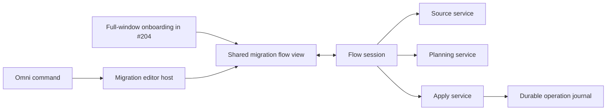

# Hucode reusable editor setup import command plan

Status: approved for implementation

Tracks: [#203](https://github.com/jimeh/hucode/issues/203), under the
[settings import and onboarding epic](https://github.com/jimeh/hucode/issues/192)

Loose UX reference: [index-and-detail prototype, variant B](https://plans.jimeh.dev/45vwijp5itxmrvuli6stxlk6py/index.html?variant=b&phase=review).
Variant B is the selected direction. The prototype remains a loose visual and
interaction reference rather than production code: it illustrates the intended
hierarchy and language, while the contracts in this plan and the existing
workbench conventions remain authoritative.

Presentation revision: the
[setup UI webview plan](setup-ui-webview-plan.md) replaces this document's DOM
renderer, visual styling, component location, and renderer testing decisions.
The migration behavior and safety contracts below remain authoritative.

This document plans the first complete user-facing consumer of Hucode's editor
migration services. It starts from the source discovery, selective planning,
and journaled Apply contracts delivered by issues
[#200](https://github.com/jimeh/hucode/issues/200),
[#201](https://github.com/jimeh/hucode/issues/201), and
[#202](https://github.com/jimeh/hucode/issues/202).

## Outcome

Add **Hucode: Import Setup from Another Editor...** to the desktop Omni shell.
The command asks for a source application, then one of its profiles. It guides
the user through an explicit target, category and difference review, publisher
confirmation, Apply progress, results, and recovery. It remains safe to close
or rerun and does not infer a target from the current Omni window.

The implementation is ready when it provides:

1. a complete Discover, Review, Apply, and Results path for Visual Studio Code,
   Visual Studio Code Insiders, and Cursor profiles;
2. a shared flow session and isolated renderer components that full-window
   onboarding can embed without executing the command;
3. observable progress tied only to durable Apply checkpoints;
4. usable resume, retry, rollback, rerun, acknowledgement, and report-copy
   actions; and
5. automated and real desktop evidence for a mixed source and non-empty target.

## Scope and settled constraints

- Register and present the command only in the desktop Omni shell. A hosted
  workbench Command Palette must not create a second migration host.
- Keep the Omni shell on the application Default profile. Preselect Hucode's
  Default profile as the migration target, while allowing the user to choose an
  existing ordinary named profile or propose a new ordinary profile. Advancing
  from the target step confirms the visible selection; the current Omni window
  never supplies it implicitly.
- Keep discovery and planning read-only. Closing before Apply admission creates
  no profile, journal, or target write.
- Keep the selected source, source snapshot, target snapshot, draft, and choices
  in memory before admission. Back restores them. Only Refresh repeats source
  discovery.
- Apply creates a proposed profile only after it has durably admitted the
  reviewed plan.
- Treat Default as the normal target and do not show an Omni-specific warning.
  The reviewed target name and selected categories provide the useful context.
- Confirm the exact publisher set in the migration flow. Do not open the
  workbench's publisher-trust or Settings Sync dialogs, and do not update the
  global trusted-publisher store.
- Keep extension installation additive and exact to the reviewed Open VSX
  coordinates. Results must disclose application-scoped placement and any
  reload or extension-host restart needed before the target reflects changes.
- Treat settings, keybindings, and snippets as rollback-eligible file
  categories. Installed extensions and extension ownership remain forward-only.
- Keep accounts, authentication state, Settings Sync, source-editor global
  state, workspace history, opaque databases, tasks, serve-web migration, and
  automatic onboarding activation out of this issue.
- Leave explicit `.code-profile` selection to issue #204's separate source
  adapter. Issue #203 must not weaken the automatic desktop discovery contract
  to add it implicitly.

## Recommended architecture

Open the command through the upstream modal editor support already composed into
Omni, but keep the flow below the editor host:



The command contribution opens one `EditorMigrationEditorInput` in
`MODAL_GROUP`. `EditorMigrationEditorPane` creates the shared view and attaches
it to a flow session. Give the input `Singleton` and `RequiresModal`
capabilities, make its serializer return `canSerialize(): false`, and implement
`matches()` so reinvoking the command reveals the existing input instead of
starting a competing session. The image-carousel input and serializer are the
closest modal precedent; `PreferencesEditorInput.matches()` is the simple
singleton-reveal precedent. Hucode does not currently own a custom editor input
or pane, so this host is new code built on established workbench machinery.

The editor input is not serialized. Closing before admission discards only
in-memory choices. Closing during Apply requests cancellation and detaches the
view, while the flow session remains alive until Apply records the next safe
boundary. Reopening the command reattaches to that session or loads its durable
operation. A renderer or app restart reconstructs recovery from
`listRecoverableOperations()`.

`EditorMigrationFlowSession` owns orchestration and immutable view state. It
does not duplicate discovery, planning, extension, or Apply policy. The shared
DOM view renders that state and sends user intents back to the session. The
standalone editor and later onboarding host may supply different framing and
exit controls, but they use the same migration steps and result components.

### Why a modal editor host

The Omni workbench already opens editors through `MODAL_GROUP`, keeps native
window controls available, and restores shell content when the editor closes.
That gives the standalone command an established host without adding a new
window or a second shell layout mode.

A Quick Input wizard is rejected. It provides useful pickers, but a long-lived
review with a persistent section index, category summaries, side-by-side
conflicts, publisher confirmation, progress, recovery, and a large extension
plan would be hard to inspect. Quick Input widgets also cannot become the shared
embedded UI that issue #204 requires.

A separate `BrowserWindow` is also rejected. It would need another trusted
profile, command, gallery, extension-management, and writer-lease composition
and would complicate ownership and recovery without improving the flow.

## Flow state and invalidation

Use one explicit state machine. Async work carries a monotonically increasing
generation so results from a canceled discovery, target inspection, or draft
build cannot overwrite newer user choices.

| Phase | Owned state | Forward action | Back and close behavior |
| --- | --- | --- | --- |
| Recovery | Durable operation summaries and selected operation | Resume, Retry, View results, Roll back, or Start another import | Close preserves journals |
| Discover | Discovery generation, descriptors, diagnostics, selected application, and selected source profile | Select an application, then one of its profiles | Changing the application clears its profile selection; Refresh cancels and replaces discovery; close writes nothing |
| Target | Source snapshot and explicit target selection | Inspect Default, a named profile, or a proposed profile | Back reuses discovery and source data |
| Review | Target snapshot, draft, category choices, conflict choices, filters | Accept one immutable reviewed plan | Back preserves choices; a source or target change invalidates downstream state |
| Publishers | Reviewed plan and exact publisher groups | Confirm publishers and request Apply authorization | Back discards authorization and returns to Review |
| Apply | Operation ID, durable revision, stage, results, and cancellation state | Continue until a durable final or recoverable result | Close requests safe-boundary cancellation and detaches |
| Results | Full operation, aggregate outcome, item outcomes, and eligible actions | Retry, Resume, Roll back, Copy report, Import again, or Done | Close preserves unacknowledged recovery data |

Changing the source application clears the selected source profile and all
downstream state. Changing the source profile invalidates the source snapshot,
target snapshot, draft, reviewed plan, and authorization. Changing the target
invalidates the target snapshot and everything after it. Category and decision
changes keep the draft but replace the reviewed plan and authorization. Back
never reuses a reviewed plan after one of its fingerprinted inputs changed.

## Discover and target selection

On entry, load recoverable operations before starting automatic discovery. If
any exist, show them first without preventing a new read-only flow. Unsupported
or corrupt operation schemas remain visible as local recovery diagnostics and
are never acknowledged or deleted by this version.

Make `listRecoverableOperations()` safe under writer contention. It currently
tries to delete acknowledged records while holding the installation-wide lease,
so a stray acknowledged journal can make the entry read fail when another Omni
window is applying. Listing must omit acknowledged records and treat cleanup as
best effort. Lease contention may defer garbage collection, but it must not hide
other recovery records or prevent a new read-only review flow.

Automatic discovery uses the source service's deterministic order, then groups
descriptors by application and channel. The first page asks which application
to import from. The second page shows only that application's profiles and
preselects its Default profile when discovery found one; if it did not, the user
must choose a profile. Each profile row shows the profile name, category
availability and counts, and accurate modification evidence. Paths and detailed
diagnostics stay behind a details disclosure rather than dominating the picker.
Both lists use virtualized rows with stable identity and size themselves to
their item count; a filter appears only when a list is long enough to need one.
Refresh explicitly cancels the current generation and reruns discovery without
changing the grouping rules.

After source selection, read all present supported categories once. This keeps
category toggles and Back local to the flow instead of repeating filesystem
reads. Unreadable categories remain visible with their diagnostics but cannot be
selected.

The target picker reads `IUserDataProfilesService.profiles`, includes Default
and ordinary named profiles, and excludes internal and transient profiles.
Preselect Default using the normal `{ kind: 'existing', profileId }` selection
shape. Every choice still passes through `inspectTarget()` so the planner
remains the eligibility authority. A proposed target stays a name and options
object. Proposed-name availability is synchronous inside the target reader,
while the surrounding async inspection still uses a generation so stale
results cannot replace a newer selection. Inspection never creates the profile.

## Review

Build the draft from current source, target, registry, keybinding, and gallery
evidence. Review uses the persistent section index and detail pane described
under [Presentation shell](#presentation-shell). Its topics are the four import
categories plus a dedicated **Not imported** topic. Review opens on the first
topic needing attention, and otherwise on Settings.

Each category topic carries, in its own detail header and body:

- that category's inclusion checkbox, planned count, available count, and
  differing count;
- its target ownership, including materialization from Default;
- its preserve-by-default differences as compact comparison rows, presented
  before anything routine, naming both the current and the imported value;
- its actionable planner warnings aggregated by warning code with a count, so a
  cause such as a pre-release fallback is stated once instead of once per
  extension; and
- its routine additions collapsed into a summary disclosure instead of rendered
  as rows.

The **Not imported** topic groups held-back items by reason and states each
reason once with its count. A deselected category contributes one whole-category
group holding its full source item count, and its per-reason exclusion groups
are then not shown as well, because that whole-category count already contains
them. Still-selected categories contribute only their per-reason exclusion
groups. The same rule drives the held-back count shown in the index and footer.
The footer separately reports items ready to import, current values kept by the
review choices, and items held back, so changing an individual or bulk conflict
choice immediately produces reconcilable counts.

Review never renders hundreds of new settings, shortcut additions, planned
extension installs, or raw plan values by default. Item names appear inside
collapsed disclosures, truncated with an explicit remainder count so a
disclosure never becomes a second scroll region. Exact extension version,
channel fallback, target-platform decisions, and every individual exclusion stay
available through the reviewed plan and the copied report. A filter appears
above a category's comparison rows only when there are enough of them to need
one, and filtering never changes the accepted choices. The internal
`defaultProfileBacksOmni` notice is never rendered.

Additions follow the planner's import default. Present setting conflicts to the
user as differences from their current values. Each row offers a keep-current
and a use-imported choice; the visible labels stay compact while each control's
accessible name states the choice, the value, and the setting. Add **Keep all
current values** and **Use imported values for all** actions that fill the
choice for every differing setting in the selected Settings category, including
rows hidden by the current filter. Excluded
settings remain excluded. The user may change an individual row after either
bulk action. Keybinding and snippet differences continue to use their
resource-specific review. Every selected difference needs a choice before
`acceptDraft()`.

These bulk actions populate the planner's existing stable per-item choice IDs;
they do not introduce a new plan choice or bypass `preserveTarget` and
`useSource` validation. The UI does not invent per-item extension selection
because the reviewed-plan contract selects extensions by category and exact
compatibility outcome.

Before leaving Review, call `acceptDraft()` and then `verifyPlan()`. Do not
render `defaultProfileBacksOmni`; Default is the intended normal target. A
changed or unavailable input leaves the user in Review, explains the stable
drift reasons, and offers a rebuild from current evidence. It never silently
accepts different target contents or gallery coordinates.

## Publisher confirmation

Derive publishers with `editorMigrationPublishers(reviewedPlan)` and group the
exact planned extensions beneath each publisher. Require one explicit
confirmation for the complete set. Plans with no third-party publishers still
obtain an empty-set authorization immediately before Apply, preserving the
single-use authorization contract without showing a pointless trust page.

Call `createApplyAuthorization()` only after confirmation and call `apply()`
immediately afterward. Going Back, changing a choice, authorization expiry, or
service restart requires confirmation against the new reviewed plan. The view
must not claim that the publisher became globally trusted.

## Apply observability and typed failures

The current Apply methods expose durable final results but no in-flight
operation identity or progress. Add an operation-scoped progress reporter to
`apply()`, `resume()`, `retry()`, and `rollback()`.

The reporter receives a small immutable DTO containing the operation ID,
journal revision, stage, target identity, selected item count, durable results,
cancellation state, and rollback progress. Report only after the corresponding
journal create or update succeeds. The first admitted report gives the flow its
operation ID. Reporter failures are logged and ignored; presentation code must
never change Apply outcome or journal ordering.

Apply presents one progress state per selected category plus at most one current
item line. It must not stream every completed operation as a list. Its section
index carries a Progress topic and one topic per selected category, and a
category topic shows that category's state and any problem recorded so far
rather than its successful operations.

The flow derives the active category from the fixed category order and durable
results. During extension work, show coarse **Resolving extensions...** progress
until an install intent becomes durable. Gallery lookup happens before that
intent today, and `alreadyPresent` extensions never create one. Once an intent
exists, the UI may name that exact extension. It may say that it is waiting or
canceling, but it must not mark an item complete before its durable result
exists.

Add typed pre-admission Apply errors for at least plan drift, invalid or expired
authorization, writer contention, and unavailable journal storage. The flow
uses codes, never English-message parsing. Plan drift returns to Review.
Writer contention keeps the reviewed state and offers Retry. A failure after an
operation ID exists loads the durable operation and moves to Results or
Recovery.

## Cancellation, close, and concurrent invocation

Use a separate `CancellationTokenSource` for each discovery, source read,
target inspection, plan verification, Apply, retry, resume, or rollback run.
Back and Refresh cancel only the work they supersede.

Cancel during Apply changes the button and announcement to **Canceling...** and
waits for Apply to settle at its next durable boundary. The user may close the
editor while it waits. The flow service retains the operation promise and
progress state so reopening in the same renderer reattaches rather than starts
another writer.

One renderer has at most one active mutating flow. Other Omni windows remain
protected by the installation-wide writer lease. If another window owns the
lease, keep this flow read-only and explain that Apply can be retried after the
other operation settles.

## Results and recovery actions

Render the durable operation, not a second interpretation of the source. Results
use the same section index and detail pane: a Summary topic, one topic per
imported category, a **Not imported** topic, and a separated **Undo file
changes** topic when restoration is available. Results open the first category
with a problem, and otherwise on Summary.

**Not imported** must preserve the complete accounting Review showed, not only
the planner's exclusions. The reviewed plan retains the source snapshot, the
target's requested categories, the exclusions, and the selected categories, so
Results derives its held-back count and groups from those durable fields using
the same rule as Review: exclusions from still-selected categories, plus each
requested-but-deselected category's full source item count, without counting
that deselected category's own exclusions a second time. The topic appears
whenever that count is nonzero, including a plan that carries no exclusions at
all but did deselect a category. Do not change the reviewed-plan schema or the
report format to carry this; the existing fields already record it.

Results are failure first. A category topic names its failed, unavailable,
incompatible, and canceled items with their stable diagnostics, then collapses
its routine successes into a summary disclosure. Keep `completed`,
`alreadyPresent`, `unavailable`, `incompatible`, `canceled`, and `failed`
distinct. The Apply result type reserves `skipped`, but the merged service never
produces it. Show persisted planner exclusions and `preserveTarget` choices as
skipped review items without manufacturing Apply results, and do not require a
runtime Apply test to observe a `skipped` outcome. Extension placement guidance
is aggregated into one statement per placement outcome with a count rather than
repeated for every extension.

Offer actions only when the operation permits them:

- **Resume** continues an interrupted preparation, Apply, or rollback.
- **Retry failed items** retries only failed, unavailable, and canceled work.
- **Roll back file changes** selects eligible settings, keybindings, and
  snippet categories. It explains that extension changes remain installed.
- **Copy report** writes a stable text report to the clipboard.
- **Import another setup** starts a new in-memory flow without deleting the
  current operation.
- **Done and remove recovery data** calls `acknowledge()` only after explaining
  that retained rollback snapshots will be deleted.

Add a read-only rollback inspection contract that returns eligible categories,
drifted categories, and a fingerprint of the observed post-Apply resources.
Normal rollback stays the default. If drift exists, show the exact categories
and require a separate force confirmation. Bind that confirmation to the
inspection fingerprint, revalidate it before persisting rollback intent, and
snapshot every confirmed drifted value before overwrite.

Reshape initial rollback so the complete read-only preflight finishes before it
persists an intent. Add a durable `mutationStarted` distinction. Before that
point, a changed inspection may supersede or clear the pending request and
return the user to inspection. After the first ownership or resource mutation
is journaled, the exact category and force set cannot change; later drift
refuses recovery rather than broadening permission.

If that post-mutation refusal occurs, record failed rollback results for the
refused and remaining categories, retain the rollback progress for the report,
and move the operation to `settled` with `completedWithIssues`. Do not let
`resume()` loop over the same refusal or let `retry()` restart Apply work against
the partially restored target. The Results view identifies restored and refused
categories and permits report copy and acknowledgement. This gives every drift
path a legal durable exit instead of stranding it in `rollbackPending`.

The operation schema is currently version 2 and has not shipped in the latest
Hucode release at the time of this plan. If #203 lands before a release carries
it, refine version 2 and its tests together. If a release ships version 2 first,
bump the operation schema and keep version 2 records readable and untouched
unless an explicit, tested upgrade exists.

The copied report may include source product and profile names, target name,
timestamps, selected categories, extension IDs, outcomes, attempts, and stable
diagnostic codes and messages. It excludes setting values, keybinding
arguments, snippet contents, filesystem paths, snapshot paths, authorization
data, and fingerprints.

## Shared UI components

Keep rendering under `src/vs/hucode/browser/migration/` and make the host supply
only framing, close, and completion callbacks. Components are:

- flow header and step navigation;
- persistent action footer;
- section index and detail pane;
- recovery operation list;
- source and target pickers;
- category detail with its inclusion control, ownership note, and comparison
  rows;
- aggregated group list and collapsed disclosures;
- publisher confirmation;
- category-level progress; and
- result, rollback, and report actions.

### Presentation shell

Every phase renders the same three-part shell: the flow header and step
navigation, a body, and a persistent action footer. The header, any error alert,
and the footer sit outside the scrolling region, so Back, Continue, Import,
publisher confirmation, cancellation, Results, retry, resume, report,
import-another, and rollback actions stay reachable in every phase and at every
scroll position.

Review, publisher confirmation, Apply, and Results additionally render a
persistent section index beside a single detail pane. The index is navigation
and status only: one row per topic carrying a status mark, a count, and one
active leading rule. Category inclusion controls belong in the detail header,
not in index rows. The index has an accessible navigation label and marks the
active row without claiming tab semantics it does not implement. Publisher
confirmation keeps the review topic map and adds a Publishers topic; its
category topics render read-only so confirmation cannot reopen a review choice
and invalidate the reviewed plan.

On indexed screens the detail pane is the only vertical scroll region. The index
never gains its own vertical scrollbar, and a disclosure never nests a scrolling
list inside the detail pane. At a narrow pane width, or at 200 percent zoom, the
index moves above the detail pane as a horizontally scrollable section strip,
and there is no horizontal page overflow.

Use workbench list primitives for the remaining virtualized collections —
applications, profiles, and recovery records — with stable row identity. Those
lists size themselves to their item count, and a filter appears only when a list
is long enough to need one. Keep filters as presentation state so typing does
not rebuild the reviewed plan.

Derive the structural surfaces from scoped migration tokens based on the editor
foreground and background plus the shared focus, warning, error, and button
tokens, so an arbitrary theme cannot erase the separation between the index and
the detail pane. Do not hard-code light or dark values, and carry calibrated
`.vs`, `.vs-dark`, `.hc-black`, `.hc-light`, and `forced-colors` behavior. A
narrow window switches comparison and progress rows to one column without hiding
labels or actions. Reduced motion removes decorative transitions rather than
slowing functional progress feedback.

## Accessibility

- Give each phase one page heading and a stable initial focus target.
- Preserve focus by stable item ID when filters, progress, or results update.
- Keep the section index operable by keyboard, leave focus on a useful visible
  target after a section change, and keep visible focus on the interactive
  control itself rather than outlining a whole row.
- Expose categories and conflicts with native checkbox or radio semantics and
  visible focus.
- Announce discovery completion, stale-plan return, Apply stage changes,
  cancellation, partial failure, rollback drift, and final outcome through the
  workbench ARIA status helpers.
- Keep progress text available independently of color and animation.
- Make source, decision, extension, and recovery lists keyboard searchable and
  operable.
- Label details disclosures, warning relationships, and destructive
  acknowledgement or force-rollback confirmations explicitly.
- Verify high-contrast borders and focus indicators rather than relying on
  background fills alone.

## Expected code ownership

| Concern | Intended location |
| --- | --- |
| Flow state, intents, and presentation DTOs | `src/vs/hucode/browser/migration/editorMigrationFlow.ts` |
| Shared flow view and components | `src/vs/hucode/browser/migration/editorMigrationFlowView.ts` and `media/` |
| Report formatting | `src/vs/hucode/common/migration/editorMigrationReport.ts` |
| Apply progress, typed errors, and rollback inspection contracts | `src/vs/hucode/common/migration/editorMigrationApply.ts` |
| Apply reporting and rollback preflight | `src/vs/hucode/browser/migration/editorMigrationApplyService.ts` |
| Modal editor input and pane | `src/vs/hucode/electron-browser/migration/` |
| Desktop-only command contribution | `src/vs/hucode/electron-browser/migration/editorMigrationCommand.contribution.ts` |
| Shell-owned command ID and routing classification | `src/vs/platform/window/common/hucodeOmniCommandRouting.ts` |
| Pure flow, formatter, and Apply contract tests | `src/vs/hucode/test/common/` and `src/vs/hucode/test/browser/` |
| Editor host and command routing tests | `src/vs/hucode/test/electron-browser/` |

Import the command contribution directly from
`src/vs/hucode/omni.desktop.main.ts`. Do not put it in
`src/vs/hucode/electron-browser/omniWindowService.ts`: the standard desktop
workbench imports that service composition too. Add the new import to
`addedByOmniDesktop` in
`build/lib/test/hucodeOmniDesktopEntrypoint.test.ts`. Do not import it from the
standard desktop workbench bundle or the serve-web Omni entrypoint.

Define the command ID as a shell-owned action and add it to
`HUCODE_OMNI_SHELL_ACTION_IDS`. Without that classification, Omni's command
service can forward a keybinding invoked while Projects has focus into the
active hosted workbench even though palette invocation happens to stay local.

## Implementation sequence

1. **Add testable flow and progress contracts.** Define immutable flow states,
   intents, durable progress DTOs, typed Apply failures, rollback inspection,
   and the redacted report formatter. Prove report redaction and legal state
   transitions with focused tests before adding DOM code.

2. **Make Apply observable without weakening durability.** Emit progress only
   after journal persistence, return typed pre-admission failures, make recovery
   listing lease-tolerant, add fingerprinted rollback inspection, define the
   durable pre-mutation rollback state, and rework initial rollback preflight so
   an unconfirmed drift never strands a pending non-force request. Settle the
   operation-schema policy before changing persisted fields. Cover reporter
   failure, cancellation, cleanup contention, drift races, intent supersession,
   force snapshots, and terminal partial rollback after post-mutation drift.

3. **Build the shared flow session.** Compose discovery, application and profile
   selection, targets, planning, authorization, Apply, recovery, clipboard, and
   cancellation. Cover stale async generations, Back, Refresh, application,
   profile, target and category invalidation, close before admission, plan
   drift, writer contention, publisher reconfirmation, reattachment, retry,
   rollback, acknowledgement, and rerun.

4. **Build the reusable view.** Add the header, persistent footer, and section
   index and detail shell; virtualized application, profile, and recovery
   pickers; target selection; the category detail with inclusion, ownership,
   comparison rows, and bulk setting decisions; aggregated groups and collapsed
   disclosures; category-level progress; failure-first results; conditional
   filters; responsive layout; keyboard behavior; ARIA announcements; and
   theme/high-contrast styling. Keep the view unaware of service policy and test
   its observable state and intents.

5. **Add the standalone editor and command host.** Register a non-serializable
   singleton-matching editor input and pane, open it in `MODAL_GROUP`, wire close
   and reattach behavior, classify the command as shell-owned, and register the
   exact user-facing command only from `omni.desktop.main.ts`. Update the Omni
   entrypoint import guard and add a change fragment after the PR number is
   known.

6. **Prove the complete desktop path.** Run a mixed VS Code or Cursor fixture
   against an isolated Hucode user-data directory and a non-empty target. Cover
   successful and partial extension results, cancellation, recovery, retry,
   normal and forced rollback, report copy, acknowledgement, and rerun. Capture
   keyboard, narrow-window, high-contrast, and reduced-motion evidence.

## Verification strategy

New behavioral tests must first fail at their intended assertion, and runner
output must confirm that each new suite and case ran.

### Automated evidence

- Pure flow tests for every legal phase transition and invalidation rule.
- Discovery generation tests proving Refresh cancels old work and Back does not
  rediscover or reread the source. Cover application grouping, application-first
  navigation, Default source-profile preselection, the no-Default fallback, and
  downstream invalidation when the application or profile changes.
- Target tests covering Default preselection, ordinary named, proposed,
  disappeared, internal, transient, duplicate-name, and changed-ownership cases.
- Review tests covering independent categories, preserve-by-default
  differences, the two per-setting labels, both bulk setting actions, individual
  overrides after a bulk action, filter-independent bulk scope, exclusions,
  actionable warnings without an Omni-specific Default warning, exact extension
  compatibility, and plan drift.
- Publisher tests covering grouped confirmation, empty sets, changed plans,
  expiry, reuse, and absence of global trust mutation or dialogs.
- Apply progress tests proving every notification follows a durable revision,
  no optimistic completion appears, reporter failure is harmless, and close or
  cancellation settles at a recorded boundary.
- Recovery tests for unsupported records, resume, retry, rollback, rerun,
  acknowledgement, renderer loss, a competing installation-wide writer, and
  recoverable listing while acknowledged-record cleanup cannot acquire the
  lease.
- Rollback inspection tests covering no drift, observed drift, confirmation
  fingerprint changes, secondary force snapshots, and a change after
  confirmation. Cover both pre-mutation return to inspection and post-mutation
  settlement with accurate restored and refused category results.
- Report tests proving useful outcomes remain and private source contents,
  paths, authorization data, and fingerprints do not reach the clipboard.
- Editor contribution tests proving one input opens in `MODAL_GROUP`, repeated
  invocation reveals it, `omni.desktop.main.ts` owns the import, the standard
  workbench bundle does not register the command, and Projects-focus keybindings
  route it to the shell.
- DOM tests for section defaulting and selection, summary-first rendering,
  aggregation of repeated warnings, exclusions, successes, and extension
  placement, held-back accounting with a deselected category in both Review and
  durable Results, the preserved
  footer actions in every phase, exactly one detail scroll region with no nested
  list, filtering the remaining large pickers, stable focus, keyboard-only
  operation, accessible names and states, announcements, narrow layout, and
  high-contrast classes.

Regenerate the Hucode suite snapshot after adding suites. Keep detailed logic in
Hucode-owned tests and avoid brittle assertions against the modal editor's
upstream chrome.

### Runtime evidence

Launch desktop Hucode with isolated source and target data. Exercise a source
with settings, keybindings, snippets, already-installed extensions, compatible
extensions, and at least one unavailable or incompatible extension. Verify the
target files and extension manifests directly after Apply and after rollback.

Drive the real command through normal and narrow windows with keyboard-only
input, a high-contrast theme, and reduced motion. Verify the shortest path asks
for an application, preselects that application's Default source profile, and
preselects Hucode Default as the target. Exercise both bulk setting actions with
enough differing settings for the filter to appear, and confirm excluded
settings stay excluded. Check the section index and detail pane at 1280x800 and
in a 480 pixel wide pane, including 200 percent zoom, and confirm the detail
pane is the only vertical scroll region. Close before
admission and during Apply, restart for recovery, retry partial work, copy the
report, and acknowledge the final operation. Confirm that the Omni shell remains
on Default and that a named target does not become the shell profile.

Before delivery, run the focused suites during implementation, then run:

```sh
npm run hucode:test-suites -- --write-snapshot
npm run hucode:check-test-suites
npm run hucode:compile
npm run -s precommit -- <changed-paths>
```

Run the desktop Omni smoke because the command, modal editor host, and shell
composition change. Use `git diff --check` and direct Markdown link and fence
checks for this plan document.

## Risks and controls

| Risk | Control |
| --- | --- |
| UI state becomes a second migration policy engine | Keep choices as stable draft IDs and call the existing source, planning, and Apply services for every decision |
| A stale async result overwrites newer user intent | Tag each async branch with a generation and ignore results after cancellation or invalidation |
| Closing the editor loses an admitted operation | Retain the active session until a durable result and recover from the installation-scoped journal after renderer loss |
| Progress claims work that a crash can still erase | Report only journaled revisions and derive completion only from durable results |
| Long review lists freeze or lose focus | Summarize routine additions and successes, aggregate repeated causes, keep virtualized workbench lists with stable item IDs for the remaining large pickers, and preserve focus by stable ID |
| Held-back counts double-count a deselected category, or Results silently drops one | Count a deselected category once as its full source item count and take exclusions only from still-selected categories; drive the Not imported count, groups, and topic presence from that one rule in both Review and durable Results |
| A bulk setting choice appears to affect only filtered rows | Apply it to every selected differing setting, show the affected count, and keep excluded settings outside its scope |
| Publisher confirmation becomes global trust | Bind one confirmation to the exact reviewed plan and keep the global trust store untouched |
| Normal rollback discovers drift after committing the wrong request | Inspect and fingerprint drift before intent persistence; distinguish pre-mutation intent so a changed inspection has a legal supersession path |
| Command appears in hosted workbenches | Import directly from `omni.desktop.main.ts`, update its import guard, and test the standard desktop bundle separately |
| Projects-focus keybinding forwards the command to a hosted workbench | Add the ID to the explicit Omni shell-action set and cover command routing |
| #204 must fork the command UI | Keep the session and view host-neutral; the editor contribution owns only standalone framing and exit |

## Unresolved questions

No product decision blocks implementation. The variant B prototype is a loose
reference, so the exact visual hierarchy may adapt to modal-editor and workbench
primitives.
Keep the settled sequence, defaults, decision wording, accessibility, publisher,
target, and recovery contracts unchanged.
