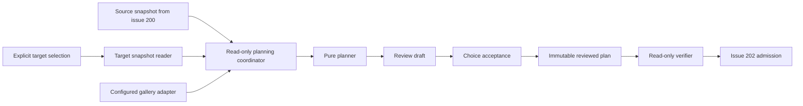

# Hucode selective editor migration planning plan

Status: proposed

Tracks: [#201](https://github.com/jimeh/hucode/issues/201), under the
[settings import and onboarding epic](https://github.com/jimeh/hucode/issues/192)

This document is the implementation plan for the read-only planning slice of
Hucode's editor migration flow. It refines the broader
[editor migration architecture plan](editor-migration-architecture-plan.md)
where that plan discusses issue #201.

## Outcome

Implement a deterministic planning service that combines one normalized source
snapshot, one explicit target, category selections, conflict choices, current
Hucode policy, and controlled Open VSX results into an immutable reviewed plan.
Planning changes no profile data and installs no extensions.

The implementation is ready when another caller can:

1. inspect an explicit existing or proposed target without switching profiles;
2. create and review a stable draft with preserve-by-default decisions;
3. accept explicit category and conflict choices;
4. verify every material input before handing the reviewed plan to issue #202;
5. explain any drift that requires returning the user to Review.

## Settled constraints

- The Omni shell keeps using the application Default profile. Planning never
  infers a target from the active window or current profile.
- Eligible existing targets are Default and ordinary named profiles. Internal
  and transient profiles are rejected.
- A proposed named profile is only a specification. Issue #202 creates it after
  admission and persists the real profile ID before category writes.
- Planning is structurally read-only with respect to user configuration and
  migration state: no profile catalog update, imported-category resource write,
  extension install or uninstall, profile switch, migration journal, recovery
  state, or onboarding state. A system-extension scan may maintain its existing
  derived cache but must not scan or initialize any user profile.
- Settings, keybindings, snippets, and extensions remain independently
  selectable. Existing target data wins unless the user explicitly chooses an
  import operation.
- An inherited target resource is read from its effective Default location but
  recorded as inherited. A selected import into that category must plan a
  copy-then-merge materialization into target-owned storage; it must never
  modify Default as a side effect or lose the inherited values used as the
  reviewed merge base.
- Open VSX access uses the configured gallery only. A reviewed plan identifies
  the exact release it reviewed; Apply may not substitute a later release.

Tasks, accounts, authentication state, source-editor global state, opaque
databases, UI, Apply, recovery, serve-web migration, and support for additional
source editors are outside this issue.

## Architecture

Keep the public orchestration surface small while separating deterministic
logic from infrastructure:



The common migration layer owns versioned DTOs, canonicalization, filtering,
conflict planning, extension classification, choice validation, fingerprints,
and drift comparison. A desktop workbench coordinator obtains target and
gallery evidence through narrow read-only collaborators, then invokes the pure
functions. Tests call the same pure entry points with fixtures.

Do not expose a public service for every stage. One coordinator should
concentrate ordering, cancellation, and evidence collection. The target reader
and gallery adapter are internal infrastructure seams because they isolate real
storage and network boundaries.

The public contract should support these operations, with final names settled
against nearby service conventions during implementation:

```ts
inspectTarget(
  target: EditorMigrationTargetSelection,
  categories: readonly EditorMigrationCategory[],
  token: CancellationToken
): Promise<EditorMigrationTargetSnapshot>;

createDraft(
  source: EditorMigrationSourceSnapshot,
  target: EditorMigrationTargetSnapshot,
  evidence: EditorMigrationPlanningEvidence
): EditorMigrationPlanDraft;

acceptDraft(
  draft: EditorMigrationPlanDraft,
  choices: EditorMigrationPlanChoices
): Promise<EditorMigrationReviewedPlan>;

verifyPlan(
  plan: EditorMigrationReviewedPlan,
  token: CancellationToken
): Promise<EditorMigrationPlanVerification>;
```

`createDraft` stays synchronous and pure. `acceptDraft` is asynchronous only
because canonical SHA-256 uses Web Crypto; it remains deterministic and
side-effect free. The coordinator may offer a convenience method that gathers
evidence before calling them, but the DTOs must not retain service objects,
URIs that depend on the current window, mutable collections, or live gallery
responses.

## Versioned planning model

Introduce a planning schema version independent of the existing source schema.
Every durable or cross-process value carries that version so issue #202 can
persist the reviewed plan without reverse-engineering an unversioned shape.

### Explicit target selection

Represent the target as a discriminated union:

- `existing`: stable profile ID supplied by the caller;
- `proposed`: trimmed, non-empty name plus the exact supported creation options
  that issue #202 will use.

Do not accept an `IUserDataProfile` supplied by the current workbench as the
authority. Resolve an existing ID against the complete profile catalog each
time it is inspected or verified. Compare a proposed name exactly and
case-sensitively against non-transient stored profile names after trimming the
proposed input once. Do not call `createNamedProfile` or allocate a profile
location.

The proposed-target DTO permits only `icon` and `useDefaultFlags`; it forbids
`transient` and `workspaces`. Every accepted plan selects at least one category,
and every selected migration category must be profile-owned. Flags may inherit
only categories outside the accepted migration. This both preserves the empty
selected-resource assumption and mirrors upstream's rule that a profile must
own at least one configuration.

### Target snapshot

An existing-target snapshot records:

- profile ID, name, kind, eligibility, and a catalog fingerprint over only ID,
  name, default/internal/transient state, and `useDefaultFlags`;
- requested categories and, for each, whether the effective resource is
  target-owned or inherited from Default;
- normalized settings, keybindings, snippets, and target extension entries;
- the state and hash of every exact resource read, including absent and
  unreadable resources;
- target platform, underlying VS Code product version and date used for
  extension compatibility, Hucode release version, gallery identity, and
  planning policy version;
- controlled built-in extension identities and versions used for
  classification.

A proposed-target snapshot records the trimmed name, supported creation options,
a fingerprint over sorted non-transient stored names, name-availability result,
empty selected resources, target platform, product versions, gallery identity,
policy version, and built-ins. Catalog fingerprints exclude profile icons,
workspace associations, and transient-profile churn. The snapshot contains no
fabricated profile ID or resource URI.

Resource identity and content hashes must come from the bytes actually parsed.
Use bounded `IFileService.readFileStream` reads with cancellation and the same
stat-before/read/stat-after stability pattern as source discovery. A changing
resource is a failed snapshot rather than a mixture of observations.

### Extension manifest reads

Do not call `IExtensionManagementService.getInstalled()` or
`IExtensionsProfileScannerService.scanProfileExtensions()` to snapshot target
extensions. The scanner can migrate legacy entries and write the manifest even
when used as a read API.

Add a bounded, dedicated read-only parser for the effective target extension
manifest. It should accept current and supported legacy entry shapes but never
rewrite them. Include application-scoped user extensions from Default in the
effective installed set using explicit read-only inputs. Invalid or changing
manifests make the target snapshot unavailable; they must not be silently
treated as empty.

Obtain built-ins through a narrow desktop collaborator that invokes
`IExtensionsScannerService.scanSystemExtensions()` directly. Its existing
derived system-extension cache is allowed, but the collaborator must never call
`IExtensionManagementService.getInstalled()`, `scanAllExtensions()`,
`scanUserExtensions()`, or `scanProfileExtensions()` with a profile location.
This avoids both Default-manifest initialization and legacy-manifest migration.
The returned built-in identities and versions become controlled planning
evidence rather than being read from the Omni shell's filtered running-
extension list.

### Review draft, choices, and reviewed plan

Keep these three concepts distinct:

- A draft contains every candidate operation, exclusion, conflict, warning,
  and default choice needed by the future Review UI.
- Choices contain only user-controlled category and conflict decisions. They
  reference stable item IDs from the draft rather than copying private values.
- A reviewed plan contains the accepted operations plus the complete evidence
  needed to prove they are still valid.

The reviewed plan is immutable by contract. Construct fresh deeply readonly
values, sort every map-derived collection deterministically, reject missing or
unknown choice IDs, and hash a canonical serialization rather than ambient
object insertion order.

For an inherited selected category, the draft contains an explicit
`materializeInheritedResource` prerequisite before its merge operations. It
names the category, Default as the reviewed owner, and the normalized baseline
fingerprint. Issue #202 must seed profile-owned storage from that exact reviewed
baseline before clearing inheritance and merging. For settings, keybindings,
and snippets this preserves the reviewed file contents; for extensions it
reproduces the normalized non-application-scoped membership while
application-scoped extensions remain effective from Default. The ownership
change performed by admitted Apply is expected state transition, not drift.

A draft targeting Default also carries a warning that Apply changes the live
Omni shell's backing settings and keybindings. It does not change target
eligibility or make the shell the source of target intent.

## Category planning

### Settings and appearance

Create a versioned, Hucode-owned exclusion policy. Its static exclusions are
authoritative; registry-derived exclusions are additive. Reuse
`getDefaultIgnoredSettings()` for configuration entries currently registered in
the workbench, while retaining explicit static coverage for known Hucode,
machine, source-account, and source-product keys that the Omni shell's filtered
extension registry may not expose. Each excluded setting has a
stable reason code such as machine-specific, account or authentication,
telemetry identity, update channel, remote authority, application path, or
source-product integration. The draft may retain the setting key for local
review, but telemetry must receive only aggregate counts and reason codes.

Policy decisions that depend on the configuration registry must be converted
to an explicit sorted set of consulted keys in planning evidence and included
in the policy fingerprint. Unknown extension-contributed settings without
available schema evidence remain importable; the draft records that limitation
rather than claiming they were classified. Do not let later registry changes
silently alter an accepted plan.

For each allowed key:

- add a source value only when the target has no value;
- select the target value by default when source and target differ;
- emit no operation when canonical JSON values are equal;
- require an explicit replacement choice to overwrite a target value.

Appearance settings follow the same merge rules and remain visible as a named
subset in the draft. Planning them changes neither the Omni shell profile nor
the currently rendered theme.

### Keybindings

The coordinator resolves every distinct source and target key through
`IUserDataSyncUtilService.resolveUserBindings()` and supplies the resulting map
as planning evidence. Include the platform and normalized-key map in the
fingerprint. The pure planner normalizes `when` expressions through
`ContextKeyExpr` and compares `args` structurally. The full idempotent identity
is normalized `key + command + when + args`.

An exact identity already present in the target needs no operation. When a
positive source entry uses the same normalized key and `when` context but
differs in command or arguments, report an observable conflict and preserve the
target by default. An accepted replacement operation removes the exact reviewed
conflicting target entries and inserts the source entry at their first position,
preserving all unrelated order. `-command` removal entries use their full
identity for deduplication and append as independent additions; they do not
replace positive user entries merely because key and context match. Do not
attempt general satisfiability analysis for partially overlapping context
expressions in this issue.

Preserve unrelated target entries and their relative order. Planned additions
use stable source order with a deterministic tie-breaker.

### Snippets

Match snippet files by the normalized filename rules used by the target file
provider. Equal content hashes need no operation. A matching filename with
different contents is a collision and preserves the target by default; a new
filename plans an addition. Never merge individual snippet definitions inside
a colliding file in this issue.

Preserve unrelated target files. Include the filename and content hash, not a
host filesystem path, in stable operation identity.

### Extensions

Classify every normalized source extension ID exactly once, in this precedence:

1. excluded source-editor integration;
2. built into Hucode;
3. already installed in the effective target profile;
4. available from the configured gallery and compatible;
5. incompatible with the target platform or product version;
6. unavailable from the configured gallery.

The policy owns the initial source-editor integration exclusion list and its
reason codes. Already-installed comparison uses normalized identifiers and
does not require the source and target versions to match because migration is
additive, not an upgrade operation.

The gallery adapter receives the remaining IDs, requested stable or pre-release
channel, target platform, and the underlying VS Code product version/date. It
first queries without `compatible: true` to distinguish existence from
compatibility, then resolves compatibility through the gallery compatibility
API using the explicit platform and product version/date. A stable source
permits stable releases only. A pre-release source permits pre-release and may
fall back to a compatible stable release with an explicit draft warning. It
returns a compact controlled result for the pure classifier. For an available
extension, record its normalized ID, UUID when present, exact version, target
platform, selected channel, requested channel, engine compatibility evidence,
and configured gallery identity. Do not retain arbitrary gallery response
fields.

If an imported appearance setting names a theme supplied by an extension that
is unselected, unavailable, or incompatible, add a cross-category warning.
The warning does not couple category selection or silently select the extension.

Tests use gallery fixtures only. A production check may query Open VSX, but the
same compact result shape must cross into the planner.

## Fingerprints and verification

Use asynchronous Web Crypto SHA-256 over canonical UTF-8, schema-versioned
values, with published test vectors shared by browser and Node tests. Do not
downgrade to the non-cryptographic common `hash()` helper or SHA-1. The reviewed
plan carries:

- the generation-bound source `ref` and fingerprint produced by issue #200;
- the target resource and ownership fingerprint;
- existing profile identity and catalog fingerprint, or proposed name,
  creation options, and availability fingerprint;
- selected categories and conflict-choice fingerprint;
- policy and registry-evidence fingerprint;
- exact gallery-selection fingerprint;
- one aggregate plan fingerprint over the above and the accepted operations.

For settings, keybindings, and snippets, target drift uses exact parsed-content
hashes. For extensions, use a semantic fingerprint over the sorted normalized
effective set `(id, uuid, version, application scope)`; retain the raw manifest
hash only as a local diagnostic. Metadata-only manifest rewrites must not force
another Review when installed membership is unchanged.

The verifier rereads only through the source service, target reader, and
gallery adapter. It returns `unchanged`, `changed`, or `unavailable`, with one
or more stable reason codes grouped as source, target content, target ownership,
profile catalog, proposed name, policy, choices, gallery, or environment drift.
It never repairs, recreates, or silently refreshes the plan.
An unavailable generation-bound source `ref` is source drift and returns to
Review rather than being interpreted as an empty source.

Verification must resolve the reviewed exact extension coordinates again. If a
coordinate is no longer compatible or available before Apply admission, the
plan returns to Review. Once issue #202 admits and persists the operation, Apply
uses only those persisted coordinates and reports an unavailable item rather
than choosing another release.

## Errors, cancellation, and data handling

- Cancellation settles all admitted planning reads and gallery requests and
  returns no partial draft or reviewed plan.
- Ineligible targets, unreadable or changing selected resources, malformed
  manifests, unavailable gallery configuration, stale choices, and
  non-canonical DTOs have stable local error codes.
- A gallery request failure is distinct from an extension being absent from a
  successful gallery result. The former blocks acceptance; the latter is a
  reportable `unavailable` classification.
- Local diagnostics may name settings, extensions, and snippet filenames needed
  for Review. They must not expose source or target values, local paths, or
  private plan contents to telemetry.
- Snapshot and plan objects remain in memory in #201. Their persistence,
  retention, and cleanup begin with issue #202.

## Expected code ownership

Keep Hucode policy and domain code under `src/vs/hucode/`; upstream changes
should be limited to registration or extraction of genuinely reusable pure
helpers.

| Concern | Intended location |
| --- | --- |
| Planning DTOs and service contract | `src/vs/hucode/common/migration/` |
| Canonicalization, policies, category planners, async SHA-256 fingerprints | `src/vs/hucode/common/migration/` |
| Read-only target snapshot and extension-manifest parser | `src/vs/hucode/browser/migration/` or the narrowest desktop layer justified by file access |
| Built-in and configured gallery evidence adapters, coordinator | `src/vs/hucode/browser/migration/` plus the narrow desktop collaborator |
| Pure tests | `src/vs/hucode/test/common/` |
| Target and adapter integration tests | `src/vs/hucode/test/browser/` or `src/vs/hucode/test/electron-browser/` |

Choose the target reader's final layer after a compile-time dependency check.
The constraint is more important than the folder name: issue #202 must be able
to reuse the same snapshot and verification semantics at admission, and no
supposed read path may invoke a mutating scanner.

## Implementation sequence

1. **Land the versioned domain contract and canonical fingerprint helpers.**
   Add explicit target selections, target snapshots, draft/choice/reviewed-plan
   DTOs, stable diagnostics, canonical serialization, and deterministic item
   identities. Add asynchronous Web Crypto SHA-256 with published vectors.
   Prove round-trip serialization, reversed-input determinism, and single-field
   fingerprint drift before adding infrastructure.

2. **Build the read-only target snapshot boundary.** Resolve explicit profile
   IDs, enforce eligibility, record ownership and inheritance, parse selected
   resources from exact bytes, model proposed targets without allocation, and
   parse extension manifests without user/profile scanner APIs, and obtain
   built-ins through the system-only collaborator. First prove Default, named,
   inherited, internal, transient, proposed, malformed, changing, and canceled
   cases with fixtures.

3. **Implement the pure category planners.** Add settings policy and conflicts,
   keybinding normalization and conflicts, snippet collisions, independent
   category choices, explicit copy-then-merge materialization prerequisites, and
   deterministic operation ordering. Tests should demonstrate preserve-by-
   default behavior and that unselected categories do not affect the plan.

4. **Add controlled extension evidence and classification.** Introduce the
   compact two-phase gallery result, source-editor exclusion policy, built-in
   and target installed inputs, exact compatibility coordinates, stable/pre-
   release fallback evidence, and failure distinction.
   Use fixture-driven planner tests and a focused adapter test with a stubbed
   gallery; do not call the live gallery in the automated suite.

5. **Assemble draft acceptance and verification.** Validate stale or unknown
   choices, produce the aggregate reviewed-plan fingerprint, reread each
   material input, and return precise drift reasons. Exercise every drift class
   independently and confirm that verification performs no mutation.

6. **Wire the service for issue #203 without adding UI.** Register the planning
   coordinator where the future shared flow can consume it, expose no command
   or onboarding surface yet, regenerate Hucode test-suite discovery, and
   update the broader architecture documentation if implementation evidence
   changed any seam.

## Verification strategy

New behavioral tests should fail at their intended assertion before the
implementation makes them pass. Confirm from runner output that every new suite
and named case ran.

The minimum automated matrix is:

- Default, ordinary named, inherited-resource, internal, transient, and
  proposed targets;
- empty, absent, malformed, unreadable, changing, and non-empty resources;
- every settings exclusion reason, equal values, conflicts, explicit
  replacements, and registry-policy drift;
- exact and conflicting keybindings, normalized keys and contexts, structural
  arguments, replacement edits, removal entries, deterministic order, platform
  evidence, and duplicate source rows;
- new, equal, and colliding snippets under target filename semantics;
- every extension classification, application-scoped and inherited installed
  extensions, stable and pre-release results, incompatible engines and target
  platforms, stable fallback warnings, disabled or failing gallery, semantic
  manifest rewrites, and exact-coordinate drift;
- independent category selection, materialization prerequisites, stale or
  unknown choices, serialization round trips, reversed-input determinism,
  repeatable fingerprints, and every verification reason;
- cancellation before and during target reads and gallery inspection;
- a mutation spy proving planning never creates or changes a profile, writes an
  imported-category resource, reaches a user/profile extension scanner, calls an
  extension install/uninstall API, or switches the current profile. Allow and
  separately assert only the system scanner's derived cache behavior.

Use the repository-generated Hucode suite list rather than editing CI paths.
During implementation, run the focused Node/browser/Electron suites appropriate
to the final layer, then:

```sh
npm run hucode:test-suites -- --write-snapshot
npm run hucode:check-test-suites
npm run hucode:compile
npm run -s precommit -- <changed-paths>
```

Run the narrow test commands again after compilation when they execute `out/`.
A runtime gallery smoke is useful only as adapter evidence; it cannot replace
the deterministic fixture matrix and should not install anything.

## Handoff to Apply

Issue #201 ends with an in-memory, versioned reviewed plan and a verifier.
Issue #202 begins by acquiring the writer lease, verifying and persisting the
admitted plan, creating a proposed profile if needed, and persisting its real
identity before category writes. It snapshots selected effective resources and
ownership, performs each reviewed copy-then-merge materialization, and then
applies only the accepted operations.

A newly created profile remains attached to the durable operation after
admission rather than being deleted automatically. Rollback of an inherited
category restores both its reviewed pre-operation content and ownership only
when the post-apply drift guard permits it; otherwise the category remains for
explicit recovery.

This boundary is deliberate: backing out of Review leaves no abandoned profile
or changed user data, while Apply receives enough exact evidence to reject
drift instead of silently re-planning.

## Risks and controls

| Risk | Control |
| --- | --- |
| A read API migrates or initializes an extension manifest | Use a dedicated bounded parser and mutation-spy tests; permit only direct system-extension scanning |
| The planner mutates Default through an inherited resource | Record effective ownership and emit materialization as an Apply prerequisite |
| Registry or policy changes alter a plan invisibly | Version policy, snapshot registry-dependent evidence, and fingerprint both |
| Open VSX changes between Review and Apply | Persist exact coordinates and revalidate them before admission |
| Canonicalization hides a material change | Canonicalize normalized domain values; retain exact parsed hashes for file categories and a semantic installed-set hash for extensions |
| A proposed profile name becomes occupied | Fingerprint catalog/name availability and return to Review |
| The plan becomes an accidental persistence service | Keep #201 plans in memory; defer journals, retention, and recovery to #202 |

## Alternatives rejected

- **Create proposed profiles during planning.** This leaves abandoned profiles
  when Review is canceled and crosses the issue's first mutation boundary.
- **Use the current Omni profile as the target.** Omni currently runs on
  Default, but window state is not target intent and would break named or newly
  proposed targets.
- **Use upstream profile import/export as the planner.** Its replacement
  semantics and extension uninstall behavior conflict with additive,
  preserve-by-default migration.
- **Let the pure planner query Open VSX.** Network state would make tests and
  outputs nondeterministic and hide exactly what the user reviewed.
- **Use the installed-extension scanner as a read facade.** It may rewrite or
  initialize profile manifests. A direct system-only scan is the sole scanner
  exception and cannot receive a profile location.
- **Model semantic overlap between arbitrary keybinding contexts.** The added
  complexity does not have a reliable existing product policy; exact normalized
  context collisions cover the observable, deterministic first release.

## Unresolved questions

No product decision blocks implementation. One placement detail must be settled
from current code and compile evidence during the relevant step:

- whether file-provider access places the target reader in browser or a narrow
  desktop service while still allowing issue #202 to reuse identical
  verification semantics.

Resolve those by dependency and behavior evidence, not by changing the scope or
introducing a new public abstraction.
