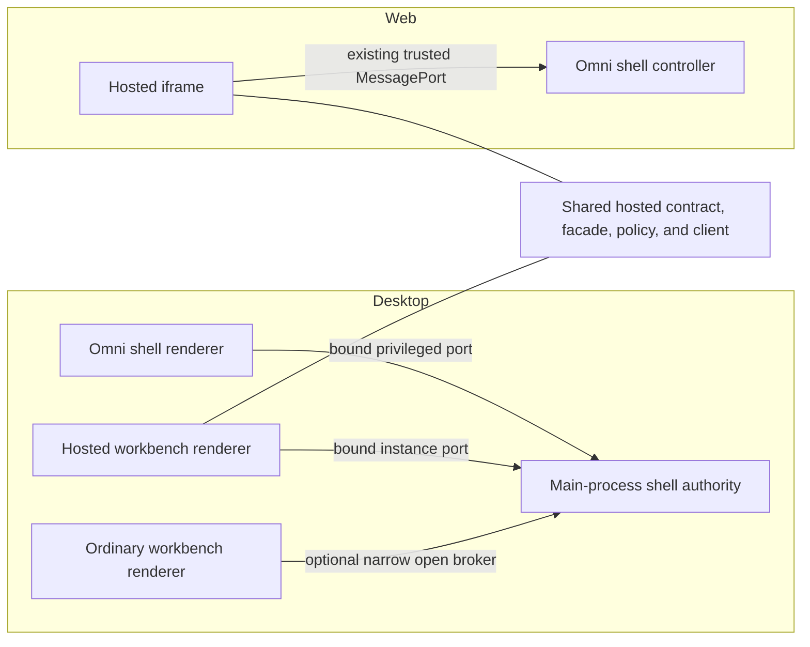

# Hosted Shell Capability Plan

## Document purpose

This document plans a least-authority boundary between Hucode's Omni shell and
hosted workbenches on desktop and serve-web. It records the current exposure,
the proposed shared capability contract, the platform-specific transports, a
reviewable migration sequence, and the evidence required before the legacy
desktop channel can be removed.

The plan is intentionally implementation-oriented so delivery can be reviewed
against an explicit contract instead of reconstructing architectural decisions
from chat history.

## Scope

This plan covers:

- restricting what a desktop hosted workbench can ask the Omni shell to do;
- replacing caller-supplied window and instance identity with identity bound
  to an authenticated connection;
- sharing the hosted capability policy, facade, and client between desktop and
  serve-web;
- separating the privileged desktop shell renderer from hosted and ordinary
  workbench renderers;
- removing the complete shell service from the global desktop renderer
  channel; and
- testing the authority boundary, connection lifecycle, and existing user
  behavior.

This plan deliberately does **not** cover:

- theme preview synchronization;
- new Omni features or shell actions;
- redesigning native menu, keybinding, clipboard, or paste forwarding from the
  shell to the active hosted workbench, except where those calls must move to a
  privileged shell connection;
- reimplementing the existing serve-web parent/iframe trust handshake; or
- changing project ownership or catalog reconciliation semantics;
- automating the exact macOS-only keyboard chord from Linux CI; or
- replacing the existing Omni runtime smoke harness with a new end-to-end
  framework.

## Independent review corrections

An independent Claude architecture review checked this plan against the
current desktop and web call sites. The following corrections are incorporated
as settled requirements before implementation begins:

- hosted paste is a hosted-to-shell request today and needs a self-scoped
  hosted capability; it must not be moved exclusively to the privileged shell
  connection;
- the privileged shell sometimes performs path-scoped operations across Omni
  windows, notably Open Selected in New Window, so the shell capability needs
  a high-level cross-window operation without accepting arbitrary target
  window or instance IDs;
- hosted navigation must preserve project targeting, normal-window fallback,
  latest-activation-intent supersession, and active/visible caller checks;
- web file-open methods are exposed today but have no confirmed hosted caller;
  audit them and omit them from the new hosted capability unless a real caller
  is demonstrated;
- ordinary desktop workbench dependency injection must remain constructible
  after the global shell service registration is removed;
- serve-web must expose only the current typed hosted-shell protocol and its
  complete required core capability set, while negotiating the optional
  `navigationSnapshot` group independently; incompatible cached pages fail
  closed and require a full browser-page reload;
- desktop port startup needs an explicit deferred-connection state and must not
  fall back to the broad channel while the port is pending;
- screenshot self-targeting is an intentional semantic change that requires
  characterization and regression coverage; and
- the existing web unload protocol version and the new hosted capability
  protocol version remain separate until there is a demonstrated reason to
  combine them.

## Post-integration runtime correction

The first five staging PRs established the intended authority boundary, but
macOS testing of integration PR #171 exposed two behavioral gaps that block
mainline delivery:

- the hosted state projection is too narrow for workbench navigation. A hosted
  workbench can see only itself, so loaded next/previous, last-active, and the
  loaded quick switcher cannot discover sibling workbenches. The full switcher
  can display project catalog entries, but hosted navigation failures are
  treated as success and last-active state is written before the shell accepts
  the navigation;
- desktop capability acquisition is a one-shot, unbounded promise. A denied,
  lost, or never-answered port request can permanently leave one workbench in a
  loading state with shell-aware commands unavailable. There is no bounded
  retry or replacement recovery path.

The same navigation defect applies to the current integration branch's
serve-web implementation because both platforms now use the shared narrow
capability. Mainline serve-web worked because its authenticated per-instance
port exposed the complete read-only shell state. That was a better transport
boundary than the former desktop global channel, but its state surface was
broader than necessary. The correction therefore restores the required
observation through a sanitized shared projection instead of restoring the
complete service.

Two corrective staging PRs are added after the original five. Both target
`series-1.131.0-hosted-shell-capability`, use a three-cycle correction budget,
and require focused Codex, Claude, and CodeRabbit review because they change
shared navigation semantics and connection lifecycle respectively. The final
integration PR remains user-merge-only.

## Final protocol compatibility amendment

The final implementation supports only the current typed serve-web hosted-shell
protocol and its complete required core capability set; the optional
`navigationSnapshot` group is independently negotiated. Missing or mismatched
protocol, required core capability, or nested bootstrap metadata fails closed.
A server deployment may therefore require a full browser-page reload; the legacy
`IHucodeShellService` adapter and its method-version-skew tests are removed.

This decision supersedes this historical plan's earlier hosted-shell
version-skew requirements, including the proposed bounded legacy adapter and
old/new hosted-shell client combinations. It does **not** supersede
`HUCODE_OMNI_WEB_UNLOAD_PROTOCOL_VERSION`: the independently versioned
single-phase/two-phase unload compatibility behavior remains supported and
tested.

## Executive decision

Replace the single renderer-visible `IHucodeShellService` with capabilities
issued according to renderer role:

| Capability | Recipient | Authority |
| --- | --- | --- |
| Shell controller | Exact desktop Omni shell renderer | Administer that shell window and its hosted workbenches |
| Hosted shell | Exact hosted workbench instance | Inspect self state plus a sanitized read-only navigation projection, control itself, and request a closed set of shell UI actions |
| Omni open broker | Ordinary trusted workbenches, only if still required | Ask Hucode to open or focus a folder through a high-level operation |
| Shell main service | Main process only | Own the complete controller implementation and authoritative state |

The hosted capability contract and policy will be shared. Desktop and web will
continue to use different connection bootstraps because their trust roots are
different.

The complete desktop improvement is not merely an allowlist on
`runActionInShell`. The global `hucodeShell` channel exposes many privileged
methods, so it must ultimately be removed or reduced to a separately justified
safe broker.

## Current architecture

### Common service

`src/vs/hucode/common/omniWindow.ts` defines `IHucodeShellService`, a single
contract containing several distinct classes of operation:

- shell state reads and mutations;
- hosted workbench creation, activation, suspension, dismissal, and ordering;
- complete project-catalog reconciliation;
- hosted self-lifecycle operations;
- shell-to-workspace native command routing;
- hosted-to-shell action routing;
- layout, overlay, screenshot, devtools, and shutdown operations.

The contract is convenient for implementations but does not express which
caller is allowed to perform which operation.

### Desktop

The main process registers the complete service through
`ProxyChannel.fromService` as the global `hucodeShell` channel. Desktop
workbenches register a renderer-side proxy for that channel.

Electron's validated IPC checks are meaningful mitigation: requests must come
from a VS Code-authority main frame. They prevent arbitrary embedded web
content from using the channel directly. They do not, however, distinguish
these trusted renderer roles:

- the privileged Omni shell renderer;
- one of the shell's hosted `WebContentsView` renderers; or
- an ordinary Hucode workbench renderer.

The generic proxy invokes the requested service method and does not apply a
role-specific facade. Hosted views also inherit the owner window ID, so the
normal IPC context is not an authoritative hosted-instance identity.

For `runActionInShell`, the current path is:

```text
hosted renderer
  -> global hucodeShell proxy
  -> HucodeShellMainService.runActionInShell(windowId, request)
  -> HostedWorkspacesController.runActionInShell(request)
  -> shell renderer vscode:runAction message
```

The controller currently accepts an arbitrary command ID and argument array.
Delivery is fire-and-forget: success means the message was sent, not that the
shell command completed successfully.

The main process already tracks trusted hosted process and `webContents` IDs
for file and webview request filtering. That mapping is the right trust root
for a hosted desktop capability, but the global generic proxy does not expose
the authoritative sender to the service method.

### Serve-web

Serve-web has a stronger hosted boundary. The shell establishes a dedicated
`MessagePort` for an iframe instance and exposes an explicit facade over that
port. The facade binds window and instance identity on the server side and
allows only a subset of the complete service.

Hosted shell actions are also checked against an explicit list. This is the
correct trust shape, but the current web implementation still has avoidable
duplication and misleading types:

- the facade is a local `Pick<IHucodeShellService, ...>` rather than a named
  shared capability contract;
- the hosted web client implements the complete service even though the port
  exposes only a subset;
- action authorization is web-local; and
- allowed calls retain the arbitrary command request shape, including caller
  arguments, even though current actions do not require arguments.

### Actual hosted-to-shell needs

The current hosted contributions require a much smaller surface than the
complete shell service:

- observe enough state to know whether the calling instance is active and
  visible, render Projects navigation affordances, and choose among sanitized
  sibling navigation targets;
- notify the shell when the calling workbench is ready;
- close, reload, focus, or reopen the calling instance;
- focus the shell;
- request Projects focus, sidebar toggle, add, refresh, collapse, back, and
  forward actions;
- open or focus a folder through the Omni routing policy; and
- capture the calling desktop hosted view for the existing screenshot
  fallback.

Hosted workbenches do not need complete catalog authority, arbitrary retained
workbench mutation, instance or process identities, shell layout control,
shell-wide shutdown, or arbitrary shell command execution. They do need
read-only sibling navigation metadata. Observation of that bounded metadata is
not authority to reconcile or mutate the shell's catalog.

## Risk framing

This is a least-authority and defense-in-depth issue, not evidence that
arbitrary internet content can currently execute shell commands. Origin,
main-frame, and sandbox boundaries still matter.

The concrete weakness is that a compromised or unintentionally misbehaving
trusted renderer receives substantially more authority than its role requires.
The API also makes future mistakes easy: any newly added method becomes
renderer-visible automatically unless each implementation remembers to add a
separate check.

The target architecture makes authority explicit in types and connection
construction, so widening a capability becomes a deliberate, reviewable
change.

## Target architecture



### 1. Internal shell authority

Keep a complete main-process implementation for desktop controller ownership,
but stop exposing it as a generic renderer service. It may retain a broad
interface internally because its caller is trusted main-process code.

### 2. Privileged shell controller capability

The desktop shell renderer needs broad, window-scoped control for project
switching, native action forwarding, hosted view layout, overlays, screenshots,
devtools, and shutdown.

Issue this capability only to the exact `BrowserWindow.webContents` registered
as the Omni shell owner. Bind the window ID to the port so methods do not take a
caller-selected `windowId`.

Binding the owner window does not mean every privileged operation is confined
to that window. Existing shell UI can intentionally move a path out of whichever
Omni window currently owns it. Represent such behavior as a high-level,
path-scoped operation such as `openSelectionInStandaloneWindow(selection)`.
Main resolves the current owner and applies the cross-window close itself; the
shell renderer does not submit another window or instance identity.

Serve-web does not require an equivalent remote privileged port: its shell
controller and shell UI already share the trusted parent page.

### 3. Hosted shell capability

Add a common service such as `IHucodeHostedShellService`. Its methods must not
accept window IDs, instance IDs, arbitrary shell command IDs, or complete
project catalogs.

An illustrative contract is:

```ts
interface IHucodeHostedShellService {
	readonly onDidChangeState: Event<IHucodeHostedShellState>;

	getState(): Promise<IHucodeHostedShellState>;
	notifyReady(): Promise<IHucodeHostedReadyResult>;
	closeSelf(): Promise<IHucodeHostedCloseResult>;
	reopenSelfInNormalWindow(): Promise<boolean>;
	reloadSelf(): Promise<void>;
	focusSelf(): Promise<void>;
	focusShell(): Promise<void>;
	requestShellAction(action: HucodeHostedShellAction): Promise<boolean>;
	navigateToFolder(
		request: IHucodeHostedNavigationRequest
	): Promise<IHucodeHostedNavigationResult>;
	triggerPasteInSelf(): Promise<boolean>;
	captureSelfScreenshot(
		rect?: IRectangle,
		quality?: number
	): Promise<VSBuffer | undefined>;
}
```

The exact return types should describe observable protocol outcomes rather
than leaking the complete controller state.

### 4. Optional ordinary-workbench broker

Some non-shell workbench integration may still need to ask whether a path is
already hosted or to open it in Omni. Preserve that product behavior through a
small application-level broker rather than the complete shell controller.

Prefer one high-level operation, such as `navigateToFolderInOmni`, over a
sequence of low-level discovery, focus, open, and activate calls. The
authoritative side can then resolve project ownership, normal-window fallback,
target window, and activation atomically while preserving the current latest
activation intent.

If the final call-site audit proves ordinary workbenches do not need this
broker, omit it.

## Shared hosted capability contract

### Semantic shell actions

Replace arbitrary shell command requests with a closed semantic union:

```ts
type HucodeHostedShellAction =
	| 'toggleProjectsSidebar'
	| 'addProject'
	| 'refreshProjects'
	| 'collapseProjects'
	| 'navigateBack'
	| 'navigateForward';
```

The authoritative facade maps these values to concrete command IDs and builds
the invocation request itself. Hosted callers cannot provide command IDs,
arguments, or `from` metadata.

The current `runActionInShell` census is exactly these six actions. Focus
Projects is deliberately outside this union: serve-web already routes it
through the dedicated `focusShell` capability rather than the generic action
wire. Keep that distinction explicit so a lifecycle/focus operation cannot
silently broaden the hosted action policy.

Do not reuse `isHucodeOmniShellAction` as the authorization check. That helper
contains namespace-prefix routing intended for trusted local command routing;
it is not a closed security policy. Adding a new routed shell command must not
silently grant it to hosted workbenches.

### State projection

Keep the evented self projection minimal. It contains only:

- Projects sidebar visibility;
- Projects back and forward availability;
- the calling instance's lifecycle state;
- whether the calling instance is active and visible; and
- any coarse availability flag demonstrably required by existing titlebar
  behavior.

Add a separate on-demand navigation projection for workbench-switching
commands. Each target may contain only the data needed to render and order a
choice and navigate by folder:

- folder URI;
- lifecycle class (`loading`, `active`, `loaded`, `dormant`, `unloaded`,
  `missing`, or `crashed`);
- last-active timestamp;
- sanitized label, description, detail, and logical ordering metadata for
  retained targets; and
- shell-owned section order.

The authoritative side constructs this snapshot. It may combine current
instances with retained records, but the hosted caller cannot submit or
reconcile either collection. The projection must remain a read model, not a
mutation protocol. Prefer a dedicated method such as
`getNavigationSnapshot()` over adding sibling data to every self-state event;
switcher commands already perform asynchronous reads and do not need a live
catalog stream.

Sibling folder URIs and sanitized retained labels are an intentional bounded
disclosure. Mainline serve-web already supplied them through its broader
read-only state, and visible navigation cannot work without target identity at
the folder level. The authority boundary is preserved because the snapshot has
no controller identity and `navigateToFolder` still validates, canonicalizes,
and commits the target server-side.

Do not expose:

- instance IDs, project IDs, window IDs, or connection generations;
- process or `webContents` IDs;
- complete project catalogs;
- unsanitized retained workbench records;
- controller focus internals; or
- catalog reconciliation or arbitrary mutation methods.

`notifyReady` should return enough information for readiness retry and
verification so the hosted client does not need to inspect the full window
state afterward.

### Bound facade

Build one platform-neutral facade factory around an authoritative delegate:

```ts
createBoundHostedShellFacade({
	windowId,
	instanceId,
	connectionGeneration,
}, delegate);
```

The binding is captured in the closure and never reconstructed from caller
arguments. The facade owns:

- method exposure;
- action validation and mapping;
- state projection and event filtering;
- self-targeting;
- active/visible policy for shell UI actions, navigation, paste, and
  screenshots;
- stale-generation rejection; and
- consistent outcome and error semantics.

Desktop main and the web shell controller provide different delegates but use
the same facade and tests.

### Authorization rules

- Shell UI actions are accepted only from the currently active and visible
  hosted instance.
- Ready notification is accepted only for the bound current generation.
- Close, reload, and reopen target only the bound instance. Whether each is
  allowed while inactive follows existing product behavior and is tested
  explicitly.
- Focus-self cannot select an arbitrary sibling instance.
- Navigation requires the bound instance to be active and visible when the
  request is accepted. It must preserve project targeting, normal-window
  fallback, and latest-activation-intent supersession across asynchronous
  preflight so an older hidden caller cannot steal activation back.
- Navigation input must be a valid supported URI. Project and destination
  resolution are authoritative-side responsibilities; any supplied project ID
  is a hint validated against authoritative catalog state.
- Paste targets the bound active and visible instance. A rejected or stale
  request must not fall through to pasting into the owner shell window.
- Screenshot capture targets the bound instance rather than whichever instance
  happens to be active. Hidden callers are rejected unless characterization
  demonstrates a legitimate hidden-self capture requirement.
- File-open routing is not added to the hosted capability unless the call-site
  audit identifies a concrete hosted-origin caller. Main/shell delivery of
  files into a hosted workbench remains an authoritative opposite-direction
  operation.
- A disposed, superseded, crashed, or stale connection fails closed.

### Response semantics

Do not conflate message delivery with command completion.

For shell actions, the first protocol may preserve the current behavior where
`true` means that an authorized action was accepted and delivered to the shell
renderer. Document that it is not proof of command completion. A future
shell-renderer RPC may strengthen this without changing the action union.

Connection failures should be logged and reflected as unavailable controls or
failed operations. There must be no fallback from the narrow hosted capability
to the global full-service channel.

Navigation callers must handle every protocol outcome explicitly:

- `accepted` means the authoritative shell committed navigation;
- `superseded` means a newer activation intent won and is a handled no-op;
- `rejected`, `stale`, and `unavailable` are visible failures and must not be
  reported as successful selection;
- `unsupported` remains an explicit compatibility failure.

Last-active-worktree persistence belongs to the navigation authority. It is
updated only after navigation is accepted, using the canonical target resolved
server-side. The caller must not write MRU state before the request because a
rejected, stale, unavailable, or superseded request did not navigate. Do not
automatically replay a user operation after a response timeout: delivery is
ambiguous and replay could apply navigation twice or after intent has changed.

### Protocol versioning

Give the hosted capability protocol an explicit version. Parent and child must
advertise the current version, the complete required core capability set, and
matching nested-bootstrap metadata. The optional `navigationSnapshot` group is
negotiated independently. Missing required core groups, older or newer protocol
versions, or otherwise mismatched bootstrap metadata fails closed on both
desktop and serve-web.
After a server deployment, a browser page holding incompatible assets must be
fully reloaded; there is no legacy `IHucodeShellService` adapter or old/new
hosted-shell negotiation window.

This strict policy applies only to the hosted-shell capability. Keep
`HUCODE_OMNI_WEB_UNLOAD_PROTOCOL_VERSION` separate: its single-phase/two-phase
compatibility behavior is independently versioned and remains supported.
Connection replacement increments a generation so late replies and old ports
cannot affect a reloaded child.

## Desktop transport design

Use Electron `MessagePort` infrastructure already present in VS Code rather
than changing the generic IPC server or preload security model.

### Hosted connection bootstrap

1. A hosted renderer requests the Hucode hosted-shell response port.
2. Validated IPC supplies the authoritative `event.sender.id`.
3. Main resolves that `webContents` against the hosted controller's trusted
   instance mapping.
4. Main rejects unknown, destroyed, normal-workbench, or shell senders.
5. Main creates a `MessageChannelMain` and binds the authoritative window,
   instance, and current connection generation to its server port.
6. Main transfers the client port only to the requesting renderer.
7. Reload replaces and disposes the previous connection.
8. View crash, unload, removal, window destruction, and controller disposal
   release the connection idempotently.

The request/response nonce provides correlation, not authentication. The
authoritative sender-to-instance lookup provides authentication and scope.

The renderer-side client uses an explicit connection state machine:

```text
connecting -> connected -> unavailable/backoff -> connecting
     |             |                  |               |
     +-------------+------------------+-----------> disposed
```

Port acquisition has a cancellable deadline and cannot leave the service
promise pending forever. Merely racing the existing acquisition promise with a
timer is insufficient because both the renderer and preload listeners would
remain registered. Add the smallest additive preload release method,
`ipcMessagePort.cancel(responseChannel, nonce)`, and a renderer acquisition
handle that removes the DOM listener and invokes that release method. This is a
deliberate, narrowly tested exception to avoiding preload churn; renderer-only
cleanup cannot satisfy the leak requirement.

A denial, timeout, stale-generation outcome, transport exception, or bounded
operation-response timeout transitions to backoff and permits a new
acquisition. The generic browser `MessagePort` wrapper has no reliable remote-
close event, so do not claim one: a dead established port is detected by a
bounded call response or an explicit Hucode liveness signal if implementation
evidence shows one is needed. The operation that discovered ambiguous delivery
returns unavailable and is never replayed. Successful replacement disposes the
old client and state observer before publishing the new connection. Disposal
cancels acquisition, backoff, listeners, and queued readiness work
idempotently, and a late-arriving port is closed immediately.

Ready notification may retry after a connection is re-established. User
operations return `unavailable` while disconnected; they are not queued or
replayed because their delivery or current intent may be ambiguous. Slow
acquisition, first denial followed by success, reload during acquisition,
connection loss after success, and shutdown before acquisition completes are
tested. The client never falls back to the global shell channel.

### Shell connection bootstrap

Issue a separate privileged port only to the registered Omni shell
`BrowserWindow.webContents`. Bind the owning window ID and reject hosted or
ordinary renderers.

Move existing shell-to-active-workspace operations onto this connection
without changing their behavior:

- native action, keybinding, and shell-originated clipboard forwarding;
- active hosted view focus and layout;
- overlays and screenshots;
- devtools and reload controls; and
- shell-wide hosted shutdown.

Hosted-origin paste uses the hosted instance capability instead. Intentional
cross-window shell operations use high-level path-scoped methods whose targets
are resolved by main rather than caller-supplied window and instance IDs.

### Avoiding upstream IPC churn

Do not teach `ProxyChannel` about Hucode renderer roles. That would modify a
generic upstream subsystem, create upgrade conflict, and still couple security
to a broadly reusable mechanism.

Prefer Hucode-owned port servers and clients, with the smallest unavoidable
registration hooks in existing Electron startup code.

## Serve-web transport design

Keep the existing same-origin parent/iframe handshake and per-instance
`MessagePort`. It already binds a child connection to a shell-owned instance.

Refactor connection setup to expose the shared bound facade and register the
shared hosted client. Web-specific code remains responsible for:

- iframe source and origin checks;
- parent/child port transfer;
- DOM focus notifications;
- iframe reload and teardown; and
- delegation to the web controller.

After migration, remove the web-local hosted-service `Pick`, duplicated action
allowlist, and hosted client that pretends to implement the complete
`IHucodeShellService`.

The parent-driven web bootstrap is more reliable than desktop's renderer-
initiated acquisition, but it still needs bounded failure behavior. A hosted
iframe must not wait forever for its initial port. Use a bounded
`whenConnected` wait and an idempotent, rate-limited ready re-signal while the
initial port is absent. Stop it on connection or disposal and preserve the
same-origin source-window check, instance binding, and generation replacement.
The re-signal must be correlation-safe: today the child latches its first port
while the parent treats every repeated Ready as a reload and replaces its
connection. Add an attempt generation or nonce that the parent echoes, discard
late ports from older attempts, and let the child adopt and re-register on the
latest accepted port. Never leave the child on a parent-disposed first port.
Hosted-shell bootstrap is strictly current-protocol-only: incompatible cached
pages fail closed and require a full browser-page reload. This does not change
the separately versioned hosted unload compatibility behavior. Do not copy
the desktop reconnect state machine or reconnect an established same-document
port unless a real loss path is demonstrated; iframe
reload already creates a fresh child service. As on desktop, user operations
are not replayed after ambiguous delivery.

## Delivery topology

Deliver one combined pull request to mainline. The original authority migration
used five focused pull requests against a temporary integration branch. The
runtime correction adds two more focused pull requests against that same
branch before the combined pull request can proceed.

At execution start:

1. Resolve and record the live remote default/mainline branch. It is currently
   `series-1.131.0`.
2. Create `series-1.131.0-hosted-shell-capability` from the exact recorded
   mainline head. This is the integration branch and the head of the eventual
   mainline PR. Its `series-*` name deliberately keeps normal Hucode pull-
   request CI and changelog workflows active for staging PRs.
3. Create each stage branch from the current integration head and target its PR
   at `series-1.131.0-hosted-shell-capability`.
4. Give each stage its focused implementation evidence and independent review,
   then merge it into the integration branch before starting the dependent
   stage.
5. Refresh the integration branch from the recorded mainline at deliberate
   checkpoints without force-pushing reviewed history. Resolve base drift and
   rerun affected evidence before the final review.
6. After all original and corrective stages are merged, update the integration
   PR from `series-1.131.0-hosted-shell-capability` to the recorded mainline
   branch.

The final PR is not a rubber stamp. Stage reviews establish local correctness;
the combined PR receives fresh exact-head CI, a complete branch-diff review,
and runtime verification of interactions between stages. Its review must cover
the whole changeset rather than relying only on approvals from the staging
PRs.

### Staging PR workflow and merge authority

Run each staging PR through the repository's `ship-feature-pr` workflow as an
independent delivery against the integration branch. Each stage therefore has:

- its own settled stage scope and closure matrix derived from this plan;
- focused implementation evidence and an evidence ledger;
- a draft PR targeting `series-1.131.0-hosted-shell-capability`;
- fresh independent Codex and Claude reviews;
- a bounded correction cycle with risk-proportional re-review;
- normal automatic Hucode CI and changelog checks, because the target branch
  matches `series-*`; and
- an exact-head ready gate before merge.

The user explicitly authorizes the orchestrator to merge each staging PR into
the integration branch after its required reviews are
non-blocking, required CI is green on the intended head, local delivery is
complete, and the PR is ready. This authorization does not extend to the final
integration PR into mainline.

Use the repository's normal merge method for staging PRs. After each merge,
verify the integration head contains the intended PR result, refresh the local
integration checkout, and branch the next dependent stage from that new head.
Do not merge a staging PR merely because its local portion works if a required
review, CI check, or documented stage acceptance criterion remains open.

Run the final combined PR through the same delivery gates at whole-branch scope:
fresh dual review, final-head local and runtime evidence, and automatic CI on
the exact combined head. The orchestrator may open it, update it, reconcile
review feedback, and mark it ready, but must never merge it. The user retains
the sole authority to merge the integration branch into mainline.

### Selected CodeRabbit reviews

Use CodeRabbit intentionally on the staging PRs where an additional external
perspective is proportionate:

| Staging PR | Risk | CodeRabbit | Reason |
| --- | --- | --- | --- |
| PR 1 — legacy-wire action hardening | Low to medium | No | Small closed policy and compatibility change; focused characterization, dual internal review, and CI are the stronger evidence |
| PR 2 — shared web capability | Medium, security-sensitive | **Required** | Establishes the shared authority contract, facade, version compatibility, navigation policy, and method-surface boundary |
| PR 3 — desktop hosted capability | Medium to high | **Required** | Introduces sender-authenticated Electron ports, stale-generation handling, startup latching, disposal, paste, and screenshot targeting |
| PR 4 — privileged shell migration | High | **Required** | Migrates the broadest consumer surface, role-aware dependency injection, cross-window behavior, and privileged shell authority |
| PR 5 — global channel removal | Medium, mostly deletion | No by default | Static audit and focused startup tests close the local risk, and the immediately following combined CodeRabbit review covers the final deletion in full context |
| PR 6 — hosted navigation repair | Medium to high | **Required** | Restores shared sibling navigation without restoring identity or catalog authority, and corrects outcome and MRU semantics |
| PR 7 — resilient transport and runtime CI | High | **Required** | Changes retry, timeout, replacement, and disposal behavior and adds real desktop and serve-web multi-workbench coverage |

Escalate PR 5 to its own CodeRabbit review if it grows beyond mechanical
removal, static enforcement, and documentation or introduces new production
behavior to resolve a missed consumer.

For PRs 2, 3, 4, 6, and 7, request one explicit incremental review with a
top-level `@coderabbitai review` comment on the internally accepted candidate
head. Do not
use the `coderabbit:review` label and do not push while a review is active.
Because CodeRabbit skips draft PRs in this repository, mark the internally
accepted candidate ready before triggering it, but keep the merge gate closed
until the CodeRabbit review covers that exact SHA, findings are reconciled, all
valid concerns are fixed, required re-review is complete, unresolved threads
are closed with evidence, and the resulting review state is non-blocking. The
user explicitly authorizes the orchestrator to resolve CodeRabbit threads that
CodeRabbit leaves open after independently verifying that the finding is fixed,
already satisfied, or invalid. Reply with concise evidence or reasoning when
useful. Leave valid unresolved or uncertain concerns open and return them for
correction. This authority does not permit dismissing a blocking review.

The final integration PR also requires a CodeRabbit review over the complete
combined diff, as selected by the user. That review does not replace the five
scoped reviews, and their results do not replace it. Corrections from any
CodeRabbit review use the same bounded `ship-feature-pr` correction budget and
risk-based internal re-review policy.

Behavioral staging PRs use honest Conventional Commit titles and carry their
own numbered `.changes/` fragments when required. Those fragments travel with
the integration branch. The final batch-integration PR uses a hidden title such
as `chore(omni): integrate hosted shell capability hardening`, so it does not
invent a duplicate fragment for work already described by its constituent
PRs.

## Implementation sequence

The original five staging PRs and the two corrective PRs form one release-level
migration. PR 5 removed the global channel, but the integration branch is not
ready for mainline until PRs 6 and 7 close the runtime regressions and their
automated coverage gaps.

### PR 1 — Closed action policy and immediate hardening

**Objective.** Remove arbitrary hosted shell action execution before replacing
the transport.

**Work.**

- Complete an action census across desktop and web, distinguishing dedicated
  lifecycle commands from actions actually sent through `runActionInShell`.
- Freeze the `runActionInShell` set at toggle sidebar, add, refresh, collapse,
  back, and forward; cover Focus Projects separately through its existing
  dedicated capability.
- Introduce `HucodeHostedShellAction`, its runtime validator, and common mapping
  to the existing command IDs.
- Change current-source callers to request semantic actions through a helper.
- Enforce a closed command-ID set in the existing desktop and web receiving
  paths and discard caller-supplied arguments and `from` metadata.
- Log rejected action kinds and connection context without logging arbitrary
  arguments.
- Add characterization tests for every required action.

**Acceptance criteria.**

- Every action demonstrated by the census works on desktop and web.
- Unknown actions and command namespace lookalikes are rejected.
- No hosted input reaches a shell command argument array.
- Shell-to-workspace arbitrary command routing remains unchanged.

**Risk.** Low to medium. The behavioral surface is small, but desktop action
delivery must remain intact.

### PR 2 — Shared hosted capability on serve-web

**Objective.** Establish the final typed contract and shared policy using the
already mature web `MessagePort` transport.

**Work.**

- Add the hosted capability interface, projected state, bound facade factory,
  common client, capability version, and negotiated capability set.
- Keep the new capability version distinct from the existing unload protocol
  version.
- Refactor the web shell connection to expose the shared facade.
- Migrate cross-platform hosted contributions to the narrow service.
- Replace full-state readiness verification with a self-scoped result.
- Preserve `navigateToFolder` project targeting, normal-window fallback,
  active/visible authorization, and latest-activation-intent semantics.
- Audit the currently exposed web file-open methods. Add them to the hosted
  contract only if a concrete hosted-origin caller and least-authority shape are
  demonstrated.
- Reject missing or mismatched protocol, required core capability, and
  nested-bootstrap metadata without registering a legacy adapter. Negotiate
  optional capabilities independently.

**Acceptance criteria.**

- Hosted web code cannot name another window or instance.
- Hidden or superseded web children cannot navigate or drive shell UI.
- The remote core method surface matches the required capability interface;
  `navigationSnapshot` is exposed only when independently negotiated.
- Incompatible hosted-shell versions fail closed and require a full page reload.
- Existing web authority, navigation, and lifecycle tests remain green.
- A static/conformance test prevents accidental facade widening.

**Risk.** Medium. The transport is proven, but state projection and navigation
may reveal hidden dependencies in hosted titlebar and workbench integration.

### PR 3 — Desktop per-instance hosted capability

**Objective.** Give each desktop hosted view the same narrow service through an
authoritatively bound connection.

**Work.**

- Add main-process hosted-port acquisition and sender validation.
- Extend the existing trusted hosted `webContents` mapping with authoritative
  window, instance, and generation lookup.
- Instantiate the shared bound facade per connection.
- Register the shared hosted client in hosted desktop workbenches with an
  explicit deferred-connection state and no broad-channel fallback.
- Migrate hosted state, readiness, lifecycle, focus, navigation, action,
  self-scoped paste, and screenshot calls.
- Characterize and test the intentional screenshot change from active-instance
  capture to bound-self capture.
- Dispose or replace ports on slow startup, reload, crash, unload, removal,
  shutdown, and window destruction.

**Acceptance criteria.**

- A hosted renderer can control only itself and the finite shell UI surface.
- Paste targets only the bound active and visible hosted instance and cannot
  fall through into the shell.
- Hidden or superseded hosted renderers cannot navigate or regain activation.
- Unknown and non-hosted renderers cannot acquire the capability.
- Slow acquisition and shutdown-before-acquisition settle without leaks or a
  broad-channel fallback.
- A stale port cannot affect a reloaded replacement.
- Desktop and web pass the same capability conformance suite.

**Risk.** Medium to high. The principal risks are Electron connection
lifecycle, reload recovery, startup latching, and accidentally tying disposal
to only one hosted-view teardown signal.

### PR 4 — Privileged shell port and role-aware consumer migration

**Objective.** Move every legitimate privileged desktop consumer off the
global channel while retaining it temporarily as a removal audit target.

**Work.**

- Add the shell-renderer privileged connection bound to its exact
  `BrowserWindow.webContents` and owner window.
- Move shell administration and shell-to-workspace routing onto that
  connection.
- Replace caller-selected cross-window IDs with high-level path-scoped
  operations, including Open Selected in New Window.
- Add the high-level ordinary-workbench open broker if the final audit proves
  it is needed.
- Refactor workbench host and native-host construction so ordinary desktop
  windows receive a role-appropriate local service and remain constructible
  without the global full-service registration.
- Split or rename service decorators so authority is visible at each injection
  site.
- Migrate raw channel consumers in workbench command forwarding, clipboard,
  devtools, host focus/screenshot integration, and Omni open routing.

**Acceptance criteria.**

- Privileged calls originate only from the bound shell renderer.
- Cross-window standalone-open behavior works without caller-supplied target
  window or instance identity.
- Hosted, shell, and ordinary workbench startup constructs the intended service
  graph.
- No legitimate consumer requires the full global channel; the remaining raw
  references are only the registration/removal seams scheduled for PR 5.
- Shell-to-workspace forwarding, lifecycle, layout, devtools, overlays,
  screenshots, shutdown, and folder routing remain functional.

**Risk.** High but bounded. This is the broadest call-site migration, but it is
reviewed before the irreversible cleanup step.

### PR 5 — Remove the global channel and finish the authority boundary

**Objective.** Delete the compatibility escape hatch and prove the final
least-authority architecture is complete.

**Work.**

- Stop registering the complete `IHucodeShellService` through the global
  `hucodeShell` proxy.
- Make the complete desktop shell service main-process-internal.
- Delete temporary adapters and obsolete full-service renderer clients.
- Audit and remove every raw `getChannel('hucodeShell')` access.
- Add a static regression check that prevents the global privileged channel or
  an equivalent broad facade from returning silently.
- Update current architecture documentation and archive this plan after the
  final mainline delivery lands.

**Acceptance criteria.**

- No renderer can reach the complete main service.
- Hosted, shell, and ordinary-workbench roles have disjoint documented
  capability surfaces.
- No compatibility fallback restores the global channel.
- All focused and aggregate authority, lifecycle, integration, and runtime
  evidence passes on the exact integration head.

**Risk.** Medium. Deletion is mechanically smaller than PR 4, but it is the
point at which any missed consumer becomes visible and the security improvement
becomes complete.

### PR 6 — Restore hosted navigation behavior without restoring authority

**Objective.** Make every workbench-switching command behave consistently from
a hosted desktop or web workbench while keeping identity, reconciliation, and
mutation authority in the shell.

**Work.**

- Add the sanitized on-demand navigation snapshot to the shared hosted
  capability and both authoritative delegates as the optional negotiated v1
  `navigationSnapshot` group with per-connection method exposure. Do not rename,
  reuse, or demote the existing required `navigation` group.
- Build the snapshot server-side from current instances and retained records,
  preserving folder, lifecycle, ordering, section, and MRU information without
  exposing instance, window, project, process, or generation identity.
- Refactor shared switcher code to consume one navigation read model from shell,
  hosted, and standalone contexts instead of special-casing hosted callers as a
  one-item collection.
- Make full picker, loaded picker, next/previous loaded, last-active, and quick
  navigation commands operate on that model.
- Treat navigation outcomes explicitly. Surface rejected, stale, unavailable,
  and unsupported outcomes; treat superseded as a handled no-op.
- Remove the hosted caller's premature MRU write and retain the existing desktop
  and web authority writes after accepted canonical navigation. Audit shell-
  controller, standalone, and `omniSelectionOpen` paths and move each remaining
  client write after its successful focus/open so non-hosted MRU ordering is not
  lost and hosted navigation writes exactly once.
- Keep `HasLoadedWorkbenchContext` driven by cached self state for titlebar/menu
  presentation, but do not use temporary `available: false` to hide the command
  from F1.
- Replace the duplicate first-wins Unload registrations with one role-aware
  action. Keep it registered and F1-visible in applicable windows, then use
  enablement and a synchronous cached-availability execution guard so PR 6
  cannot wait on the desktop adapter's still-unbounded connection. Surface an
  unavailable message instead.
- Apply that cached-availability gate to every shell-aware navigation snapshot
  read and hosted command execution in PR 6. A workbench whose initial desktop
  connection is unavailable must fall back to the safe project/current-folder
  model or report unavailable without invoking the still-queued adapter path.
- Apply the same explicit outcome handling to other user-invoked hosted
  lifecycle and semantic shell actions that currently discard `unavailable`,
  `stale`, or `rejected` results.
- Add shared contract, projection, command-context, picker, MRU, and outcome
  regression tests for desktop and web delegates.

**Acceptance criteria.**

- Full picker selection, loaded picker selection, next/previous loaded, and
  last-active navigation switch between at least two hosted workbenches.
- A failed selection does not silently succeed or update MRU.
- An accepted selection updates authoritative MRU exactly once using the
  canonical target.
- Unload Current Worktree appears in the hosted command palette when applicable.
- Projection tests prove that privileged identity and mutation surfaces remain
  absent and that incompatible serve-web peers fail closed.
- Desktop and serve-web consume the same projection and outcome semantics.

**Risk.** Medium to high. The data is read-only, but it feeds several command
families and persistence. A broad state shortcut would undo the quality of the
authority boundary, so the projection shape and negative tests are part of the
feature rather than optional hardening. This PR is an independently reviewable
stage, not a mainline-ready endpoint: PR 7 remains required to remove the
underlying unbounded desktop connection path.

### PR 7 — Resilient capability lifecycle and real multi-workbench CI

**Objective.** Ensure a transient connection failure cannot permanently disable
one hosted workbench, and exercise the actual hosted command path in normal
pull-request CI on desktop and serve-web.

**Work.**

- Replace the desktop adapter's one-shot deferred promise with the bounded
  connection state machine described above.
- Add the minimal preload cancellation method and a cancellable timeout to
  desktop port acquisition that removes renderer and preload listeners. Retry
  with bounded backoff after denial, timeout, stale generation, transport
  failure, or bounded response timeout, and tear down all timers/listeners on
  replacement or disposal.
- Keep readiness retryable but return unavailable immediately for user
  operations while disconnected; never replay an ambiguous operation.
- Give web bootstrap a bounded initial wait and correlation-safe, rate-limited
  ready re-signal with latest-port adoption, without weakening origin,
  source-window, binding, or generation checks.
- Extend the existing Linux Omni smoke driver with narrowly scoped test-driver
  setup and hosted-frame/page command driving. Reuse the real Hucode desktop
  runtime and serve-web shell rather than mocking their connection boundary.
- Identify desktop hosted pages and web hosted frames through resolved workbench
  configuration, then share transport-neutral command-palette/Quick Input
  helpers. Extend the smoke-only Omni driver only as far as needed to open the
  deterministic Alpha/Bravo fixtures in serve-web.
- Treat serve-web as new multi-workbench fixture and hosted-frame coverage: its
  current smoke checks only user-data and shell rendering. Treat desktop command
  driving as new coverage on top of the existing lifecycle smoke. The existing
  executable argument already accepts the development wrapper once the Electron
  runtime has been prepared under the Hucode mixin.
- Run the smoke in ordinary PR CI. Keep release packaging smoke coverage, but
  do not make packaging the only place this regression can be detected.
- Assert shell lifecycle state after each operation and after one forced hosted
  connection replacement or renderer recovery so a stuck loading indicator is
  observable.

**Acceptance criteria.**

- First acquisition denial or timeout followed by a successful response
  recovers without reloading the shell or falling back to a broad channel.
- Stale generation, transport/response timeout, renderer reload/crash recovery,
  and disposal settle without leaked listeners, timers, or permanently pending
  calls.
- A timed-out or disposed acquisition leaves no renderer or preload response
  listener behind.
- A user operation during disconnection returns unavailable and is not replayed.
- A lost first web port followed by a correlated re-signal cannot leave the
  child latched to a parent-disposed port; stale attempt ports are closed.
- Linux desktop CI opens two example workbenches and drives the full picker,
  loaded next/previous, last-active, loaded quick switcher, and unload command
  from a hosted workbench.
- Serve-web CI exercises the same command behaviors through hosted iframes.
- The smoke verifies lifecycle and active-row state after switching and after a
  recovery event, catching permanent loading indicators and dead command
  forwarding.
- CI prepares the development Electron runtime under the Hucode mixin, runs the
  desktop smoke after Electron unit tests to avoid shared-runtime races, and
  retains capped logs, page errors, target inventory, and failure screenshots.

**Risk.** High but localized. Retry and teardown code is timing-sensitive, and
real Electron/browser smoke adds CI cost. Reusing the existing fixture and
covering one representative recovery path per platform keeps maintenance and
runtime proportionate.

## Verification strategy

Authority tests must inspect the actual target and delivered operation, not
only a returned boolean.

### Shared contract tests

- Every defined action maps to exactly one expected shell command.
- Unknown values and namespace lookalikes are rejected.
- Hosted caller arguments are structurally impossible and rejected at runtime
  if malformed wire data bypasses TypeScript.
- The facade binds window and instance identity from construction.
- Self operations always target the bound instance.
- Shell UI actions require the calling instance to be active and visible.
- Navigation requires an active visible caller and loses to a newer activation
  intent after any asynchronous preflight.
- Paste targets the bound active visible instance and cannot fall through to
  the shell window on rejection.
- Navigation projection includes only folder and sanitized presentation,
  lifecycle, order, and MRU fields; it omits every instance/window/project/
  process identity, connection internals, complete catalogs, and mutation
  methods.
- Rejected, stale, unavailable, unsupported, and superseded navigation outcomes
  have distinct tested caller behavior.
- MRU persistence occurs only after accepted canonical navigation.
- Old/new serve-web peers preserve the v1 core in both directions; the
  navigation snapshot method is remotely callable only when its optional group
  was negotiated.
- Stale connection generations fail closed.
- The exposed method list is exact, so adding a method to a broader service
  cannot widen the hosted facade implicitly.

### Desktop tests

- Shell, hosted, normal, unknown, and destroyed senders receive only their
  intended capability or a rejection.
- Caller-provided nonce reuse cannot change the authoritative sender binding.
- Slow connection establishment exposes a bounded connecting state; readiness
  recovers after connection without broad-channel fallback.
- First denial followed by success, no response followed by success, and port
  close after success all recover through bounded reacquisition.
- Acquisition timeout/disposal removes the nonce-specific DOM and preload
  listeners and closes a late-arriving port.
- User operations fail unavailable while disconnected and are never replayed.
- Reload replaces the connection and invalidates the old port.
- Crash, removal, unload, shutdown-before-connect, controller close, and window
  destruction dispose connections exactly once.
- A hidden hosted instance cannot drive shell UI actions, navigate, paste, or
  capture an unrelated active instance.
- Intended self-lifecycle operations behave correctly while inactive.
- Only server-constructed action requests reach the shell renderer.
- Open Selected in New Window preserves cross-window behavior through an
  authoritative path-scoped operation.
- Hosted, shell, and ordinary workbench service graphs construct without the
  global full-service registration.
- The old global privileged methods are unavailable after removal.

### Serve-web tests

- Existing origin, source-window, and port-handshake checks remain effective.
- A child cannot select another instance through arguments.
- Missing or mismatched hosted-shell protocol/capability metadata fails closed;
  no legacy hosted-shell channel is registered.
- Replaced and stale iframe connections are rejected.
- The current nested bootstrap connects and reloads correctly.
- Initial port wait is bounded and a valid parent re-signal can recover the
  same bound child without broadening the handshake.
- A first-port/re-signal race adopts only the latest correlated port and closes
  the parent-disposed or stale attempt.
- Web and desktop expose the same hosted capability surface and action policy.

### Integration and runtime tests

- The six hosted shell actions: toggle sidebar, add, refresh, collapse, back,
  and forward; plus Focus Projects through its separate dedicated capability.
- Hosted ready notification, focus, close, reopen, and reload.
- Hosted navigation and ordinary-workbench folder routing, including project
  targeting, normal-window fallback, supersession, and hidden-caller rejection.
- Open Selected in New Window when the path is owned by another Omni window.
- Multi-workbench activation with one active and multiple hidden instances.
- Desktop hosted view crash and reload recovery.
- Slow desktop capability connection and shutdown during connection.
- Native menu and keybinding forwarding from shell to active workbench.
- Clipboard copy/cut and paste behavior, including existing at-most-once
  timeout semantics.
- Bound-self screenshot behavior versus the previous active-instance behavior.
- Ordinary desktop workbench startup after global channel removal.
- Devtools, overlay occlusion, layout, and shell shutdown, including shutdown
  ordering while privileged and hosted ports are disposing.

### Corrective closure matrix

| Reported or adjacent behavior | Automated evidence | Residual/manual evidence |
| --- | --- | --- |
| `Cmd+Ctrl+Tab` / Switch to Last Active Workbench | Shared command test invokes the registered command with two hosted targets and verifies accepted navigation and MRU | Linux cannot synthesize the macOS-only chord faithfully; verify the macOS keybinding registration statically and include the chord in final macOS QA |
| Full Switch Workbench picker selection | Desktop and serve-web smoke choose the other fixture from a hosted workbench | None beyond final macOS spot check |
| Switch to Next/Previous Loaded Workbench | Shared unit coverage plus desktop and serve-web hosted-command smoke | None |
| Quick Switch Loaded Workbench | Desktop and serve-web hosted-command smoke selects a sibling | None |
| Unload Current Worktree command palette presence | Single-registration/role dispatch test plus runtime command-palette assertion, including cached unavailable guard | None |
| Selection currently does nothing | Outcome tests for every protocol result plus runtime accepted selection | Final macOS confirmation of error presentation |
| Permanent loading icon and dead commands in one workbench | Adapter denial/timeout/reconnect tests plus runtime connection replacement/recovery and shell lifecycle assertions | Final macOS reproduction attempt after integration update |
| Mainline serve-web behavior retained | Shared projection tests plus real hosted-iframe smoke | A server update may require a full browser-page reload; old hosted-shell clients fail closed |
| Least-authority boundary retained | Exact method-surface and serialized-projection negative tests on both delegates | CodeRabbit and whole-integration review |

### Repository validation

Use proportionate focused suites during each PR, then the relevant aggregate
Hucode validation before delivery. Repeat final aggregate and runtime evidence
on the exact integration head after all staging PRs and mainline drift are
combined:

- `npm run gulp compile-client` after TypeScript source edits;
- focused Node and Electron suites for each changed layer;
- focused browser/web shell suites;
- `npm run hucode:test-suites -- --write-snapshot` if new Hucode suites change
  the generated inventory;
- `npm run hucode:check-test-suites`;
- `npm run typecheck-client` where the touched service graph warrants it;
- `npm run -s precommit -- <edited paths>` before staging, or the staged
  precommit path when appropriate; and
- desktop and serve-web smoke runs for the interaction matrix above.

PR 6 must at minimum run `npm run gulp compile-client`, the focused shared
hosted-capability and project-switcher suites, `npm run typecheck-client`,
`npm run hucode:check-test-suites`, and precommit on every edited path. PR 7
adds the focused desktop adapter/port and web connection suites plus the real
Linux desktop and serve-web multi-workbench smoke jobs. If a new Hucode-named
suite is added, regenerate and commit
`build/hucode/test-suites.snapshot.json` before checking the inventory.

Do not run multiple Electron test harnesses concurrently. Recompile after
source edits before interpreting `VSCODE_SKIP_PRELAUNCH=1` test results.

## Complexity and maintenance assessment

### Upfront complexity

**Medium to high.** The semantic action restriction is straightforward. Most
complexity comes from:

- binding and disposing desktop ports across reload, crash, unload, and window
  lifecycle;
- teasing apart current service consumers by renderer role;
- projecting enough state without retaining accidental dependencies on the
  complete window state; and
- keeping current-protocol bootstrap correlation and reload recovery strict.

### Ongoing maintenance

**Low to medium, and lower than maintaining parallel policies.** The end state
has:

- one hosted contract;
- one action policy and mapping;
- one bound-facade implementation;
- one hosted client and conformance suite; and
- small desktop and web connection adapters.

Adding a hosted capability becomes intentionally explicit: update the narrow
interface, authoritative delegate, both transport conformance tests, and the
security rationale. This is maintenance friction by design and prevents
unrelated shell methods from becoming remotely callable automatically.

### VS Code upgrade burden

Keep generic IPC, preload, and upstream workbench changes minimal. Hucode-owned
port servers, clients, and contracts should live under `src/vs/hucode/` where
possible. The desktop startup registration and a handful of workbench
integration seams are likely unavoidable, but the design should not alter
`ProxyChannel` or the core IPC context format. The one justified upstream-
adjacent change is the additive nonce-specific `ipcMessagePort.cancel` preload
method needed to prevent listener leaks; keep it generic, minimal, and directly
tested.

This structure should be easier to replay across upstream upgrades than a
custom role-aware fork of VS Code's generic IPC system.

## Principal risks and mitigations

| Risk | Mitigation |
| --- | --- |
| Hidden hosted dependency on complete state | Characterize call sites first, add projected-state tests, and migrate web before desktop |
| Sanitized navigation projection grows into a shadow catalog | Separate on-demand read model, exact serialized-field tests, and no identity/reconciliation methods |
| Stale renderer controls a replacement | Bind a connection generation and fail closed after replacement |
| Port leak across lifecycle paths | Central idempotent disposal; tests for reload, crash, unload, host close, and global destruction |
| Acquisition timeout leaks preload listeners | Add and directly test the nonce-specific preload cancel seam; renderer-only timeout is not accepted |
| New action is accidentally authorized | Closed semantic union; never reuse namespace routing as authorization |
| Desktop and web drift again | Shared facade/client/policy plus cross-platform conformance suite |
| Serve-web old/new asset mismatch | Fail closed and require a full browser-page reload after deployment; do not retain a legacy hosted-shell adapter |
| Optional navigation is invoked without negotiation | Require the complete current core capability set before accepting the port and gate optional member exposure on its independent negotiation |
| Web retry disposes the child's latched port | Correlate attempts, adopt only the latest accepted port, and close late or replaced clients |
| Hidden child steals navigation | Active/visible authorization plus latest-activation-intent checks after asynchronous preflight |
| Hosted paste reaches the shell | Self-bound paste capability with no shell-window fallback |
| Slow desktop connection regresses startup | Explicit connecting state, bounded behavior, and shutdown-during-connect tests |
| Retry duplicates a user operation | Retry acquisition and readiness only; return unavailable for user operations and never replay ambiguous delivery |
| Runtime smoke becomes flaky or release-only | Reuse deterministic Alpha/Bravo fixtures, assert observable shell state, and run desktop plus serve-web smoke in ordinary PR CI |
| Cross-window shell behavior is lost | High-level path-scoped operations resolved authoritatively in main |
| Ordinary workbench DI breaks | Role-aware service registration and startup-construction tests before global channel removal |
| Migration silently restores broad access | No runtime fallback to global full service; static raw-channel audit |
| Shell renderer loses legitimate authority | Separate privileged shell capability, migrated and tested before deleting the global channel |
| Upstream merge burden grows | Avoid core IPC changes and keep platform adapters Hucode-owned |

## Quality bar

The work is complete only when all of the following are true:

- hosted authority is represented by a narrow named type, not documentation
  around a broad service;
- window and instance identity are connection-bound on both platforms;
- arbitrary shell command IDs and arguments cannot cross the hosted boundary;
- desktop sender identity is derived from authoritative `webContents` state;
- stale and disposed connections fail closed;
- hidden or superseded hosted renderers cannot navigate, paste, or drive shell
  UI;
- self-scoped paste and screenshot behavior targets the bound instance;
- cross-window shell workflows use authoritative high-level operations rather
  than caller-supplied target IDs;
- ordinary desktop workbenches construct without a privileged remote service;
- the desktop shell renderer has a separately bound privileged capability;
- the complete shell main service is no longer globally renderer-visible;
- desktop and web share policy, facade, client, and conformance tests;
- hosted switchers receive a sanitized read-only sibling navigation projection
  without instance identity or catalog authority;
- serve-web accepts only the current hosted-shell protocol plus the complete
  required core capability set, negotiates `navigationSnapshot` independently,
  and requires a full browser-page reload after an incompatible deployment;
- every navigation outcome has explicit caller semantics and only accepted
  canonical navigation updates MRU;
- desktop and web connection bootstrap is bounded and can recover from a
  transient denial, timeout, detected transport loss, or replacement without
  replaying user operations;
- acquisition cancellation removes both renderer and preload listeners, and a
  web re-signal cannot leave the child bound to a replaced port;
- there is no broad compatibility fallback;
- negative authority tests verify denied operations and actual targets;
- existing user-facing Omni behavior passes focused automated and runtime
  verification; and
- current architecture documentation describes the resulting authority model.

Stopping after the semantic allowlist or per-instance hosted port would be a
useful intermediate hardening step, but it would not meet this final quality
bar while the complete global desktop channel remains reachable.

## Review decisions

The recommended defaults for implementation are:

1. Use semantic hosted actions, never arbitrary command IDs.
2. Permit shell UI actions only from the active visible hosted instance.
3. Bind all self operations to the connection's instance.
4. Resolve hosted navigation and intentional cross-window shell operations
   authoritatively through high-level path-scoped methods.
5. Share contract, facade, policy, client, and conformance tests.
6. Keep only transport bootstrap and host mechanics platform-specific.
7. Accept only the current serve-web hosted-shell protocol and complete required
   core capability set, negotiate `navigationSnapshot` independently, and keep
   the hosted-shell protocol versioned separately from the unload protocol.
8. Deliver the original five and both corrective `ship-feature-pr` staging PRs
   into `series-1.131.0-hosted-shell-capability`, followed by one holistic PR
   from that branch to mainline.
9. Treat staging reviews as focused evidence, not a substitute for fresh
   exact-head review of the combined mainline PR.
10. Merge staging PRs only after their ready gates pass; never merge the final
    integration PR, whose merge authority remains exclusively with the user.
11. Remove the complete global desktop channel as the terminal condition.
12. Treat sanitized sibling navigation as observation, not authority, and keep
    it out of the evented self-state projection. Add it as an optional v1
    `navigationSnapshot` capability group with negotiated per-connection method
    exposure; leave all eight existing v1 core groups unchanged.
13. Bound and retry connection establishment, but never replay a user operation
    after ambiguous delivery.
14. Require normal-PR Linux desktop and serve-web multi-workbench smoke before
    integration is ready for the user's final macOS retest.

## Source map

- `src/vs/hucode/common/omniWindow.ts` — current complete service contract.
- `src/vs/platform/window/common/hucodeHostedShellService.ts` — shared hosted
  contract, capability negotiation, exact remote surface, projection, and
  bound facade.
- `src/vs/code/electron-main/app.ts` — desktop global channel registration.
- `src/vs/hucode/electron-browser/hostedShellServiceAdapter.ts` — current
  one-shot desktop hosted connection and corrective retry state machine seam.
- `src/vs/hucode/electron-main/hostedShellPortAcceptor.ts` — desktop request
  denial, authoritative binding, connection replacement, and retry seam.
- `src/vs/hucode/electron-main/shellMainService.ts` — main service delegation.
- `src/vs/hucode/electron-main/hostedWorkspacesController.ts` — hosted view
  ownership, trust tracking, and shell action delivery.
- `src/vs/hucode/browser/webShellService.ts` — serve-web controller and current
  bound hosted facade.
- `src/vs/hucode/browser/hostedOmniWebConnection.ts` — hosted web `MessagePort`
  bootstrap.
- `src/vs/hucode/browser/hostedOmniWebShellService.ts` — current hosted web
  client adapter.
- `src/vs/hucode/browser/hostedOmniWorkspace.web.contribution.ts` — hosted web
  Ready signal and workbench-client registration.
- `src/vs/hucode/browser/hostedOmniWorkspace.contribution.ts` — shared hosted
  readiness, actions, and lifecycle consumers.
- `src/vs/hucode/browser/hostedShellStateObserver.ts` — cached self-state and
  capability-availability observation.
- `src/vs/hucode/browser/omniSelectionOpen.ts` — path-scoped standalone-window
  flow that can intentionally cross Omni window ownership.
- `src/vs/hucode/browser/projectSwitcher/openProjectSwitcherTarget.ts` — hosted
  navigation, normal-window fallback, and activation-intent consumer.
- `src/vs/hucode/browser/projectSwitcher/switchProjectWorktree.contribution.ts`
  — full, loaded, adjacent, last-active, and quick switcher state consumers.
- `src/vs/workbench/services/host/electron-browser/hucodeHostedOmniHost.ts` —
  desktop hosted focus, state, and screenshot integration.
- `src/vs/workbench/services/host/electron-browser/nativeHostService.ts` —
  ordinary and hosted desktop service construction.
- `src/vs/workbench/services/host/electron-browser/hucodeOmniOpen.ts` — desktop
  workbench folder routing.
- `src/vs/workbench/services/clipboard/electron-browser/clipboardService.ts` —
  hosted-origin native paste routing.
- `src/vs/workbench/electron-browser/hucodeOmniCommandForwarding.ts` — shell-to-
  hosted action, keybinding, and clipboard forwarding.
- `src/vs/workbench/electron-browser/hucodeHostedDevTools.ts` — hosted devtools
  raw-channel consumer.
- `src/vs/platform/window/common/hucodeOmniCommandRouting.ts` — trusted command
  routing classifier, which must remain separate from hosted authorization.
- `src/vs/base/parts/ipc/electron-browser/ipc.mp.ts` and
  `src/vs/base/parts/ipc/electron-main/ipc.mp.ts` — existing Electron
  `MessagePort` infrastructure.
- `build/hucode/linux-omni-smoke.ts` — existing real desktop lifecycle smoke to
  extend with hosted command and recovery coverage.
- `build/hucode/web-server-user-data-smoke.ts` — existing serve-web smoke seam
  to extend or complement with hosted iframe navigation coverage.
