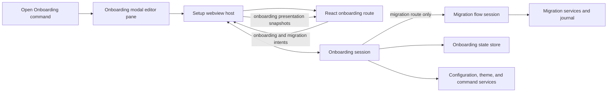

# Hucode onboarding host plan

Status: proposed

Tracks the manually reopenable onboarding experience for
[#204](https://github.com/jimeh/hucode/issues/204) and prepares the surface
that [#205](https://github.com/jimeh/hucode/issues/205) will connect to first
launch.

The product contract remains in the
[first-launch onboarding plan](onboarding-plan.md). This plan supersedes that
document's full-window presentation decision and defines how onboarding is
hosted, how it composes the migration flow shipped by
[#203](https://github.com/jimeh/hucode/issues/203), and how it is delivered.
It does not change migration policy, target rules, Apply, recovery, or the
renderer boundary defined by the [setup UI webview plan](setup-ui-webview-plan.md).

## Outcome

Add **Hucode: Open Onboarding**. It opens a three-stage flow in the Omni modal
editor: bring a setup from another editor or skip the import, review and
apply that choice, then meet Omni and open the first project or workbench. The flow is
opt-in in this change. Nothing routes a new installation into it yet.

The change is complete when:

1. the command opens onboarding in the same modal editor host the import
   command uses, and closing it restores the shell and its focus;
2. the migration route drives the existing `EditorMigrationFlowSession`
   unchanged, and the Skip Import route never creates a migration session;
3. the Meet Omni step previews `default` and `compact` list density and
   Continue writes both Omni layout settings while Back preserves the staged
   value without writing;
4. Add Project and Open Folder as Workbench invoke the existing commands and
   finish in real Omni;
5. a versioned installation-scoped record distinguishes not started, in
   progress, skipped, completed, and superseded, and reopening a completed
   onboarding neither repeats an import nor changes existing values; and
6. keyboard-only use, live announcements, narrow modal sizes, the four
   renderer palettes, and reduced motion have automated and runtime evidence.

## Settled decisions

- **Onboarding is a modal editor, not a full-window mode.** The
  [first-launch onboarding plan](onboarding-plan.md) originally required a
  full-window surface without a backdrop, dialog role, or focus trap. That
  decision predates the proven modal host from #203 and the fix in
  [#223](https://github.com/jimeh/hucode/pull/223), which removed the only
  Omni-specific modal defect. The modal keeps native window controls and the
  drag region available, gives users an obvious way out through Escape or a
  click outside the dialog, and needs no new layout mode in the Hucode
  `Workbench`. The product plan is updated to match.
- **Escape and outside-click mean Do This Later.** Dismissing the modal records
  the current step as resumable. It is never treated as Skip, which is an
  explicit button. A close during an admitted Apply keeps the existing
  migration cancellation binding.
- **Onboarding wraps an optional migration session.** A new onboarding session
  owns stage navigation, the appearance draft, the density choice, and the
  final handoff. During the migration route it embeds a session created through
  `IEditorMigrationFlowService.createSession()` and forwards its state and
  intents unchanged. It never reaches into migration services directly.
- **One renderer, two routes.** The onboarding route lives in the reserved
  `extensions/hucode-setup-ui/src/onboarding/` entry point and reuses the
  setup shell, section rail, panels, feedback, and collection components. The
  build gains a second bundle entry; the host chooses which script to load.
- **The fake Projects list is illustrative.** It shows what the real Projects
  sidebar looks like in each density using the renderer's own React components
  and palette. It does not share DOM, CSS, or the native row renderer with the
  Projects sidebar. A shared pure row model in Hucode common code defines which
  fields each row kind shows per density, and both the sidebar renderer and the
  preview are tested against it so the preview cannot drift silently.
- **The alternative to importing is Skip Import, not Start Fresh.** Onboarding
  can be reopened at any time, so a route named Start Fresh would read as
  erasing existing configuration. The route is labelled as continuing without
  importing from another editor, and its copy states that nothing is removed.
  The product plan's Start Fresh wording is updated to match.
- **The appearance step writes to the Default profile.** Skip Import has no
  target-profile step. Its theme choices are written through the configuration
  service to user settings of the Default profile, which backs the Omni shell.
  This is an explicit product decision, not an inference from the current
  window, and the copy says where the values go. Controls are prefilled from
  current values, and Continue writes only values that changed.
- **No workspace-profile association in this change.** Hosted workbenches
  resolve their profile through VS Code's ordinary folder association, which
  Hucode has no API to write, and the per-project versus per-worktree semantics
  are unsettled. The final actions open projects on their normal profile. The
  standalone import command has the same gap today.
- **Installation-scoped state uses application storage.** The onboarding record
  is stored under `StorageScope.APPLICATION` with `StorageTarget.MACHINE`, so it
  survives profile switches and is never synced. Migration operations keep
  their separate durable journal.

## Architecture



The webview host stays a deep boundary. It gains the ability to serve a
different renderer entry and a wider protocol, but asset probing, CSP, revision
binding, coalescing, and disposal do not change.

### Ownership

| Concern | Owner |
| --- | --- |
| Stage navigation, staged choices, resume, completion | `src/vs/hucode/browser/onboarding/onboardingSession.ts` |
| Versioned installation-scoped record | `src/vs/hucode/browser/onboarding/onboardingStateStore.ts` |
| Shared row model for Projects density preview | `src/vs/hucode/common/omniProjectsRowModel.ts`, consumed by the sidebar renderer and the presentation mapper |
| Onboarding presentation DTOs and localized copy | `src/vs/hucode/browser/onboarding/onboardingPresentation.ts`, composing the existing migration presentation for the embedded stages |
| Protocol additions and validators | `src/vs/hucode/common/migration/editorMigrationSetupProtocol.ts`, mirrored by the existing sync script |
| Modal editor input, pane, and command | `src/vs/hucode/electron-browser/onboarding/` |
| React onboarding route | `extensions/hucode-setup-ui/src/onboarding/` |
| Theme and layout writes, final commands | Onboarding session through `IConfigurationService`, `IWorkbenchThemeService`, and `ICommandService` |

The Hucode `Workbench`, `OmniHostPart`, upstream welcome and onboarding
contributions, and startup routing are untouched.

## Flow model

The onboarding session is one explicit state machine with these stages:

| Stage | Content | Continue | Back |
| --- | --- | --- | --- |
| `bring` | Ranked sources with Skip Import and explicit `.code-profile` selection at equal prominence, plus Do This Later | Chosen route | None |
| `migrate` | Embedded migration phases `application` through `results` | After acknowledged results | Migration Back, then to `bring` from its first phase |
| `appearance` | Mode and preferred light and dark themes | `meetOmni` | `bring` |
| `meetOmni` | Vocabulary, fake Projects list, density toggle, final actions | Finish action | Previous route stage |
| `done` | Transient. Modal closes after the chosen handoff | | |

Rules that keep the routes distinct:

- The migration session is created when the user chooses a source and disposed
  when the user goes Back to `bring` before admission. After admission it lives
  until acknowledged results, exactly as in the standalone command.
- Appearance values stay a draft until Continue on `appearance`. Back to
  `bring` keeps the draft in memory but writes nothing.
- The density choice stays a draft until Continue on `meetOmni`. Continue
  writes `hucode.omni.workbenchItemLayout` and
  `hucode.omni.worktreeItemLayout` to the same value in one configuration
  update. Finish for Now, Add Project, and Open Folder as Workbench all pass
  through that write first.
- The onboarding session records the resumable stage after every stage change
  and after every completed write, so a dismissed modal can reopen on the same
  stage with the same drafts.

### Reopen behaviour

When the record says `completed` or `skipped`, the `bring` stage opens in a
rerun mode. It shows any completed migration operation from the durable journal
as a summary line, keeps Skip Import and Do This Later, and labels the import
action as starting a new import. Nothing runs automatically. When the record
says `inProgress`, the session restores the recorded stage and drafts. A record
with a newer schema version than the running app is treated as `superseded`
and opens in rerun mode without being rewritten.

## Protocol

The onboarding route needs a presentation snapshot that carries the onboarding
stage, a stage-level progress indicator, and either an onboarding panel or the
embedded migration presentation. Extend the existing protocol module rather
than adding a second one:

- a new top-level `route` discriminator, `import` or `onboarding`, on every
  host-to-renderer state message, so the import route's validators keep
  rejecting onboarding-only payloads;
- new panel kinds `bring`, `appearance`, and `meetOmni`, each with wire-safe
  rows, choices, and localized copy;
- new renderer intents `chooseRoute`, `selectMode`, `selectPreferredTheme`,
  `setDensity`, `continueStage`, `backStage`, `skip`, `finishForNow`,
  `addProject`, and `openFolderAsWorkbench`, each with an admission policy
  naming the stages it may act in;
- the existing migration intents, admitted only while the `migrate` stage is
  active and forwarded to the embedded session unchanged.

The host validates every message before dispatch as it does today. Theme
identifiers come from the snapshot the host built from
`IWorkbenchThemeService.getColorThemes()`, so the renderer can only select
values the host already listed.

## Modal host

- Add `OnboardingEditorInput` with `Singleton` and `RequiresModal`
  capabilities, a non-serializing serializer, and `matches()` so reinvoking the
  command reveals the open input. It implements `IModalEditorOptionsProvider`
  with `compactHeader: true` so the renderer owns the visible header.
- Add `OnboardingEditorPane`, mirroring `EditorMigrationEditorPane`: one webview
  host per `setInput` to `clearInput` cycle, `onDone` closes the input, and the
  input's `onWillDispose` drives both the Do This Later record and the existing
  migration cancellation binding.
- The import and onboarding inputs may not be open at the same time. Opening
  onboarding while the import command has an admitted operation shows that
  operation in the `bring` stage summary and offers to open the import command
  instead of starting a second session.
- Do not override modal size, position, or maximized state. Those are one
  profile-scoped record shared by every modal editor, so forcing them for
  onboarding would leak into the import command. The default cap of 1400 by
  900 clamped to the window is sufficient, and the user can maximize.
- Keep the modal's Escape, outside-click, and close-button behaviour. The
  renderer's own Skip and Finish controls call `close` through the protocol as
  the import route does.

## Skip Import and appearance

Choosing Skip Import on `bring` opens the `appearance` stage. The stage offers
System, Light, and Dark mode as a radio group and two theme lists for the
preferred light and preferred dark themes. The host builds the lists from
installed color themes and preselects the current values, so a user who changes
nothing can Continue without any write.

Continue writes only the changed values, in one configuration update to the
Default profile's user settings:

- `window.autoDetectColorScheme` for System, and `workbench.colorTheme` for
  Light or Dark set to the matching preferred theme;
- `workbench.preferredLightColorTheme` and `workbench.preferredDarkColorTheme`.

The copy states that nothing already configured is removed and that the
standalone import command remains available from the Command Palette.

## Meet Omni

- Explain Project, Worktree, Workbench, Loaded, Dormant, Suspend, and Unload in
  one short definition each, using the vocabulary from [Omni](omni.md). No
  further feature tour.
- Render a non-interactive fake Projects list with one project root, one linked
  worktree, and one arbitrary workbench, built from the shared row model. Rows
  are `role="presentation"` and excluded from the tab order.
- Offer one **Use compact worktree and workbench lists** switch. Toggling it
  re-renders the fake list immediately and updates a text label naming the
  density, so the change does not depend on visual comparison.
- Mention three commands with their resolved platform keybinding labels from
  `IKeybindingService`: Switch Worktree, Quick Switch Loaded Workbench, and the
  next and previous loaded workbench pair. The host resolves the labels; the
  renderer never formats key chords. Those commands currently bind keys only on
  macOS, so the snapshot carries an explicit no-shortcut state and the copy
  names the Command Palette as the fallback instead of showing an empty chord.
- Offer Add Project, Open Folder as Workbench, and Finish for Now. The first
  two execute `ADD_PROJECT_COMMAND_ID` and `ADD_WORKBENCH_COMMAND_ID` after the
  density write and the completion record, then close the modal. Those commands
  own their dialogs and path handling.

## Onboarding state record

```ts
interface OnboardingRecord {
	readonly version: 1;
	readonly status: 'notStarted' | 'inProgress' | 'skipped' | 'completed';
	readonly stage?: 'bring' | 'migrate' | 'appearance' | 'meetOmni';
	readonly route?: 'migrate' | 'skipImport';
	readonly density?: 'default' | 'compact';
	readonly completedAt?: number;
}
```

The record stores navigation and staged non-sensitive choices only. It holds no
theme names, imported values, extension identifiers, paths, or operation
identifiers. The migration journal remains the source for operation summaries.

## Implementation sequence

Each step is one reviewable pull request with its own tests.

1. **Host and state.** Add the onboarding session with the `bring` stage and
   Do This Later, the state store, the modal input and pane, the command, the
   `route` discriminator, and the onboarding renderer entry with a placeholder
   `bring` panel. Prove that open, dismiss, reopen, and resume work end to end
   before any route content exists.

2. **Migration route.** Embed the migration session behind the `bring` stage,
   forward migration presentation and intents, and add the rerun summary.
   Verify with the same mixed source and non-empty target used for #203 that
   the embedded flow and the standalone command produce identical journal
   records.

3. **Skip Import route.** Add the mode and theme panel, the theme list snapshot,
   the draft, and the Default-profile write.

4. **Meet Omni and handoff.** Extract the shared row model from the sidebar
   renderer, add the fake list and density switch, the vocabulary copy with
   resolved keybinding labels, the completion record, and the three final
   actions. Retarget the sidebar renderer's layout tests to the shared model.

5. **Evidence and documentation.** Add the keyboard, live-region, narrow-size,
   palette, and reduced-motion runtime evidence, update the setup UI layout
   smoke to cover the onboarding route, and record the outcome in the product
   plan.

Steps 2, 3, and 4 do not depend on each other and can proceed in parallel
after step 1.

## Verification strategy

### Automated evidence

- Session tests for every stage transition, Back preserving drafts, Do This
  Later recording the stage, Skip and completion records, rerun mode, and
  version supersession. One representative perturbation confirms a test fails
  when Back writes a draft.
- State store tests for application scope, machine target, a missing record,
  a malformed record, and a newer version.
- Protocol tests for each new intent and panel kind, the `route` discriminator,
  stage admission, and rejection of migration intents outside the `migrate`
  stage.
- Presentation tests for the `bring` summary in rerun mode, theme list marking,
  the fake list rows for both densities against the shared row model, resolved
  keybinding labels, and the no-shortcut state.
- Renderer component tests for route selection, the appearance controls, the
  density switch and its text label, focus restoration across stage changes,
  and live announcements.
- Pane tests mirroring the import pane: hide-then-reshow reconstruction,
  cancellation binding during Apply, and single-open exclusion with the import
  input.
- Regenerate the Hucode suite snapshot and add the new renderer route to the
  existing setup UI test command.

### Runtime evidence

Run the real desktop command from a clean profile and from a profile with a
completed import. Capture `bring`, appearance, Meet Omni in both densities, and
the rerun summary at the default modal size, maximized, and at the modal's
minimum size. Repeat Meet Omni at 200 percent zoom.

Verify Dark 2026, Light 2026, both high-contrast palettes, and reduced motion.
Traverse every stage by keyboard only and confirm a visible focus indicator,
Escape closing the modal, and focus returning to the shell. Confirm live-region
announcements for stage changes and completion with a desktop screen reader on
one platform, and record which one.

Finish through each of Add Project, Open Folder as Workbench, and Finish for
Now, then inspect user settings for the two layout values, the theme values
after Skip Import, and the application-scope record. Confirm that reopening
after completion shows the rerun summary and changes no settings.

Before the final push of each step, run the setup UI package tests and build,
the focused core suites, `npm run hucode:check-test-suites`,
`npm run hucode:compile`, changed-file precommit hygiene, `git diff --check`,
and the desktop Omni smoke.

## Risks and controls

| Risk | Control |
| --- | --- |
| A dismissed first-launch onboarding strands a new user | Record the stage on dismissal, keep the command in the palette, and let #205 decide how Omni surfaces resume |
| The fake list misrepresents the real sidebar | Derive both from the shared row model and test each against it; accept visual differences, reject field differences |
| Onboarding writes the shell profile by inference | Appearance writes are an explicit decision stated in copy; migration keeps its explicit target |
| Skip Import reads as erasing configuration | Name the route as skipping the import, say nothing is removed, prefill current values, and write only changes |
| Modal state overrides leak into other modal editors | Do not pass size, position, or maximized options when opening |
| Two sessions mutate the same target | Enforce single-open between the import and onboarding inputs and surface an admitted operation instead of starting another |
| The protocol grows into two incompatible dialects | One module, one `route` discriminator, one validator set, one drift check |
| Reopen repeats an import | Rerun mode never auto-starts; the import action is an explicit new-import control |

## Non-goals

- Routing a new installation into onboarding, replacing upstream welcome
  contributions, or any change to startup. That is #205.
- Serve-web onboarding.
- Additional source adapters or import categories.
- A shared DOM or CSS between the fake list and the Projects sidebar.
- Associating a newly added project or workbench with a non-Default target
  profile. Deferred until the per-project versus per-worktree semantics and a
  write API exist.
- Onboarding-specific telemetry beyond what the migration flow already emits.

## Unresolved questions

None. The workspace-profile association, the Meet Omni keybindings, and the
separate import input were settled in review and are recorded above.
