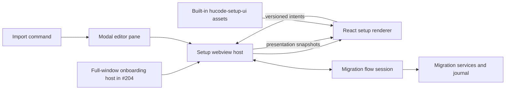

# Hucode setup UI webview plan

Status: approved for implementation

Tracks the presentation rewrite for
[#203](https://github.com/jimeh/hucode/issues/203) and prepares the renderer
boundary needed by [#204](https://github.com/jimeh/hucode/issues/204).

The functional contract remains in the
[reusable editor setup import command plan](editor-migration-command-plan.md).
This plan supersedes that document's DOM renderer, visual styling, component
location, and renderer testing decisions. It does not change migration policy,
state transitions, target rules, publisher authorization, Apply, recovery, or
reporting.

## Outcome

Replace the hand-built workbench DOM view with an isolated React webview. Keep
the selected index-and-detail interaction model, but give the import flow a
deliberate Hucode design instead of inheriting arbitrary workbench CSS.

The rewrite is complete when:

1. every #203 path still drives the existing `EditorMigrationFlowSession` and
   durable services;
2. the modal editor contains one stable webview with one bounded content scroll
   area and a persistent action footer;
3. pointer interaction does not show keyboard focus rings, while keyboard focus
   remains clear in dark, light, and high-contrast modes;
4. hundreds of conflicts, extensions, results, or recovery records remain
   responsive and keyboard operable;
5. the renderer resolves from the built-in extension directory without
   extension scanning or extension-host activation and can later render inside
   the full-window onboarding host; and
6. local development, packaged desktop builds, focused tests, and real desktop
   runs all load the same renderer assets.

## Settled decisions

- Hucode core owns the modal import host, the future full-window onboarding
  host, the migration session, durable operations, and all privileged actions.
- A built-in `hucode-setup-ui` extension packages renderer assets only. It has
  no `main`, `browser`, activation events, commands, or migration services.
- Core creates and owns the webview directly. The desktop host resolves the
  renderer from `INativeEnvironmentService.builtinExtensionsPath`, which also
  honors `--builtin-extensions-dir`, and passes that media root into the shared
  browser host. Extension registration and enablement do not participate.
- The renderer uses React, Tailwind CSS, selected official shadcn components,
  and `@tanstack/react-virtual`. It does not use TanStack Router, Query, Form,
  Table, or Store in this change.
- Hucode owns a small light, dark, high-contrast-light, and
  high-contrast-dark token set. The renderer uses the mode class that the
  webview infrastructure already places on its body, but it does not consume
  arbitrary workbench theme variables or colors.
- Variant B remains the interaction model: a compact section index and one
  detail view. Conflict review shows the useful set together rather than asking
  the user to resolve one setting at a time.
- Default remains the preselected source profile when present and the
  preselected Hucode target. The flow continues to ask for the source
  application before its profile.
- Use the official shadcn registry with the Radix base, Nova style, Lucide
  icons, and Tailwind CSS v4. shadcn source files are vendored code. Generated
  files stay byte-for-byte close to the pinned generator and are outside
  formatter and linter rewrites.
  They remain inside TypeScript compilation and dependency and security checks.

## Architecture

The webview host is a deep boundary. Callers provide a migration session and
host framing. The host hides asset probing, URI conversion, webview creation,
CSP construction, protocol validation, state synchronization, focus handoff,
and disposal.

The built-in extension is a packaging unit, not a runtime authority. Disabling
extensions or restarting the extension host must not stop the import UI. The
desktop host derives the media root from the native environment service and
probes the required files before mounting the webview.

### Bootstrap checkpoint

Implement asset loading first and prove it before building the complete React
view:

- register an asset-only built-in extension;
- add its package directory to `build/npm/dirs.ts`, its script and JSX-enabled
  tsconfig to `build/lib/extensions.ts`, and its output to packaged extension
  tests in `build/lib/test/hucodeSetupUiExtension.test.ts`;
- resolve `<builtinExtensionsPath>/hucode-setup-ui/media`, probe the required
  files, and expose a bounded retry from the core-owned failure state;
- mount a strict-CSP test page in the real modal editor and require the bundled
  external script to execute and post a ready message; and
- repeat that assertion from the development layout, `.build/extensions`
  layout, and a real desktop run with `--disable-extensions`.

Failure at this checkpoint is a build or asset-path defect to fix before the UI
work continues. It must not be bypassed through extension activation, a private
extension API, or a second controller.

## Core and renderer ownership

| Concern | Owner |
| --- | --- |
| Migration state, policy, services, and durable operations | `src/vs/hucode/browser/migration/` and existing common or platform layers |
| Canonical dependency-free wire protocol and runtime validators | `src/vs/hucode/common/migration/` |
| Presentation DTO mapping and localized copy | `src/vs/hucode/browser/migration/editorMigrationFlowSections.ts` and focused companions |
| Webview lifecycle, CSP, state delivery, and intent dispatch | `src/vs/hucode/browser/migration/` |
| Native asset root, modal mount, and close behavior | `src/vs/hucode/electron-browser/migration/` |
| React application and Hucode setup components | `extensions/hucode-setup-ui/src/` |
| Generated protocol mirror consumed by the renderer | `extensions/hucode-setup-ui/src/generated/` |
| Unmodified generated shadcn source | `extensions/hucode-setup-ui/src/vendor/shadcn/` |
| Tailwind entry CSS and Hucode design tokens | `extensions/hucode-setup-ui/src/styles/` |
| Built renderer assets | `extensions/hucode-setup-ui/media/`, generated by the existing extension-media build |
| Future onboarding entry point | `extensions/hucode-setup-ui/src/onboarding/`, added by #204 |

The import and onboarding entry points share a setup shell, navigation,
feedback, collection, and migration components. They do not share host-specific
navigation state. #204 will own Start Fresh, Omni teaching, installation-scoped
onboarding progress, and the final Omni handoff.

## Protocol

Put one dependency-free protocol module in Hucode common code. A Hucode build
script copies it byte-for-byte into the frontend's generated directory before
type checking and bundling. Keep the generated mirror tracked so review shows
wire changes, and fail a drift check if it does not match the canonical source.
Both sides compile the same runtime validators. No extension source imports
from `src/vs/**`.

Every message carries a literal protocol version, a message type, and the
state revision it describes. Use closed discriminated unions in both
directions:

- renderer to host: `ready`, `startImport`, `refreshDiscovery`,
  `selectApplication`, `selectSourceProfile`, `continueFromProfile`,
  `selectTarget`, `continueFromTarget`, `rebuildReview`, `toggleCategory`,
  `chooseDecision`, `chooseAllSettingDifferences`, `acceptReview`,
  `confirmPublishers`, `requestCancellation`, `showRecovery`, `resume`, `retry`,
  `inspectRollback`, `clearRollbackInspection`, `rollback`, `copyReport`,
  `acknowledge`, `back`, and explicit `close`;
- host to renderer: `state`, accepted intent acknowledgement, recoverable host
  error, focus request, and disposal.

Keep the session-action intents one-for-one with the session's public
user-action methods, then add `ready` and host-level `close` separately. A
focused test fails when one side gains an action without the other. Host-only
`initialize` and service construction never become webview intents.

The host validates unknown input before dispatch. It rejects unsupported
versions, malformed payloads, unknown intent types, stale revision-bound
actions, and IDs absent from the current state. It never accepts a command ID,
filesystem path, URI, extension install request, or arbitrary service method
from the webview.

`editorMigrationFlowSections.ts` becomes the core presentation DTO builder. It
maps domain state into wire-safe sections, rows, values, state marks, accessible
names, and all localized user-visible copy. Most current view tests retarget
this mapper. The renderer contains no user-visible English literals except a
static fatal-bootstrap fallback that core replaces during normal startup.

The renderer posts `ready` after React mounts. The host then sends the current
full presentation snapshot. Later session changes replace that immutable
snapshot. Filters, open disclosures, active section, and measured row heights
stay local to React so typing, scrolling, and progress updates do not rebuild
the webview document.

Coalesce progress-only snapshots latest-wins before crossing the webview
boundary, with at most one delivery per animation frame. Treat the matching
progress announcement as part of that progress bucket so a changing live-region
string does not defeat coalescing. Send admitted operation identity, phase
changes, errors, cancellation changes, and terminal states immediately.
Skipping an intermediate presentation snapshot never skips or changes a durable
journal update.

Do not persist source contents, target values, plans, paths, authorization, or
operation data through `acquireVsCodeApi().setState`. The authoritative session
and journal already own recovery. A recreated webview may reset local filters
and scroll positions while preserving migration choices and durable progress.

## Webview security and lifecycle

- Use `IWebviewService.createWebviewElement()` and mount it into the modal
  pane's placeholder. The modal input is singleton and does not reparent across
  editor groups, so it does not need overlay claim, release, or z-order logic.
  Treat the element webview lifetime as one `setInput` to `clearInput` cycle:
  hiding the pane detaches and disposes it, and showing the singleton input
  creates a fresh element whose state is reconstructed from the session.
- Set `allowScripts: true`, `allowForms: false`, `enableCommandUris: false`,
  and a single local resource root for the setup UI media directory. Keep the
  webview service worker enabled because local resource loading depends on it.
- Generate HTML in core with a per-document nonce and an explicit CSP. Default,
  connect, frame, media, object, and remote font sources remain disabled. Load
  only the local script and stylesheet converted through the webview resource
  URI helper. Allow `webviewGenericCspSource` for those local assets and require
  the nonce on the module script.
- Set `transformCssVariables` to remove the injected `--vscode-*` variable map.
  Keep the infrastructure-provided light, dark, and high-contrast body classes
  as the renderer's only workbench theme input. Add a static check that the
  frontend never references `var(--vscode-...)`.
- Override the webview pre-page's layered default body padding, font fallback,
  and `a`, `input`, `select`, and `textarea` focus outlines from the renderer's
  later unlayered stylesheet. Reintroduce accessible focus solely through the
  renderer's `:focus-visible` rules so pointer interaction does not inherit the
  platform's bright default outline.
- Do not embed remote images, scripts, styles, fonts, analytics, or telemetry in
  the renderer.
- Dispose message listeners and the mounted webview with the editor input. A
  close during Apply still asks the existing session to cancel at its next
  durable boundary.
- Treat `postMessage()` failure or a disposed webview as renderer loss. Keep an
  admitted migration alive in the session and journal. Reopening reconstructs
  the view from current authoritative state.
- Show a core-owned loading or failure message when asset probing or loading
  fails. It must offer retry and close instead of leaving a blank modal.

## Design direction

The setup UI should look like a focused transfer tool, not a stack of VS Code
settings panes. Use a calm graphite canvas, restrained cool accent, compact
type scale, and thin structural rules. Light and high-contrast variants keep
the same hierarchy. Use the app's normal UI font stack so the screen feels
native to the platform without importing workbench component styling.

The signature element is the section rail. It acts as a compact manifest of the
import: each category has one label, count, and state marker, and the selected
rule visually connects it to the detail pane. It communicates import structure
rather than decorating the page.

### Layout

- Keep the title, four-step progress, errors, and persistent footer outside the
  content scroller.
- Use one centered shell with a bounded readable width. Avoid full-width empty
  list boxes and avoid cards nested inside cards.
- Application, profile, target, and recovery choices use content-sized rows or
  a compact card grid. Short lists grow naturally and do not reserve a large
  blank viewport.
- Review, Publishers, Apply, and Results use the section rail beside one detail
  pane. At narrow widths and 200 percent zoom, the rail becomes a horizontally
  scrollable strip above the detail.
- The detail pane is the only vertical scroll region. Disclosures expand in
  document flow and never create another scrollbar.
- Review opens on the first category needing attention. Put differing values
  and actionable warnings before routine additions. Keep the two bulk setting
  actions next to the conflict summary.
- Results lead with the aggregate outcome and exceptions. Routine successes and
  repeated placement guidance stay summarized.

### Interaction and focus

- Use `:focus-visible` for keyboard focus. Pointer click and touch focus must
  not produce the bright workbench-blue outline seen in the current DOM view.
- Preserve the focused item by stable ID when a presentation snapshot updates.
  If a transition removes it, focus the next phase heading or its first
  required control.
- Keep section selection and category inclusion as separate controls. Section
  buttons use navigation semantics, while choices use native checkbox or radio
  semantics through shadcn components.
- Announce phase changes, plan drift, progress boundaries, cancellation,
  partial failures, rollback drift, and completion through one polite live
  region. Errors use an alert role.
- Respect reduced motion and forced colors. No information depends only on
  color, animation, position, or an icon.

## Frontend stack

Create an isolated npm package under `extensions/hucode-setup-ui/` with its own
lockfile. Add it to `build/npm/dirs.ts`. Use the repository's existing
extension-media esbuild path rather than adding Vite or a development server.
Register its `{ script, tsconfig }` pair in `build/lib/extensions.ts` and use a
JSX-enabled tsconfig that the existing tsgo media type check can resolve.

Use the official shadcn registry with a checked-in `components.json`, a pinned
CLI version, the settled Radix/Nova/Lucide/Tailwind v4 configuration, and only
the components the import UI needs. The expected initial set is Button, Badge,
Checkbox, Radio Group, Input, Field, Alert, Progress, Separator, Collapsible,
Tooltip, and Skeleton. Do not vendor Scroll Area because the shell owns the
single scroll region.

Keep generated shadcn files in one vendor directory with upstream license and
generation metadata. Add that directory to `.eslint-ignore` so the global
header rule and autofix never rewrite generated source. Exclude it from
formatting, lint rewrites, copyright hygiene, and autofix. Keep application
wrappers, feature components, protocol adapters, tests, and styles under normal
repository checks. Provide a verification script that regenerates or diffs each
recorded component with the pinned CLI so an upgrade is an explicit reviewed
change.

Record the build boundary in `.vscodeignore`, ignore generated media in the
extension `.gitignore`, and add narrow `build/filters.ts` exclusions for
vendored component source and generated media. Do not exclude application code.
Package only the manifest, license, and built media needed at runtime.

Use Tailwind for layout and semantic utilities. Define Hucode setup tokens in
the one frontend CSS entry point and map shadcn semantic variables to them. Add
a small local esbuild plugin through `additionalOptions.plugins` that runs
PostCSS with `@tailwindcss/postcss`; the shared webview esbuild path does not
compile Tailwind directives itself. Define `process.env.NODE_ENV` as
`"production"` in the browser bundle. Do not add arbitrary workbench theme
variables, raw status colors in components, manual dark overrides, or
per-component style patches to generated files.

Use `@tanstack/react-virtual` behind a Hucode `VirtualCollection` wrapper for
large conflicts, extension details, results, and recovery records. The wrapper
owns the threshold for falling back to normal rendering, stable item keys,
overscan, variable-height measurement, width-sensitive remeasurement,
scroll-to-focused-item behavior, and `aria-posinset` and `aria-setsize`.

Keep canonical migration state outside React. A small reducer or external-store
adapter holds the latest host snapshot and local presentation state. Contain
frequent Apply progress updates to the progress region. Use deferred filter
values for large collections and avoid broad context subscriptions that rerender
every row.

Use Vitest, jsdom, and React Testing Library for renderer component tests. Add a
root `hucode:test-setup-ui` command and invoke it from Hucode CI. Keep mapping,
protocol, and migration behavior in the existing fast core suites; component
tests cover browser interaction and rendering that the core runner cannot.

## Implementation sequence

1. **Prove packaging and bootstrap.** Add the asset-only built-in extension,
   npm directory, media build entry, package filters, native asset-root input,
   strict-CSP placeholder, and development plus packaged-layout tests. Require
   the external bundle's ready message before continuing.

2. **Define the boundary.** Add versioned protocol types, tracked generated
   mirror and drift check, runtime validators, localized presentation mapping,
   revision checks, progress coalescing, and the reusable webview host. Test
   malformed, stale, unknown, and valid messages before exposing session
   intents.

3. **Create the isolated frontend.** Initialize React, Tailwind and its PostCSS
   esbuild plugin, the pinned official shadcn configuration, the scoped vendor
   policy, TanStack Virtual, production defines, type checking, and the Vitest
   component runner. Add import and future onboarding entry points, but ship
   only the import route in #203.

4. **Build the import experience.** Implement the setup shell, compact choice
   pages, section rail, category review, bulk and per-setting conflict actions,
   publisher confirmation, progress, failure-first results, recovery, rollback,
   and report actions. Keep the current session as the only behavior owner.

5. **Switch the modal host.** Replace `EditorMigrationFlowView` in the editor
   pane with the webview host. Preserve singleton input behavior, close and
   cancellation semantics, focus return, and modal anchoring.

6. **Remove the old renderer.** Delete the hand-built view and its workbench CSS
   after the React path has equivalent behavior. Move valuable assertions to
   protocol, presentation, component, or runtime tests. Do not keep two
   production renderers or a dormant fallback.

7. **Verify the final experience.** Exercise a mixed source and non-empty target
   through normal Apply, publisher confirmation, partial failure, cancellation,
   recovery, retry, rollback, report copy, acknowledgement, and rerun. Inspect
   target data and the durable journal, not only rendered text.

## Verification strategy

### Automated evidence

- Keep the existing migration flow, planning, Apply, report, command routing,
  and editor-input suites green.
- Add protocol tests for every message variant, version mismatch, malformed
  input, stale revision, unknown ID, denied privileged input, session-method
  coverage, and generated-copy drift.
- Add host tests for missing assets, bounded retry, strict CSP, local resource
  roots, empty transformed theme variables, state delivery after `ready`,
  progress coalescing, immediate boundary states, message disposal, explicit
  close, Escape and keybinding pass-through, hide-then-reshow reconstruction,
  and renderer loss during Apply.
- Add frontend component tests for application-first navigation, Default source
  and target preselection, section changes, category selection, individual and
  bulk conflict choices, publisher confirmation, progress, error recovery,
  Results actions, focus restoration, live announcements, and pointer versus
  keyboard focus classes.
- Add collection tests with hundreds of variable-height rows. Cover filtering,
  stable identity, overscan, focus reveal, width changes, disclosure expansion,
  ARIA positions, and the short-list non-virtualized path.
- Add build tests proving the setup extension has no runtime entry point or
  contributions, its npm directory and media build are registered, package and
  hygiene filters are scoped, vendored files match their manifest, and packaged
  output contains the required script and stylesheet.
- Regenerate the Hucode suite snapshot for new core suites. Wire the frontend's
  focused test command into Hucode CI instead of relying on an uncalled package
  script.

### Runtime and visual evidence

Run the real desktop command with isolated source and target profiles. Capture
the application, profile, target, conflict review, publisher, Apply, Results,
and recovery states at 1200 by 800. Repeat representative review and Results
states at 200 percent zoom and a 480 pixel pane width.

Verify Dark 2026, Light 2026, dark high contrast, light high contrast, forced
colors where the platform supports it, and reduced motion. For each theme mode,
click choice rows, disclosures, section buttons, and bulk actions and confirm no
keyboard focus outline remains after pointer interaction. Then traverse the
same controls by keyboard and confirm a visible focus indicator remains.

Inspect the accessibility tree for headings, navigation, groups, controls,
descriptions, status, and alert relationships. Confirm live-region updates for
phase changes, cancellation, problems, and completion with a desktop screen
reader on one supported platform when that assistive technology is available;
record the platform and any uncovered cross-platform risk.

Use a source with hundreds of settings and extensions. Record that filtering,
section changes, scrolling, disclosure expansion, and Apply progress stay
responsive and preserve the expected focused item and scroll anchor.

Before the final push, run the changed package's install, type check, tests,
vendor verification, and media build, followed by the applicable core suites,
`npm run hucode:check-test-suites`, `npm run hucode:compile`, changed-file
precommit hygiene, `git diff --check`, and desktop Omni smoke. Treat GitHub CI
as the clean-environment and packaged-build gate for the exact pushed head.

## Risks and controls

| Risk | Control |
| --- | --- |
| The asset extension becomes a second controller | Give it no runtime entry point and keep every privileged action behind core protocol validation |
| Renderer assets are missing or incomplete | Resolve from `builtinExtensionsPath`, probe both required files, show a core-owned failure state, and offer bounded retry |
| Core and renderer protocol drift | Keep one versioned type source, validate at runtime, and test both message directions |
| A webview message bypasses reviewed migration policy | Accept only closed intent variants and current stable IDs, then call the existing session methods |
| React state competes with authoritative migration state | Keep plans and operations in the session, and keep only filters, disclosure, section, and measurement state in React |
| Durable progress floods the iframe or live region | Coalesce presentation-only progress snapshots while delivering phase, error, cancellation, and terminal boundaries immediately |
| A long virtual list loses focus or scroll position | Centralize measurement and focus behavior in `VirtualCollection` and verify width changes and dynamic rows in a browser |
| Vendored shadcn files drift and become hard to upgrade | Pin the generator and preset, isolate generated files, record the component set, and verify through CLI diffs rather than formatter churn |
| A fixed brand palette becomes inaccessible | Maintain four explicit mode palettes and verify forced colors, contrast, text scaling, and keyboard focus independently |
| The rewrite weakens recovery while improving appearance | Retain the current session and journal, test renderer loss during Apply, and inspect durable state in end-to-end QA |
| #204 cannot reuse the renderer | Keep host framing outside the import route and reserve a separate onboarding entry point over shared setup components |

## Non-goals

- Implementing the full-window onboarding route, Start Fresh, Omni education,
  onboarding persistence, or first-launch activation.
- Moving migration policy, file access, gallery access, or extension
  installation into the webview or extension host.
- Supporting serve-web migration in #203.
- Mirroring every VS Code theme or exposing arbitrary theme tokens to the
  renderer.
- Adding a general Hucode frontend framework, component registry, router, query
  cache, form framework, table framework, or global client store.

## Unresolved questions

None. The bootstrap checkpoint still runs first because it verifies the asset
path and service-worker assumptions before the frontend depends on them.
