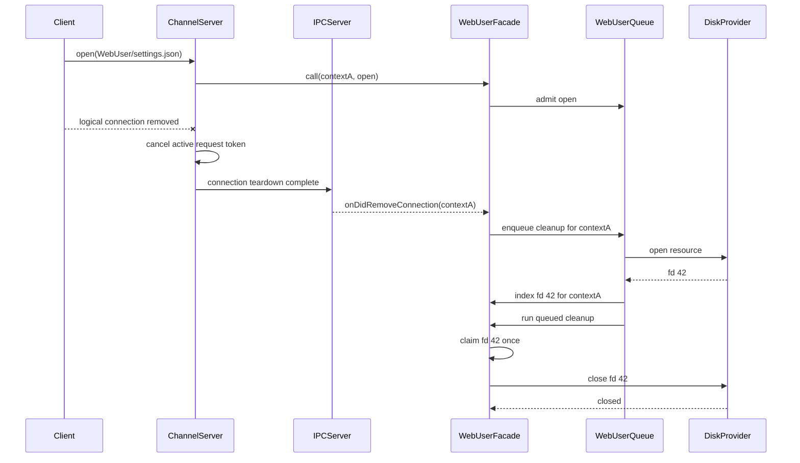

# Serve-Web User-Data Handle Cleanup Plan

## Document purpose

This document is the implementation plan for
[issue #158](https://github.com/jimeh/hucode/issues/158): release every open
server-backed WebUser filesystem handle when its owning serve-web client is
finally disconnected, without closing another client's handles or invoking the
underlying provider's close path more than once.

It records the selected lifecycle seam, ownership model, operation ordering,
shutdown behavior, error policy, file-level work, tests, and validation needed
to implement the change. It is deliberately implementation-specific. Durable
behavior should be added to `architecture.md` when the implementation lands,
and this plan should move to `docs/hucode/archive/` after delivery.

## Status and delivery boundary

- Investigation: complete against `series-1.131.0` at
  `9cb62ef7ca930753ab94efc35ebb59e1ae5ec7ac`.
- Design: independently reviewed by Claude; corrections incorporated; approved
  by the user on 2026-08-02.
- Implementation: not started.
- Delivery issue: `jimeh/hucode#158`.
- Expected pull request title:
  `fix(web): release server user-data handles on disconnect`.
- Required change fragment: `.changes/<slug>.md` before a PR exists, optionally
  renamed to `.changes/<pr-number>-<slug>.md` after creation.

## Goal

When server-backed WebUser storage is enabled:

- associate each successfully opened WebUser file handle with the unique
  logical IPC connection that opened it;
- preserve the normal explicit-close behavior;
- close all and only the remaining handles owned by a logical connection when
  that connection is removed;
- route every cleanup through the underlying filesystem channel's `close`
  command so the `DiskFileSystemProvider` releases the OS descriptor, write
  lock, position state, and write-tracking state;
- make explicit close, disconnect cleanup, and server shutdown share one
  claim-once close mechanism;
- drain all admitted WebUser operations before final shutdown cleanup; and
- avoid adding a new generic VS Code IPC lifecycle contract.

## Non-goals

- Do not close handles on a transient socket loss while the logical management
  connection remains eligible for reconnection.
- Do not identify ownership by `remoteAuthority`, `clientId`, reconnection
  token text, or another caller-controlled or shared value.
- Do not redesign the generic remote filesystem provider's lifecycle for every
  remote path. That broader upstream concern may be considered separately.
- Do not change browser-backed user-data behavior or the
  `--user-data-storage=browser|server` product contract.
- Do not redesign the v1 global WebUser operation queue. Issue #157 separately
  owns contention measurement and any admission-barrier redesign.
- Do not make `IPCServer.dispose()` emit connection-removal events as part of
  this fix.

## Confirmed current behavior

### Shared filesystem facade

`setupServerServices()` registers one shared
`HucodeWebUserDataFileSystemChannel` around the
`RemoteAgentFileSystemProviderChannel`. Each successful `open` records only
`handle -> resource`. Explicit `close` delegates to the underlying channel and
then removes the handle from the map. No owner or connection-removal callback
exists.

The underlying channel delegates `close` to `DiskFileSystemProvider.close()`.
That provider closes the OS descriptor and releases associated position,
write, flush, and resource-lock state. Removing only the facade's map entry is
therefore not cleanup.

### Existing connection identity seam

`IPCServer` deserializes one context object when a logical client connection is
created. It passes that exact object to the connection's `ChannelServer`, stores
it as `connection.ctx`, and later includes the same object in
`onDidRemoveConnection`.

Context object identity is therefore the ownership key. Two fresh connections
with identical serialized `remoteAuthority` and `clientId` values still receive
distinct server-side objects. Existing `AgentHostChannel`, `McpGatewayChannel`,
and `PlaywrightChannel` implementations already use `onDidRemoveConnection`
for per-context cleanup.

### Reconnection behavior

The server passes `ManagementConnection.onClose` to
`SocketServer.acceptConnection()`. A transient transport loss schedules the
management connection's reconnection grace timer but does not fire `onClose`.
Reconnection reuses the existing `PersistentProtocol`, `ChannelServer`, and
context object. `onDidRemoveConnection` runs only after graceful logical
disconnect or grace-period expiry.

Cleanup at `onDidRemoveConnection` therefore preserves reconnection semantics:
a temporarily unreachable client retains its handles, while a connection that
can no longer return releases them.

### Shutdown behavior

`HucodeWebUserDataServer.close()` currently:

1. rejects new WebUser operation admission;
2. waits for the global WebUser operation queue to become idle;
3. closes server-backed state storage; and
4. lets the wrapped server-services disposable tear down the remaining
   providers and services.

It does not close filesystem handles. Generic `IPCServer.dispose()` also clears
its connection set without firing `onDidRemoveConnection`, so disconnect events
cannot be the sole shutdown mechanism.

## Settled design decisions

1. Use the server-side context object's identity as the connection owner.
2. Retain the shared Hucode filesystem facade; do not create one filesystem
   provider per connection.
3. Subscribe to `socketServer.onDidRemoveConnection` in `serverServices.ts`,
   where both the concrete socket server and concrete Hucode facade are
   available.
4. Keep cleanup logic and handle state in the Hucode-owned facade.
5. Track only handles whose transformed resource is inside `WebUser`. An
   untracked handle continues to use the unmodified generic filesystem path.
6. Admit connection cleanup into the same FIFO WebUser operation queue as
   managed `open`, `read`, `write`, and `close` operations.
7. Remove a tracked handle from lookup maps before starting the underlying
   close, and retain the resulting close promise on the stable entry object.
   Every competing path joins that promise instead of issuing another close.
8. Perform a final close-all pass after admitted operations drain and before
   the underlying filesystem provider is disposed.
9. Attempt all relevant closes even when one fails. Observe and report every
   asynchronous cleanup failure.
10. Do not patch generic `ipc.ts` unless implementation proves the verified
    local seam insufficient.
11. Register disconnect cleanup only when server-backed WebUser mode is
    enabled. Do not use an empty-owner-set fast path in that mode because an
    admitted `open` may not have registered its handle yet.
12. Treat a duplicate explicit handle operation that arrives only after its
    stable entry was detached as a pre-existing generic filesystem boundary.
    The facade cannot distinguish that stale numeric descriptor from an
    untracked outside-WebUser handle without adding tombstone state.

## Target ownership model

Introduce an internal stable entry for each managed open handle. The precise
names may follow nearby conventions, but its material state is:

```ts
interface OpenWebUserHandle<TContext> {
	readonly handle: number;
	readonly resource: URI;
	readonly owner: TContext;
	closePromise: Promise<void> | undefined;
}
```

Maintain two indexes:

```ts
private readonly handles = new Map<number, OpenWebUserHandle<TContext>>();
private readonly handlesByOwner = new Map<TContext, Set<OpenWebUserHandle<TContext>>>();
```

`handles` supports normal `read`, `write`, and `close` lookup. `handlesByOwner`
supports bounded connection cleanup without scanning unrelated live clients.
Both maps use the stable entry object, allowing an operation that already
captured an entry to join its close even after the entry has been detached from
the indexes.

When detaching the last entry in an owner's set, delete the owner key from
`handlesByOwner`. Otherwise a long-running server would retain the context
object for every disconnected client.

Do not use a `WeakMap`: final server shutdown must enumerate all remaining
owners and handles.

## Facade contract

Return a narrow Hucode-owned interface from `createFileSystemChannel()`:

```ts
export interface IHucodeWebUserDataFileSystemChannel<TContext>
	extends IServerChannel<TContext> {
	releaseConnection(context: TContext): Promise<void>;
	closeTrackedHandles(): Promise<void>;
}
```

The concrete class can remain private. The interface lets `serverServices.ts`
request per-connection cleanup without depending on implementation details.
`HucodeWebUserDataServer` retains a close-all callback for every facade it
creates so its shutdown path does not depend on `IPCServer` events.

The facade constructor should receive five capabilities rather than the whole
user-data server:

- the delegated filesystem `IServerChannel`;
- the URI-transformer lookup;
- `isManagedResource(resource)`, using the server's existing WebUser containment
  check; and
- `runManagedOperation(resources, operation)`, preserving the existing normal
  operation admission, shutdown check, FIFO queue, and lease behavior;
- `queueCleanup(operation)`, which admits a connection cleanup operation to the
  same server-owned queue or reports that shutdown already owns cleanup.

This keeps lifecycle policy in `HucodeWebUserDataServer` while keeping handle
mechanics in the facade. Normal managed operations and disconnect cleanup must
enter the same underlying queue; the two callbacks separate their admission
policy without creating separate execution domains.

## Operation algorithms

### Managed-resource classification

Extract the containment predicate currently embedded in `runFileOperation()`
into one helper that:

- removes query and fragment components;
- uses `uriIdentityService.extUri.isEqualOrParent()`;
- returns `false` when server-backed user-data mode is disabled; and
- compares against `URI.file(webUserHome)`.

Use the same helper for operation admission and deciding whether an opened
handle enters the ownership maps. This prevents classification drift.

### Open

1. Transform the incoming URI before admission.
2. Determine whether it is a managed WebUser resource.
3. Run the provider `open` through the existing resource-based operation path.
4. After the provider resolves, create and index the stable handle entry only
   when the resource is managed.
5. Return the provider handle unchanged.

The entry must be registered inside the admitted operation. If disconnect
cleanup is queued after the IPC request began, FIFO ordering ensures cleanup
runs after the provider open resolves and after the entry is registered.

If server shutdown begins while the open is admitted, shutdown waits for the
queue and the final close-all pass sees the new entry.

### Read and write

1. Look up the captured entry by handle.
2. If no tracked entry exists, preserve the generic delegate behavior. This is
   an outside-WebUser handle or an invalid generic handle.
3. If an entry exists but its owner is not the calling context object, reject
   without calling the provider.
4. Queue the managed operation using the entry resource.
5. Re-check inside the queued factory that `closePromise` is still undefined.
   If close has already claimed the entry, reject as closed instead of touching
   a descriptor that may already have been recycled.
6. Delegate the operation.

The in-queue recheck is required because a read or write can capture an entry
while waiting behind an earlier explicit close.

### Explicit close

1. Look up the stable entry by handle.
2. If there is no tracked entry, preserve the generic delegate behavior.
3. Reject a tracked entry owned by another context.
4. Queue the close using the entry's managed resource.
5. Inside the queue, call the shared `closeEntry(entry)` helper.
6. Return or await the entry's shared close promise.

Do not delete by numeric handle from a `finally` callback. A descriptor number
may be reused as soon as the provider closes it, and an old completion must not
delete a newer entry carrying the same number.

### Claim-once close helper

`closeEntry(entry)` should:

1. return `entry.closePromise` immediately when another path has claimed it;
2. synchronously detach that exact entry from both indexes;
3. delete the owner key when detachment leaves its owner set empty;
4. create and store one promise that calls the underlying channel's `close`
   command with the entry owner and handle; and
5. return that promise to every caller holding the stable entry.

Detaching before the asynchronous provider call prevents any later lookup from
treating the descriptor as open. Retaining the promise on the stable entry lets
operations that captured it before detachment join the same result.

If the provider close fails, do not put the numeric handle back into the maps.
Retrying later could close an unrelated file if the OS recycled the descriptor.
The failure must be logged or returned, but the close remains at-most-once.

### Connection removal

`releaseConnection(context)` should ask `HucodeWebUserDataServer` to enqueue one
cleanup operation. Inside that queued operation:

1. snapshot the current stable entries in `handlesByOwner.get(context)`;
2. call `closeEntry()` for every snapshot entry;
3. await all closes with all-settled semantics; and
4. reject with an aggregate cleanup error after all attempts when any close
   failed.

Do not snapshot before queue admission. A managed `open` that was already
admitted can finish after `ChannelServer.dispose()` cancels its response. The
queued cleanup must run after that open and take its snapshot afterward.

When server-backed WebUser mode is enabled, `serverServices.ts` should register
the listener in the setup disposable store:

```ts
disposables.add(socketServer.onDidRemoveConnection(connection => {
	void webUserDataFileSystemChannel.releaseConnection(connection.ctx).catch(
		error => logService.error('Unable to release disconnected WebUser file handles.', error),
	);
}));
```

Use the repository's final logging wording and error helper conventions. The
material requirements are that the listener is disposed with server services,
the promise is observed, and failures are attributed to disconnect cleanup.
Browser-backed mode should not register the listener.

### Shutdown

Revise `HucodeWebUserDataServer.close()` to preserve this order:

1. set `closing` so new managed operations and new disconnect-cleanup admission
   cannot enter;
2. await the existing WebUser operation queue's idle state;
3. invoke `closeTrackedHandles()` on every created filesystem facade;
4. attempt every remaining handle close and collect failures;
5. close `storageHost`, even if one or more handle closes failed;
6. mark the server closed after all cleanup attempts settle; and
7. surface an aggregate error after cleanup so
   `createServerServicesDisposal()` logs it and still disposes provider-backed
   services.

If a connection-removal event arrives after `closing` becomes true, its cleanup
admission should resolve as owned by shutdown rather than emit a misleading
failure. The final close-all pass is authoritative in that state.

The underlying `RemoteAgentFileSystemProviderChannel` must remain alive until
the close-all pass settles. The existing `createServerServicesDisposal()`
wrapper already defers disposal of the setup `DisposableStore` until
`HucodeWebUserDataServer.close()` settles; preserve that ordering.

### Production process-exit limitation

The current production shutdown entrypoints call `process.exit()` or invoke
`RemoteExtensionHostAgentServer.dispose()` from Node's synchronous `exit`
event. They cannot await `HucodeWebUserDataServer.close()`. The OS reclaims file
descriptors when the process exits, so this does not preserve the long-lived
server leak, but it means the asynchronous close-all phase is not load-bearing
for those process-exit paths today.

Disconnect-time cleanup is the production fix for long-lived servers. The
close-all phase remains required for explicit/test disposal, for shutdown
ordering as a component contract, and for any future awaited server-close
entrypoint. Expanding this issue to redesign process signal and auto-shutdown
handling would touch a materially broader lifecycle surface and is not selected
by default.

## Expected event sequence



## Race and boundary matrix

| Scenario | Required ordering and result |
|---|---|
| Explicit close, then disconnect | Explicit close claims the entry; disconnect joins or sees no remaining owner entry; one provider close. |
| Disconnect, then explicit close already queued | FIFO winner claims the stable entry; the other path joins the same promise or receives the closed outcome; one provider close. |
| Disconnect while open is pending | Cleanup queues behind open, snapshots afterward, and closes the newly registered handle. |
| Disconnect while read/write is pending | Previously admitted operation settles first; cleanup then claims and closes the handle. |
| Two clients share authority | Context object identity keeps their owner sets distinct; removing A never enumerates B. |
| Wrong client supplies a tracked handle | Facade rejects before provider access. |
| Descriptor number is reused | Old stable entry is detached before await; old completion cannot delete or close the new entry. |
| Duplicate explicit close arrives after detachment | It falls through to the generic untracked-handle path; document this pre-existing boundary rather than adding unbounded tombstones in this fix. |
| Disconnect cleanup close fails | Remaining owned handles are still attempted; failure is observed and logged. |
| Shutdown begins before disconnect cleanup admission | Admission declines because shutdown owns cleanup; final close-all releases the entry. |
| Shutdown begins after cleanup admission | Shutdown waits for the queue, including cleanup, then close-all covers anything remaining. |
| `IPCServer.dispose()` emits no removal event | Final close-all remains sufficient. |
| Temporary transport loss remains inside reconnection grace | `ManagementConnection.onClose` does not fire, so no connection-removal cleanup runs and handles remain available to the reconnected logical client. |
| Browser-backed mode | No resource is classified as managed; generic channel behavior remains unchanged. |

## Error and logging policy

- Explicit close returns the underlying provider error to the requesting
  client.
- Wrong-owner access and access through a captured entry whose close has begun use
  `createFileSystemProviderError(..., FileSystemProviderErrorCode.Unknown)` with
  identical generic wording. The response must not reveal whether a numeric
  handle belongs to another client or expose its resource path.
- Disconnect cleanup attempts all owned closes before rejecting.
- The event listener observes and logs a rejected disconnect cleanup promise.
- Shutdown attempts all handle closes and state-storage closure before
  surfacing an aggregate error.
- A provider close is never automatically retried. Descriptor reuse makes an
  uninformed retry unsafe.
- Log one structured aggregate per cleanup phase rather than logging inside
  `closeEntry()`. The aggregate can carry per-handle failures for diagnostics;
  this avoids duplicate logs when the phase's caller already owns reporting.
- Logs should include cleanup phase and handle number. Include the resource only
  if existing server logs treat local paths as acceptable diagnostic data.
- Shutdown-owned declined admission is not an error and should not produce a
  warning.

## File-by-file implementation plan

### `src/vs/server/node/hucodeWebUserDataServer.ts`

- Add the narrow exported facade interface.
- Extract one managed-resource predicate from `runFileOperation()`.
- Retain close-all callbacks for created filesystem facades.
- Add cleanup admission that shares the existing FIFO queue and operation
  lease behavior.
- Replace `openResources` with stable owner-aware entries and dual indexes.
- Implement ownership validation, in-queue state rechecks, claim-once close,
  connection cleanup, and close-all.
- Extend `close()` to drain filesystem handles before state storage and setup
  service disposal.
- Add concise JSDoc to new exported interfaces and methods.

### `src/vs/server/node/serverServices.ts`

- Retain the concrete Hucode filesystem facade before registering it.
- When server-backed WebUser mode is enabled, register
  `socketServer.onDidRemoveConnection` and pass `connection.ctx` by object
  identity to the facade.
- Observe and log the asynchronous result.
- Add the event subscription to the existing setup disposable store.
- Keep the remote filesystem provider alive until the Hucode close barrier
  settles.

### `src/vs/server/test/node/hucodeWebUserDataServer.test.ts`

- Extend focused facade tests with a controllable delegate channel.
- Assert provider-visible close commands and counts rather than private map
  shape.
- Exercise two object contexts containing identical authority/client values.
- Cover delayed open, delayed close, close failure, wrong-owner access, and
  server close ordering.
- Cover a read and write captured while a close is waiting, proving their
  in-queue closed-entry recheck rejects without reaching the delegate.
- Assert owner-map cleanup through observable behavior or a bounded diagnostic
  hook rather than exposing the internal maps solely for tests.

### `src/vs/server/test/node/hucodeWebUserDataConnection.test.ts`

- Add one focused `SocketServer`/`IPCClient` protocol-pair integration suite.
- Prove that the context received by a channel call is strictly identical to
  `onDidRemoveConnection(...).ctx`.
- Prove that two serialized-equal context payloads become distinct server-side
  connection identities.
- Prove that cleanup is not requested until the supplied
  `onDidClientDisconnect` event fires. Treat the deeper transport-loss and
  reconnection-grace behavior as an upstream `ManagementConnection` contract,
  verified by source unless an existing focused harness makes direct coverage
  proportionate.
- Keep the test Hucode-named and server-local rather than modifying the generic
  upstream IPC test suite.

The exact test filename may be folded into the existing server suite if that
produces clearer fixtures without obscuring the integration boundary.

### `build/hucode/test-suites.snapshot.json`

- Regenerate with `npm run hucode:test-suites -- --write-snapshot` if a new
  Hucode-named test file is added.

### `build/hucode/upstream-provenance.json`

- Expand the existing `src/vs/server/node/serverServices.ts` reason to include
  per-connection WebUser handle cleanup.
- Keep the `1.131.0` upstream path and blob baseline unchanged.
- Do not add `src/vs/base/parts/ipc/common/ipc.ts` unless the implementation
  unexpectedly requires an upstream edit.

### Documentation and release metadata

- Add the final lifecycle invariant to `docs/hucode/architecture.md`.
- Add any non-obvious, generally reusable shutdown or context-identity gotcha
  discovered during implementation to `docs/hucode/agent-instructions.md`.
- Add the required `.changes` fragment with the exact PR title header.
- Move this plan into `docs/hucode/archive/` after the implementation PR lands.

## Test strategy

### Test-first evidence

Before changing the facade implementation, add focused tests that demonstrate:

1. disconnect currently leaves a managed handle unclosed;
2. two clients are not isolated by the current handle map;
3. disconnect during delayed open can miss the handle without queue ordering;
   and
4. explicit close and disconnect can otherwise invoke or attempt cleanup more
   than once.

Confirm each new test runs by name and fails at its intended assertion. A single
representative perturbation is sufficient where several assertions exercise
the same claim-once mechanism.

### Focused successful and failure cases

- Explicit managed open/read/write/close remains successful.
- Explicit managed close calls the delegate exactly once.
- Disconnect closes every managed handle for one context.
- Disconnect leaves another context's handles open and usable.
- Two contexts with identical property values remain isolated.
- Wrong-owner read, write, and close do not reach the delegate.
- Read and write captured behind an earlier delayed close recheck state inside
  the queue and do not reach the delegate.
- Disconnect queued behind delayed open closes the late handle.
- Explicit close racing disconnect produces one provider close.
- Multiple concurrent cleanup callers share the same outcome.
- One failed provider close does not skip sibling handles.
- Shutdown drains an admitted operation before close-all.
- Shutdown closes handles even when no removal event fires.
- Shutdown-owned cleanup admission does not generate a spurious error.
- Browser-backed mode does not track or alter generic handles.
- Browser-backed mode does not register or enqueue disconnect cleanup.
- Repeated connection cleanup removes empty owner state rather than retaining
  disconnected context objects.

### Integration boundary

The `SocketServer` integration test should use an in-memory protocol pair and a
real `IPCClient`. It should exercise serialization, channel invocation,
disconnect signaling, and the removal event. Avoid mocking `connection.ctx`;
the purpose is to protect the exact generic IPC behavior on which the Hucode
facade relies.

### Regression evidence

After focused tests pass:

1. compile the client output because server Node tests execute compiled `out/`;
2. run the affected Hucode server test suites explicitly;
3. run the test-suite snapshot check;
4. run upstream-provenance validation against `1.131.0`; and
5. run targeted precommit hygiene for every edited path.

Do not run `npm run test-node` concurrently with `npm run gulp compile-client`.

## Validation commands

Use the exact final paths selected during implementation. The expected command
shape is:

```sh
npm run gulp compile-client

npm run test-node -- --run \
  src/vs/server/test/node/hucodeWebUserDataServer.test.ts

npm run test-node -- --run \
  src/vs/server/test/node/hucodeWebUserDataConnection.test.ts

npm run hucode:test-suites -- --write-snapshot
npm run hucode:check-test-suites
npm run hucode:check-upstream-provenance -- --upstream-ref 1.131.0

npm run -s precommit -- \
  src/vs/server/node/hucodeWebUserDataServer.ts \
  src/vs/server/node/serverServices.ts \
  src/vs/server/test/node/hucodeWebUserDataServer.test.ts \
  src/vs/server/test/node/hucodeWebUserDataConnection.test.ts \
  build/hucode/test-suites.snapshot.json \
  build/hucode/upstream-provenance.json \
  docs/hucode/architecture.md \
  docs/hucode/agent-instructions.md \
  .changes/<fragment>.md
```

If the integration test is folded into the existing suite, omit the nonexistent
test path and avoid an unnecessary snapshot rewrite.

Also run:

```sh
git diff --check
git status --short
```

## Acceptance-criteria traceability

| Issue criterion | Planned evidence |
|---|---|
| Every WebUser handle belongs to one unique client connection | Stable entry owner is the context object; strict-identity integration test. |
| Explicit close releases exactly once | Shared `closePromise`; delegate close-count assertion. |
| Abnormal disconnect closes all and only owned handles | Owner index plus two-context cleanup tests. |
| Cleanup is safe when close and disconnect race | Claim-once tests with delayed delegate close. |
| One client cannot close another client's handles | Ownership validation and same-authority context tests. |
| Shutdown drains and releases remaining handles | Queue-drain plus no-removal-event shutdown tests for the awaited component-disposal contract; the existing production process-exit limitation remains explicitly documented. |
| Required scenarios have automated coverage | Focused facade matrix and real SocketServer boundary test. |
| Upstream seam remains minimal and recorded | Only existing `serverServices.ts` patch reason changes; provenance check passes. |

## Implementation risks and mitigations

### Context identity accidentally replaced with value identity

Using a stringified context, authority, or client ID would merge live clients.
Keep the owner key as the deserialized object and assert strict identity in the
integration test.

### Cleanup snapshots too early

Taking the owner snapshot in the synchronous removal callback misses an open
that finishes after cancellation. Snapshot only inside the admitted FIFO
cleanup operation.

### Numeric descriptor reuse

Deleting by handle after an awaited close can affect a newer descriptor. Detach
the exact stable entry before awaiting and never retry a failed close by number.

A duplicate explicit operation that arrives after entry detachment remains an
accepted generic boundary: without a live stable entry the facade cannot tell a
stale WebUser handle from an unmanaged handle. Tombstones are not selected
because they add lifetime, reuse, and memory-bounding policy beyond this issue.

### Shutdown skips or races cleanup

Connection-removal events are not guaranteed during generic IPC disposal. Make
close-all an explicit phase of `HucodeWebUserDataServer.close()` and preserve
the existing service-disposal barrier.

### Cleanup failure strands other handles

`Promise.all` fails fast. Use all-settled behavior, then aggregate failures so
every handle receives one close attempt.

### Tests prove private bookkeeping rather than behavior

Assert delegate calls, outcomes, ownership isolation, and lifecycle ordering.
Do not expose maps solely for tests.

## Rollback boundary

The implementation is isolated to the Hucode facade, server registration, and
Hucode tests. If regressions appear, revert the facade ownership and listener
wiring together. Do not retain the disconnect listener without the shutdown
close-all path, or retain owner bookkeeping without claim-once close semantics.

The user-data format, migration manifest, and persisted state layout do not
change, so rollback requires no data migration.

## Review decisions

Independent Claude review verified the plan's context-identity, reconnection,
queue, provider-close, and disposal-barrier assumptions against current source.
The following review choices are incorporated:

1. Use the existing filesystem-provider error type with `Unknown` code and the
   same generic wording for wrong-owner access and a captured tracked entry
   whose close has begun.
2. Emit one structured aggregate error per disconnect or shutdown cleanup
   phase; do not log inside `closeEntry()`.
3. Prefer the separate Hucode-named
   `hucodeWebUserDataConnection.test.ts` suite for the generic IPC identity
   boundary.
4. Keep awaited process-shutdown redesign out of this issue unless explicitly
   approved as a scope expansion.

These decisions do not change the selected lifecycle seam or claim-once
ordering contract.
